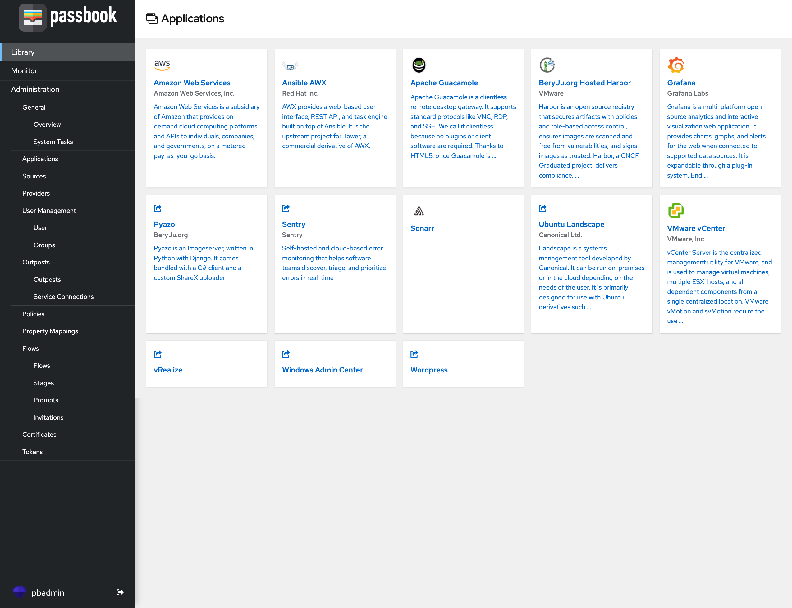
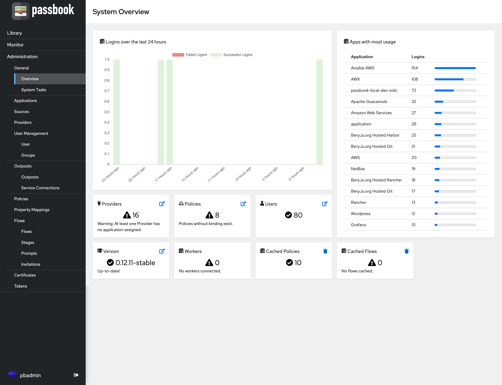

[](https://dev.azure.com/beryjuorg/passbook/_build?definitionId=1)

[](https://codecov.io/gh/BeryJu/passbook)


## What is passbook?

passbook is an open-source Identity Provider focused on flexibility and versatility. You can use passbook in an existing environment to add support for new protocols. passbook is also a great solution for implementing signup/recovery/etc in your application, so you don't have to deal with it.

## Installation

For small/test setups it is recommended to use docker-compose, see the [documentation](https://passbook.beryju.org/docs/installation/docker-compose/)

For bigger setups, there is a Helm Chart in the `helm/` directory. This is documented [here](https://passbook.beryju.org/docs/installation/kubernetes/)

## Screenshots




## Development

To develop on passbook, you need a system with Python 3.8+ (3.9 is recommended). passbook uses [pipenv](https://pipenv.pypa.io/en/latest/) for managing dependencies.

To get started, run

```
python3 -m pip install pipenv
git clone https://github.com/BeryJu/passbook.git
cd passbook
pipenv shell
pipenv sync -d
```

Since passbook uses PostgreSQL-specific fields, you also need a local PostgreSQL instance to develop. passbook also uses redis for caching and message queueing.
For these databases you can use [Postgres.app](https://postgresapp.com/) and [Redis.app](https://jpadilla.github.io/redisapp/) on macOS or use it the docker-compose file in `scripts/docker-compose.yml`.

To tell passbook about these databases, create a file in the project root called `local.env.yml` with the following contents:

```yaml
debug: true
postgresql:
  user: postgres

log_level: debug
```

## Security

See [SECURITY.md](SECURITY.md)
