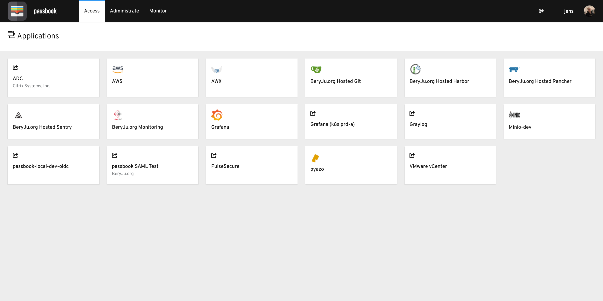
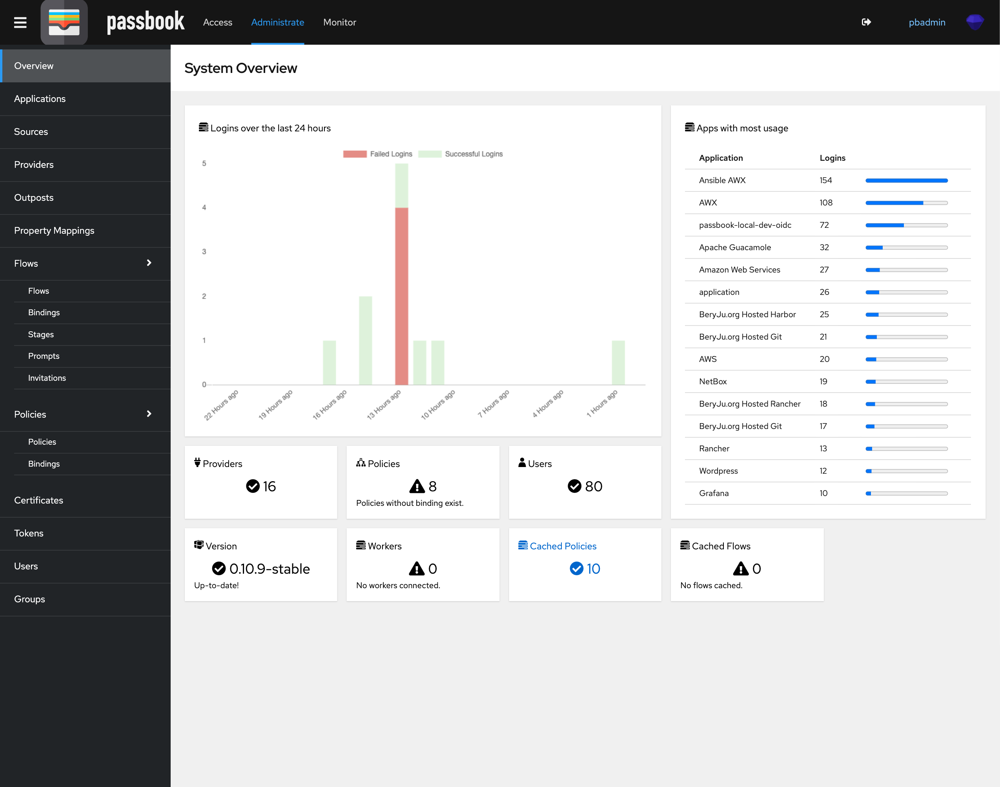

#
{: style="height:50px"}
{: style="height:50px"}

## What is passbook?

passbook is an open-source Identity Provider focused on flexibility and versatility. You can use passbook in an existing environment to add support for new protocols. passbook is also a great solution for implementing signup/recovery/etc in your application, so you don't have to deal with it.

## Installation

See [Docker-compose](installation/docker-compose.md) or [Kubernetes](installation/kubernetes.md)

## Screenshots

