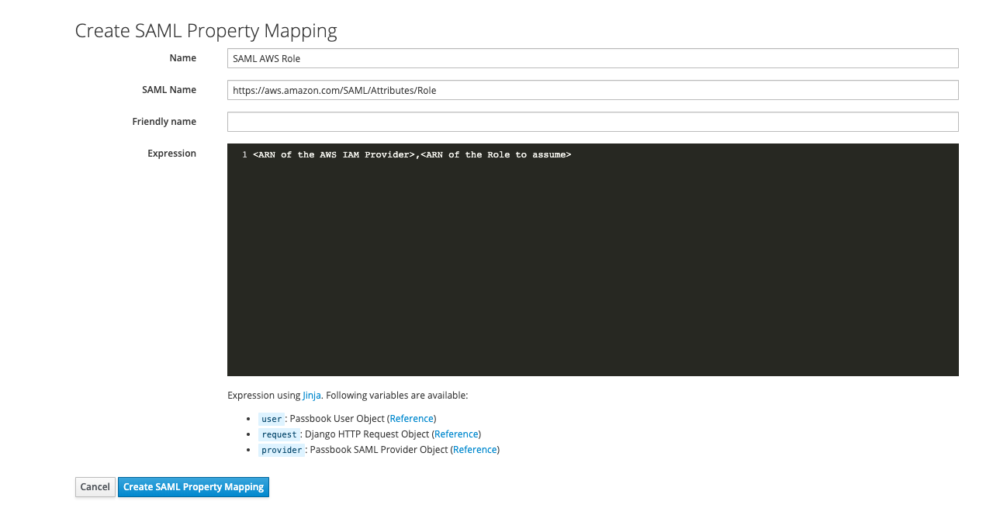

# Amazon Web Services Integration

## What is AWS

!!! note ""
    Amazon Web Services (AWS) is the world’s most comprehensive and broadly adopted cloud platform, offering over 175 fully featured services from data centers globally. Millions of customers—including the fastest-growing startups, largest enterprises, and leading government agencies—are using AWS to lower costs, become more agile, and innovate faster.

## Preparation

The following placeholders will be used:

-   `passbook.company` is the FQDN of the passbook Install

Create an application in passbook and note the slug, as this will be used later. Create a SAML Provider with the following Parameters:

-   ACS URL: `https://signin.aws.amazon.com/saml`
-   Audience: `urn:amazon:webservices`
-   Issuer: `passbook`

You can of course use a custom Signing Certificate, and adjust durations.

## AWS

Create a Role with the Permissions you desire, and note the ARN.

AWS requires two custom PropertyMappings; `Role` and `RoleSessionName`. Create them as following:

Afterwards export the Metadata from passbook, and create an Identity Provider [here](https://console.aws.amazon.com/iam/home#/providers).
