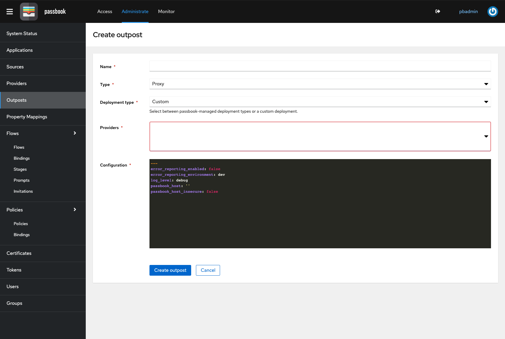

# Outposts

An outpost is a single deployment of a passbook component, which can be deployed in a completely separate environment. Currently, only the Proxy Provider is supported as outpost.



Upon creation, a service account and a token is generated. The service account only has permissions to read the outpost and provider configuration. This token is used by the Outpost to connect to passbook.

To deploy an outpost, you can for example use this docker-compose snippet:

```yaml
version: 3.5

services:
  passbook_proxy:
    image: beryju/passbook-proxy:0.10.0-stable
    ports:
      - 4180:4180
      - 4443:4443
    environment:
      PASSBOOK_HOST: https://your-passbook.tld
      PASSBOOK_INSECURE: 'true'
      PASSBOOK_TOKEN: token-generated-by-passbook
```

In future versions, this snippet will be automatically generated. You will also be able to deploy an outpost directly into a kubernetes cluster.w
