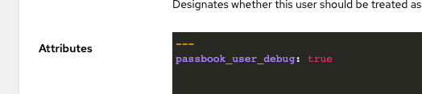
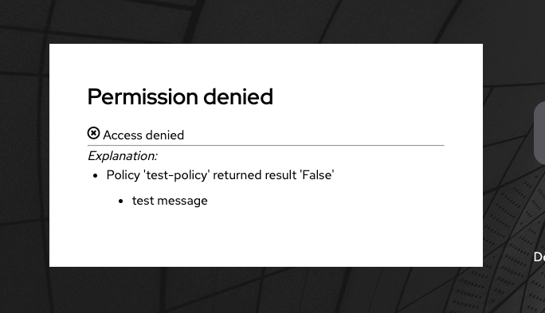

# Troubleshooting access problems

## I get an access denied error when trying to access an application.

If your user is a superuser, or has the attribute `passbook_user_debug` set to true:

Afterwards, try to access the application again. You will now see a message explaining which policy denied you access:

