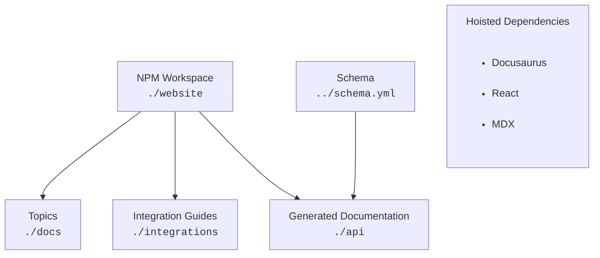

# authentik documentation source

This directory contains the source files for the authentik [technical documentation](https://docs.goauthentik.io/docs?utm_source=github), [integration guides](https://integrations.goauthentik.io?utm_source=github), and [API documentation](https://api.goauthentik.io?utm_source=github).

Contributions are welcome! Please refer to our [contributor guidelines](https://docs.goauthentik.io/developer-docs?utm_source=github) for details about contributing code or docs.

For instructions to set up your local environment for building docs locally, refer to our [Docs development environment](https://docs.goauthentik.io/developer-docs/setup/website-dev-environment?utm_source=github) page.

For instructions for writing the docs and then testing in your local build, plus tips on writing, links to our Style Guide and templates, see the [Writing documentation guide](https://docs.goauthentik.io/developer-docs/docs/writing-documentation?utm_source=github).

To ensure a smooth review process, we encourage you to build the documentation locally to preview and test your documentation contributions. Be sure to test locally before opening a pull request. Let us know if you have any questions or want help with any part of the process.

## Package structure

At the root of the `website` directory is a `package.json` file that defines an [NPM Workspace](https://docs.npmjs.com/cli/v11/using-npm/workspaces). This allows us to have multiple packages in the same repository, and to install their dependencies via a single command: `make docs-install`

NPM packages which are in a _parent workspace_ share a common `node_modules` directory. _Sibling packages_ define their dependencies in their own `package.json` files. The dependencies which they share in common are lifted or "hoisted" to the parent `node_modules` directory.

### Topics (AKA "The Docs")

The [`website/docs`](./docs/) directory contains documentation on how to use authentik. It is organized into topics, which are defined by the [`sidebar.mjs`](./docs/sidebar.mjs) file.

### Integrations

The [`website/integrations`](./integrations/) directory contains documentation on how to use authentik with various third-party services.

### API

The [`website/api`](./api/) directory contains documentation on the authentik API.

### Deployment

Deployment is handled by a combination of [Netlify](https://www.netlify.com/) and [GitHub Action workflows](../.github/workflows/).

## Additional Resources

- [Documentation Setup](https://docs.goauthentik.io/developer-docs/setup/website-dev-environment?utm_source=github)
- [Writing Documentation](https://docs.goauthentik.io/developer-docs/docs/writing-documentation?utm_source=github)
- [Style Guide](https://docs.goauthentik.io/developer-docs/docs/style-guide?utm_source=github)
