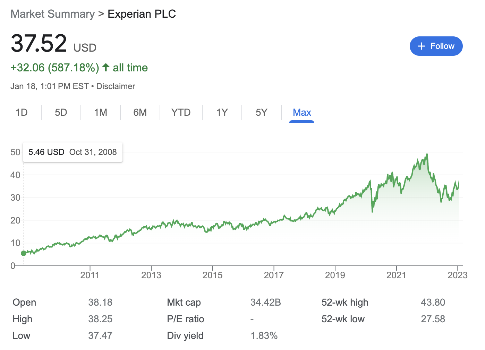
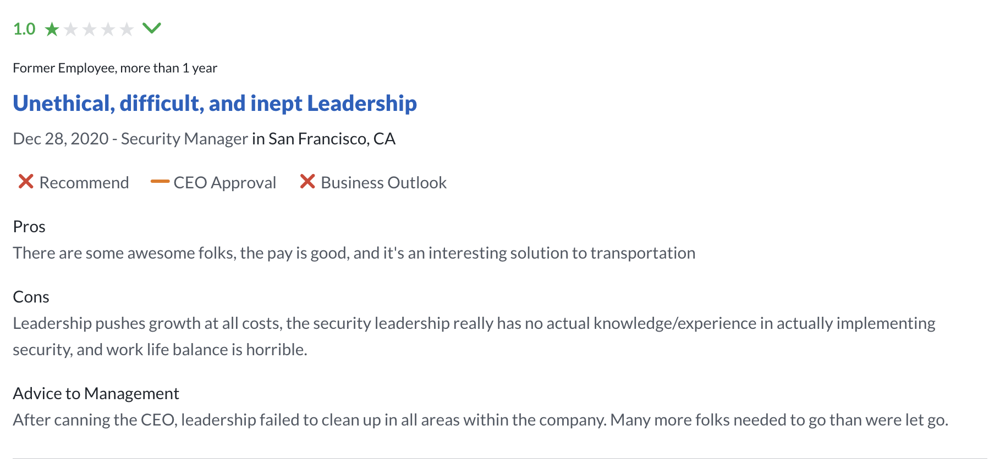
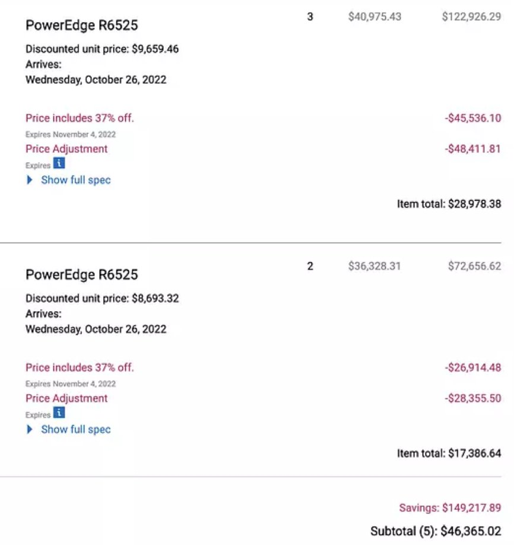

“We made a mistake” – so said authentication provider [Okta](https://support.okta.com/help/s/article/Frequently-Asked-Questions-Regarding-January-2022-Compromise?language=en_US) on March 25, 2022 – two months after an attack on one of Okta’s vendors (Sitel, a contact center) in January. During Okta’s initial investigation, the company didn’t warn its customers about the attack nor about its potential damage.

“At that time,” Okta admitted later, “We didn’t recognize that there was a risk to Okta and our customers.”

On March 22, three days before the admission, the group responsible for the attack – LAPSUS$ – shared screenshots online that evidenced the success of their attack. As users, customers, and onlookers reacted, Okta co-founder and CEO Todd McKinnon [tweeted about the attack](https://twitter.com/toddmckinnon/status/1506184721922859010?s=20&t=o7e6RA25El2IEd7EMQD3Xg), claiming that the attack was “investigated and contained” but, more controversially, framing the attack as “an attempt.”

<!--truncate-->

Many disagreed with that framing considering, as the news progressed, that the attack had succeeded and had affected 2.5% of Okta customers ([about 375 companies](https://www.bleepingcomputer.com/news/security/okta-confirms-25-percent-customers-impacted-by-hack-in-january/)). Worse, LAPSUS$ itself disagreed, claiming they had “logged in to a superuser portal with the ability to reset the Password and MFA of ~95% of clients.”

Data breaches are not uncommon but in this case, the coverup became worse than the crime. In the days and weeks after, most criticism of Okta didn’t focus on the attack itself but on the company’s response. Okta had two months to talk about the attack before LAPSUS$ forced them to and it’s unclear whether Okta ever would have talked about it at all without the circulation of those screenshots.

Eventually, Okta admitted its faults. On March 23, David Bradbury, Chief Security Officer at Okta, [wrote that](https://www.okta.com/blog/2022/03/oktas-investigation-of-the-january-2022-compromise/): “I am greatly disappointed by the long period of time that transpired between our notification to Sitel and the issuance of the complete investigation report.”

The Okta case is one example in a line of many. It’s a particularly galling case because Okta manages authentication for so many companies – making it a frontline security product – but the pattern itself is not rare.

A major consequence of the rise of SaaS software is a misalignment of incentives between SaaS vendors and customers. We don’t have to put on tinfoil hats to realize that vendors have a strong incentive to ignore or even suppress bad news so as to safeguard their relationships with current and future customers.

As honest and as well-intentioned as a vendor might be, that incentive misalignment is still there. This tension exposes the leading edge of an emerging trend and potentially major shift: Companies are reconsidering the value of self-hosting their software so as to have greater control over security and cost.

### 5 incentives SaaS vendors have to be secretive about security

This is not a secret nor a conspiracy theory: SaaS vendors have a compelling array of incentives to hide security flaws in their services and suppress the publicity of successful data breaches.

The very model of delivering software as a service means that vendors are incentivized to maintain relationships with their customers so as to encourage them to maintain their subscriptions. That incentive leads to good things, such as prompt customer service and product iteration. But it can also lead to bad things, such as hiding mistakes and flaws.

It’s hard, bordering on impossible, to claim that any given company suppressed news about a data breach. But we can infer it’s likely that it happens given three things:

-   The SaaS industry is [massive and growing](https://www.grandviewresearch.com/industry-analysis/saas-market-report), meaning there are many companies out there that _could_ suffer a data breach and _could_ suppress news about it.
-   The media industry is inherently limited and can’t discover and report on every data breach.
-   The number of data breaches has [consistently risen](https://www.statista.com/statistics/273550/data-breaches-recorded-in-the-united-states-by-number-of-breaches-and-records-exposed/) from 2005 to 2021.

Given these three dynamics, it’s likely some significant portion of vendors have tried, or at least hoped, for news about a data breach to not break headlines. Is it ethical? Likely not. But is it rewarding? If it all works out, yes. Let’s look, then, at the five biggest incentives companies have to suppress data breach news.

#### 1. Fines

With the passing of the General Data Protection Regulation (GDPR) in Europe, along with a slew of other regulations, many of which are still emerging, fines have become a significant concern for companies.

GDPR fines are designed, in the [words of the EU](https://gdpr.eu/fines/), to “make non-compliance a costly mistake for both large and small businesses.”

The “less severe infringements” can cost companies up to €10 million (almost $11 million) or up to 2% of the company’s annual revenue – ”whichever amount is _higher_” [emphasis ours]. The “more serious infringements” can cost companies €20 million (about $21.5 million) or 4% of the company’s annual revenue – again, “whichever amount is higher.”

#### 2. Reputation

At first glance, the reputation cost of a data breach might seem minimal. Even headline-breaking data breaches don’t always seem to impair companies.

You couldn’t infer, for example, when the infamous Experian data breach occurred looking at its stock price alone.

(It happened in September of 2017 and a [class action lawsuit](https://www.ftc.gov/enforcement/refunds/equifax-data-breach-settlement) resulted in payments starting in December of 2022).

The problem with considering the potential of reputation damage is that it’s hard to predict. There are a few factors that make news coverage of a data breach more likely, such as whether a company targets average users or business users and whether a company stores obviously sensitive data or not, but predictability remains hard.

Your company needn’t trend on Twitter to suffer reputation damage, however. According to [Impravata research](https://security.imprivata.com/rs/413-FZZ-310/images/IM_Report_Third-Party-Remote-Access-Security.pdf), 63% of companies don’t do security evaluations on prospective vendors because they rely instead on the reputation of the vendors in question.

The incentive to suppress bad news and avoid a bad reputation also worsens with time. The same research shows that 55% of companies consider a “history of _frequent_ data breach incidents” [emphasis ours] to be a major indicator of risk. That means a company might be transparent about it first breach and gradually more secretive as it suffers more attacks.

#### 3. Legal issues

Beyond sheer fines, regional, national, and international governments can also levy lawsuits against companies and individuals. Joe Sullivan, for example, a former CTO at Uber, was convicted of [covering up a 2016 data breach](https://www.washingtonpost.com/technology/2022/10/05/uber-obstruction-sullivan-hacking/) in 2022.

Even if individuals aren’t jailed and the company itself survives a lawsuit just fine, the consequences can still be meaningful. The previously cited Imprivata research shows that 40% of companies consider legal actions against a vendor to be another risk factor.

#### 4. Professional reputation

Parallel to the previously mentioned risk of more general reputation damage is the risk of damage to a company’s professional reputation. Even if a data breach doesn’t make headlines, employees, investors, and partners in your industry might still take heed.

The risk here gets worse when you consider the implications of a data breach. Many people, perhaps not entirely fairly, might doubt whether a company runs a good operation if it suffers repeated data breaches. Consider a representative [Glassdoor review of Uber](http://www.glassdoor.com/Reviews/Employee-Review-Uber-RVW39883443.htm):

Companies can also start negative feedback loops wherein repeated security issues give them a reputation as having a bad security team, meaning good security engineers might avoid working for the company to avoid association with that reputation.

#### 5. Contract cancellation

Fines aren’t the only form of monetary loss. Many companies build security risks into their vendor contracts, making it easy to sever the relationship or recoup their losses after a breach.

The previously cited Imprivata research shows that 59% of companies demand contracts that obligate vendors to “adhere to security and privacy practices.” The same proportion of companies – 59% – don’t do security evaluations because they rely on the consequences of the security agreements in the contract.

### What’s old is new again: Why self-hosted software is making a comeback

Depending on your age and experience in the industry, the prospect of self-hosted software returning can range from plausible to laughable. The instinct to doubt makes sense – SaaS became the dominant model of software delivery for a variety of valid reasons.

When the SaaS model emerged, it was clear that, in general, SaaS products were easier to use and often more effective than their self-hosted counterparts. SaaS products, for example, are:

-   Easy to purchase – often requiring little more than an account and a credit card.
-   Easy to run, install, and upgrade.
-   Easy to maintain – especially given companies can rely not only on the resources of the SaaS vendor but on the distributed infrastructure of the cloud vendor the SaaS vendor is using.

That said, there are also compelling reasons to use self-hosted products. For example, with self-hosted products, companies can:

-   Know where their data is located.
-   Customize the application to their unique workflows.
-   Shift financing from opex to capex, which often results in net cost savings.
-   Trust in shared alignment. If you own and self-host a product, you’re incentivized, in a way even the best SaaS vendor isn’t, to keep it secure.

Authentication, what we specialize in here at Authentik, is a great example. The industry standard used to be a self-hosted products – most commonly Microsoft ADFS – but they were notoriously unwieldy, which gave companies like Auth0 and Okta a chance to take over the market.

The technology industry is cyclical, however, and our bet is that by applying lessons learned from SaaS, vendors can offer self-hosted products that are as good or better than SaaS products. Customers can then have their cake and eat it too.

#### Technology is cyclical, not regressive or progressive

At first glance, the idea of companies shifting back to a self-hosted model seems silly – didn’t we learn our lessons the first time? It’s easy to assume that the technology industry progresses in a linear, upward fashion and infer that anything from the past is necessarily worse.

And while that might be true for specific products (floppy discs aren’t coming back, I’m afraid to say) business and technology models can and have returned from the dead.

Marianne Bellotti, author of the book _Kill It with Fire: Manage Aging Computer Systems (and Future Proof Modern Ones)_, raises the example of thick and thin clients. Decades ago, most companies ran applications on bulky mainframes but before the founding of AWS in 2006, companies had shifted toward running applications on personal computers. But as the cloud grew, the mainframe model returned with companies “time-sharing,” in Bellotti’s words, on public clouds in much the same way they did on mainframes.

“Technology doesn’t advance in a straight line,” argues Bellotti, “because a straight line is not actually efficient.” Instead, she writes, “Technology advances not by building on what came before, but by pivoting from it.” And there are significant, growing, multiplying reasons to not only reconsider self-hosting but reconsider private data centers and on-premises infrastructure.

#### Early signs of an unwinding trend

It’s hard to believe given years of discourse and “thought leadership” about the cloud but there are signs of change. And to be clear, the claim here is not that AWS will suddenly collapse and IT admins will need to rapidly re-learn server racking skills; the claim is that there are reasons to reconsider self-hosting and evidence that more and more companies will do that reconsideration.

Consider the recent decisions of three established companies: 37signals, Dropbox, and Retool.

On Twitter, 37signals and Basecamp co-founder DHH [summarized the results](https://twitter.com/dhh/status/1613508201953038337?s=20&t=QFmwWhR0YSCygvItPwtC8w) of a recent accounting 37signals did across its properties. 37signals spent, in total, $3,201,564.24 on cloud in 2022 and in a [subsequent tweet](https://twitter.com/dhh/status/1613558939760689153?s=20&t=QFmwWhR0YSCygvItPwtC8w), DHH compared that cost to purchasing “insanely powerful iron” from Dell that included “288 vCPU, 15 TB NVM, 1.3TB RAM for $1,287/month over 3 years.”

In a [full post](https://dev.37signals.com/our-cloud-spend-in-2022/) on the 37signals blog, senior site reliability engineer Fernando Álvarez provided more details, writing that “In 2023, we hope to dramatically cut that bill by moving a lot of services and dependencies out of the cloud and onto our own hardware.”

Years prior to this planned shift, in 2015, Dropbox decided to “[reverse migrate](https://www.datacenterknowledge.com/manage/dropbox-s-reverse-migration-cloud-own-data-centers-five-years)” from the cloud (AWS, in this case) to privately owned data centers. Before the end of the year, Dropbox relocated 90% of its customer data to an in-house network of data centers. At the time, the shift broke headlines because it seemed so unique.

Five years on, as Scott Fulton writes, Dropbox’s decision “is starting to look more like a pioneer expedition.” Dropbox is able to save money and manage their resources more closely. Fulton argues there’s no reason this choice “should only fit Dropbox.” Given the ability to effectively plan capacity, Fulton writes that many companies could also “avoid the breaking point of cloud-based service affordability.”

This trend also emerges on a customer-facing level. In 2021, low code platform Retool announced a [self-hosted plan](https://twitter.com/retool/status/1404835350250344449?s=20&t=VMzl65BkICVb3v2HxIXsEw), enabling customers to host Retool inside their infrastructure. Self-hosting, again, is not new, nor is the presence of customers requesting a self-hosted option. The difference here is that Retool, a relatively new company, founded in 2017 and growing fast, found reason to prioritize building a self-hosted option. Retool even [says that](https://twitter.com/retool/status/1404835454948495360?s=20&t=VMzl65BkICVb3v2HxIXsEw) “Self-hosting has been a top request from our self-serve customers.”

Retool cited a couple of [key use cases](https://twitter.com/retool/status/1404835751833989125?s=20&t=VMzl65BkICVb3v2HxIXsEw), including companies working within a regulated industry and companies hosting sensitive data. Retool also made it clear, though, that self-hosting is typically burdensome and offering this plan required the company to modernize the deployment process and make deployment easy by integrating Docker and Kubernetes.

### SaaS should not be the default

David Bradbury, Okta’s Chief Security Officer, concludes his [post](https://www.okta.com/blog/2022/03/oktas-investigation-of-the-january-2022-compromise/) explaining the company’s investigation of the LAPSUS$ incident and their response to it in a familiar way: “As with all security incidents, there are many opportunities for us to improve our processes and our communications. I’m confident that we are moving in the right direction and this incident will only serve to strengthen our commitment to security.”

You don’t have to impugn Okta’s commitment or accuse them of suppressing news about this breach to see the problem. SaaS companies, due to the very structure of their business and delivery models, can’t be as aligned with your company’s needs as you are. SaaS companies will always, at best, be “moving in the right direction,” whereas your company, if it self-hosts its software, won’t have to worry about misaligned incentives.

There might be a paradigm shift in how the technology industry hosts its workloads and delivers its software. There might not be. Either way, more companies are realizing that SaaS isn’t, and shouldn’t be, the default.
