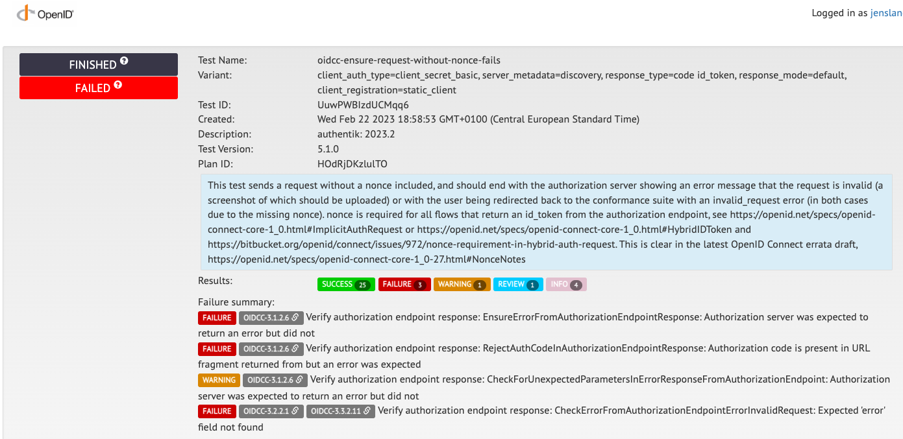
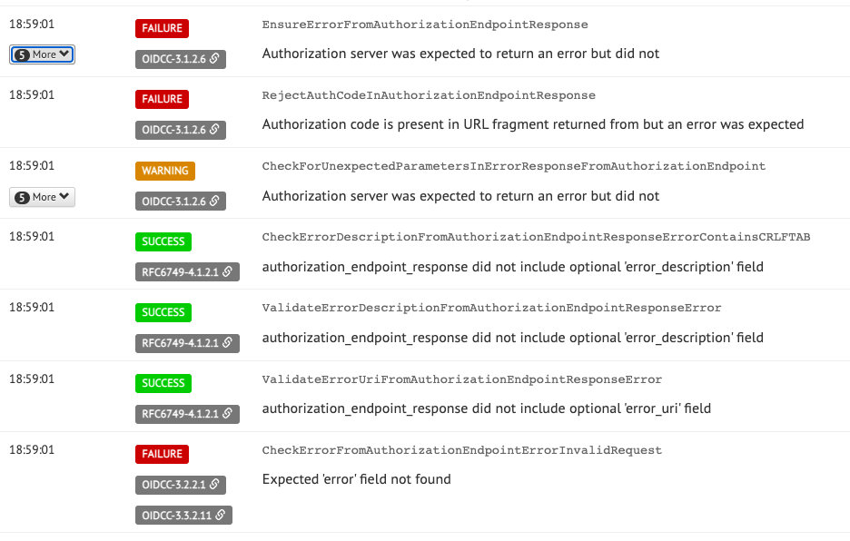

We all know standards matter, without them we wouldn't have the internet, we wouldn't have computers and we wouldn't even have electricity. But standards are complex. They need to define edge cases, they need to be explicit but also allow room for implementations to advance and new features to be created. Today we'll dive into the OpenID Connect standard, why it is hard to implement and also what makes it in some ways easier than other standards.

<!--truncate-->

### OpenID Connect

OpenID Connect (from here on "OIDC") is a standard that builds on top of OAuth 2.0, an existing standard. OIDC adds a standard for user identity on top of OAuth, which allows RPs (Relying Parties, more commonly referred to as "Clients") to verify the identity of users through tokens issued by an IDP (Identity providers). Before OIDC was as broadly used as it is now, most identity providers relied on a custom method for this, which made it much harder to implement broad support in clients. For example, a client would have to implement custom logic for logging in with Google, GitHub, Microsoft, etc. This also made it much harder for new identity providers (hey that's us!) to work with existing clients, as identity providers would have to basically emulate the specific implementation by one of the aforementioned providers.

Since its introduction in [2014](<https://en.wikipedia.org/wiki/OpenID#OpenID_Connect_(OIDC)>), OIDC has been broadly adopted in the late 2010s, and now most providers support it (there's still a large list of providers that rely on pure OAuth with a custom identity layer on top, like Facebook, Twitter, Apple, but hopefully they'll migrate to OIDC eventually).

The broad adoption on both sides has also increased the diversity and fragmentation, and indirectly also the diversion away from the standard.

### Standards and testing

One aspect where OIDC is very different to other standards is that they have a certification program, where applications can run through a (quite large) set of tests specified by the foundation itself, called [Conformance Tests](https://openid.net/certification/). This allows library authors for both clients and identity providers to ensure their implementation matches the standard, and behaves as expected. These tests are very thorough (the basic identity provider test suite contains 96 tests), which ensures that edge cases, uncommonly used features and both positive and negative flows are tested.

These tests are all very well defined, they explain exactly what is tested, what the expected behavior is, and what (if any) possible issues are.

For example, here you can see the overview of a test that's failed:  and the exact request and reason why it failed: 

The exact standard definition is linked, which makes it very easy to dig in further and figure out what's supposed to happen.

For authentik, we use these tests to ensure that we adhere to the standard as much as possible to increase compatibility as much as possible. We've got all tests passing on the current development builds (which actually helped us a couple of bugs), and we'll be certifying the identity provider portion of authentik very soon.

### Deviation of standards

It is sadly also quite common for clients to deviate from these standards, often requiring special behaviour that is specific to one or more implementations. One example that we had this issue with in the past is VMware's vCenter.

They introduced "Identity federation" in [Version 7](https://blogs.vmware.com/vsphere/2020/04/vsphere-7-new-generation-vsphere.html), but explicitly only supported Microsoft's ADFS identity provider. However under the hood, this was using OIDC, which ADFS has supported for a while.

Of course for us, ADFS being the only supported solution wasn't great, and I was very curious to see if ADFS was _actually_ required. With the OIDC implementation authentik had at the time, we didn't get very far. Logins would fail with a very cryptic error message, and since this was unsupported territory, there wasn't much we could find to help us figure out what's wrong.

I'll spare you the details, but after a lot of digging through logs and figuring out what vCenter actually expects and attempts to do, I found it expects the `access_token` to be an encoded [JWT](https://jwt.io/) (stay tuned for our upcoming blog post about how JWT took the identity world by storm). Expecting an encoded JWT is not part of the [OpenID standard](https://openid.net/specs/openid-connect-core-1_0.html), so it somewhat made sense that they only advertise ADFS compatibility. However as we were finding out, vCenter was not the only applications that had this requirement. Researching further, it seemed like this had become sort of a "quasi-standard", as many identity providers were behaving this way.

In the end we decided to follow suit with authentik (mostly for the sake of compatibility, but also since it can make sense), and vCenter logins via authentik are now [fully supported](https://goauthentik.io/integrations/services/vmware-vcenter/) (at least from our side).

### Standards in authentik

Quickly touching on standards more generally in authentik; we aim to make authentik as standards-compliant as possible while retaining its feature set. For example, for SAML sources/providers, all generated responses are tested against the official SAML XML schema. The same is done for the newly added SCIM integration, where everything is equally validated.

### Certification

Standards are great, but without a central governing body that actually verifies and certifies the standards, that's only half the story. With OIDC and the OpenID Connect Foundation, the standards can be enforced, validated, and built on by a group of independent people. Having such a certification makes it a lot easier for people potentially interested in authentik (and software in general) to see that the application adheres to the standard and will work with other existing pieces of software. This alone is a very big part of why we're working on getting certified.
