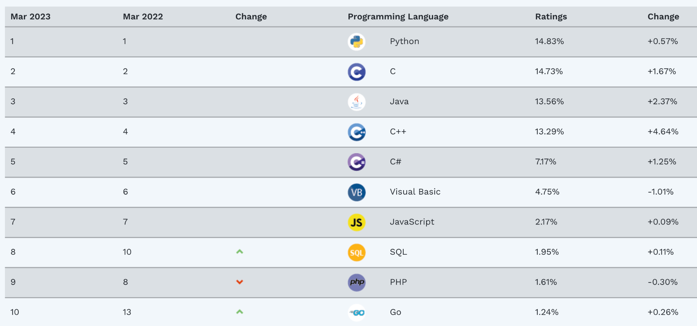
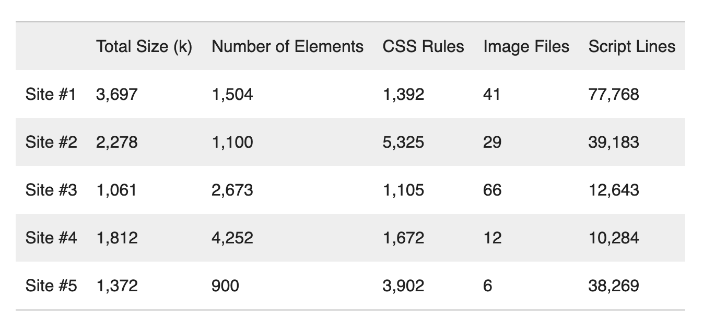
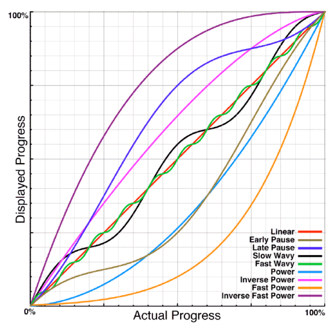

# authentik on Django: 500% slower to run but 200% faster to build

I started [authentik](https://github.com/goauthentik/authentik) in 2018 as an open source hobby project but in 2022, with help from Open Core Ventures, I started [Authentik Security](../2022-11-02-the-next-step-for-authentik/item.md), an open core company built around the authentik project.

Building a new startup is, unsurprisingly, quite different from building and maintaining an open source project. With the arrival of funding and the requirement to build a business that could sustain itself now and scale as the company evolved, I had to confront some of the technical choices I made when building authentik – in particular, the choice to build authentik using Python and Django.

The primary reason behind choosing these languages was simple: I knew them well and could write code fast. In retrospect, we know now there was a tradeoff. I was able to code faster but the language itself would eventually impose speed limitations. Python isn’t the slowest language out there but when compared to Node.js and other compiled languages like Go, its speed can seem like a big problem. And Django on top of Python makes it even slower.

And yet, I stand by the decision and as the company has evolved, I think it was a good one. In this post, I’ll explain why this decision was a net positive, the benefits and costs of choosing these languages, and the lessons we learned along the way.

<!--truncate-->

## Why we chose Python and Django

We chose Python and Django from a purely pragmatic perspective. Python and Django enabled us to build. Performance is important; architecture is important; sustainability and scalability are important. But in a very real sense, you don’t get the privilege of facing those challenges until you build.

The rest of your worries, as important as they may be, can’t even be worried about until the business is built. As the business has evolved, we’ve found too that using these languages supports our primary differentiating feature and makes it easier to hire developers who can help us build further.

### Easier leads to better

As I wrote above, I came to this project knowing the most about Python and Django and feeling the most comfortable using those languages to build a robust product.

And while there is a known sacrifice in performance using languages that tend to be slower, the kind of speed I prioritized was the speed of iteration. By using a language I knew better, I was not only able to build the first versions of authentik faster; I was able to debut them, get feedback, and iterate faster too.

And it wasn’t just about comfort. Python was also a good choice because it has a wealth of libraries and components that make the language even easier to build with. While other languages would have required either coding by hand or gluing libraries together, much of our work was relatively out of the box.

### Differentiating features need the most support

The authentication market is not new. The original version of Microsoft ADFS came out back in 2003 with Windows Server. Okta was founded in 2009 and went public in 2017. Auth0 was founded in 2013 and was acquired by Okta in 2021.

In a crowded market, it’s more important to be different than better. Okta employs more than 5,000 people and it’s unrealistic to think we can outrun them. Even if we were somehow able to teleport to feature-parity tomorrow, Okta will benefit from a “You can’t be fired for buying IBM” dynamic. Why go with the upstart instead of the established product?

The answer is a differentiating feature, one that goes beyond being a gimmick and becomes compelling enough that at least a select group of people will choose you.

For authentik, our primary differentiator is our delivery model: Unlike other players in authentication, authentik is focused on being self-hosted. There are numerous benefits to this – we also think the trend is [shifting toward self-hosted delivery](../2023-01-24-saas-should-not-be-the-default/item.md) overall, especially for security products – but the relevant benefit here is customization.

authentik appeals the most to developers who want to self-host their authentication and customize it to suit their specific needs. Building authentik with Python and Django supports this because so many developers know Python. If we used a different language, even if it were better in terms of performance, it would likely be less accessible to as many developers.

As it is, when I tell prospects we’ve built authentik with Python and Django, they’re outright excited. They know from the get-go that they can customize authentik, which makes that differentiating feature all the more compelling.

### Hiring is an accelerant

From the outside in, the hardest part about building a startup is building the product. From the inside out, the hardest part is hiring. Shahed Khan, co-founder of Loom, [put it simply](https://twitter.com/_shahedk/status/1416041429432819716): “Hiring is the hardest part about startups.”

Luckily for us, my comfort with Python and Django isn’t unique. Python, according to the [TIOBE Index](https://www.tiobe.com/tiobe-index/), is the most popular programming language in the world as of this writing and has been one of the most popular programming languages for years and years.

With the amount of Python developers out there, we’re much more likely to find a developer with specialized experience or interests than if we had chosen a less popular language. And while there are other great languages out there (but if it’s not C, Java, or C++, then it’s not even half as popular as Python), the fact that Python has been popular for years means our pool of potential hires includes Python developers with all levels of experience.

## Speed is an overrated benefit with diminishing returns

Speed is important – that much goes without saying.

But the benefits of speed are relative. Larger companies save more money and resources with better speed than smaller companies. Products that need to be in front of users all day require better performance than products that operate in the background or infrequently.

This isn’t to say speed isn’t worth investing in but past a certain threshold, fiddling with performance won’t be worth the cost of investment.

### Speed is gravy

DHH, the creator of Ruby on Rails and co-founder of Basecamp & HEY, wrote a post back in 2016 titled “[Ruby has been fast enough for 13 years](https://m.signalvnoise.com/ruby-has-been-fast-enough-for-13-years/).” According to DHH, speed is “gravy for most people.”

The tricky part is that speed is not only gravy but gravy for universally everyone. If you add, say, a new level of compliance to your product so HIPPA-compliant medical companies can use your tool, that’s primarily good for those customers. No one else cares about HIPPA compliance. Speed is different. If you ask, everyone – from the end-users to the executives in any company or industry – will agree that better performance is, well, better.

It’s easy, then, to think prioritizing speed will provide significant benefits but as DHH writes, a supposed lack of performance didn’t stop the growth of Ruby on Rails and it didn’t stop the growth of Python either. Revealed preference shows that while everyone probably cares about performance to some degree, almost everyone cares about your core and differentiating features more.

### Speed is even less impactful depending on customer base and product usage

Speed is valuable, yes, but its value is relative to numerous factors, including customer base, company size, and product usage. With those factors accounted for, speed might not even be a priority for you.

Consumers, for example, are fickle. When people talk about performance, they often bring up studies that [companies like Amazon did](https://www.contentkingapp.com/academy/page-speed-resources/faq/amazon-page-speed-study/) – one showing that every 100 milliseconds in added page load time cost Amazon 1% in sales. I don’t doubt those results.

At the scale of Amazon, even small performance boosts can create huge gains. When you’re just starting out though, the same gain will be proportionately less effective if your customer base – and the resources you dedicate to them – is small.

And that’s assuming your users even care about speed in the same way Amazon users do. But if you’re working in B2B and your users are developers and administrators rather than consumers, you’re not going to get those kinds of results. Unless speed is your differentiating feature, B2B users are using your product for another compelling reason and that reason is likely enough to keep them waiting (barring extreme performance issues or actual downtime).

More than likely, B2B users are also using your software on a reasonably powerful desktop machine connected to office or home Wi-Fi. Amazon wants consumers to be just as satisfied searching on the train as they searching at home. In most B2B contexts, that simply isn’t a use case (or is at least rare).

A [Nielsen Norman Group study](https://www.nngroup.com/articles/response-times-3-important-limits/) provides a clarifying framework:

-   If an application responds in 0.1 seconds, the user tends to feel the system is “instantaneous.”
-   If an application responds in 1.0 seconds, the user will notice the delay but the user’s flow of thought will likely stay “uninterrupted.”
-   If an application takes 10 seconds to respond, the user won’t be able to stay focused on the task at hand and if the delay takes any longer, the user will likely look for other tasks to do while waiting.

This framework leads to these questions: Do your users need to feel your application is instantaneous? When they’re using your application, are they typically in a state of focus they don’t want to break? No one will object to an experience that feels instantaneous but in terms of setting up initial priorities for a new startup, most B2B software likely doesn’t apply to a use case where perfect performance is impactful.

There are a few counterexamples, such as Slack, but most B2B software isn’t running in the background constantly, ready to be picked up on a whim. authentik provides a really important service – authentication – but users only have to call on it occasionally. Once you’re in, you’re in.

### Speed is often blamed for other problems

Especially given Python’s notorious performance limits, the language can be an easy target when you do encounter speed issues. But Python is more than likely not the source (or at least not the primary source) of performance problems.

After effective optimization, you can make applications built on Python much faster than you might think. In numerous cases, we’ve added new features to authentik and had customers complain about resulting performance issues – leading us to optimize and end up with something even faster than before.

Sometimes, speed really is a problem but your language might not be the bottleneck. The language might take twenty milliseconds instead of five, for example, but if your database query still takes 300 milliseconds, then the language isn’t the limiting factor. By the time you optimize everything down to the language, your users might be more than happy with the performance.

In a post on A List Apart, W3C [demonstrates this idea well](https://alistapart.com/column/performance-matters/), showing that what you might assume about performance, given the reputation of a programming language, doesn’t always bear out. They showed users five travel sites with similar designs and functionality. They then asked participants to predict, based on the graph below, which site was slowest.

“Many developers would assume,” they write, “that the fastest site would be the one with the least number of formatted lines of JavaScript, like Site #4, or the one with the least bytes downloaded, like Site #3.” In reality, they go on to show, “Site #5 is actually the fastest, even though it has more JavaScript and bytes downloaded.”

The primary point they wanted to make was that “It’s not just about how to most efficiently execute JavaScript, it’s about how all of the browser subsystems can most effectively work together.” And the point we can extrapolate from this — beyond web apps and beyond JavaScript – is that our assumptions about languages don’t always hold once an application is actually built. This isn’t to say the limits imposed by JavaScript or Python aren’t real but that the limits more likely come from elsewhere in the system.

“Elsewhere” can also include, maybe counterintuitively, user experience design. Performance, though we can measure it down to the millisecond, isn’t as objective as the metrics imply.

One [study](https://blog.codinghorror.com/actual-performance-perceived-performance/) showed, for example, that the design of progress bars changed how people experienced speed. In the study, all progress bars took the same amount of time but users experienced smooth progress bars and progress bars that sped up toward the end as being faster.

The user’s experience of time is ultimately more important than the raw reality.

## Lessons learned

We’ve learned a few lessons worth sharing and even though we might have done things differently if we knew all of this ahead of time, it was better to build and learn rather than delay and hypothesize.

As [Jeff Atwood has written](https://blog.codinghorror.com/version-1-sucks-but-ship-it-anyway/): “Version 1 Sucks, But Ship It Anyway.” That doesn’t mean it will or should suck forever but, as he writes, whatever you create will inevitably be a “pale shadow of the shining, glorious monument to software engineering that you envisioned when you started.”

Instead, ship – you’ll make mistakes and you’ll make tradeoffs you know have consequences but it’s only after shipping and iterating that you’ll know which mistakes really matter.

### Choose your drawback

Listen, I get it: I built authentik as an open source project first and if you’re coming from that world especially, it’s tempting to want to prioritize technical quality above all else. If you’re building a hobby project, that’s fine, but as soon as you start building a business, you have to learn to make tradeoffs.

Once you embrace the need to make tradeoffs, you can decide which drawback you’d most like to take. There will be consequences for each of your decisions so you need to not only choose the best available option but choose the option with either the fewest drawbacks or the option with the kinds of drawbacks you can compensate for.

With that in mind, we learned that Python was a good choice because even though its performance issues are real, we are equipped to deal with them. We’ve been able to optimize around it and we think we’ll be able to stay ahead of any real performance issues in the future too.

### Your tech stack is not static

Reputations tend to outlast realities and that pattern could happen to Python. Despite its recognized issues, Python is getting faster over time and speed is becoming less of an issue.

According to the Microsoft team [contributing to Python](https://devblogs.microsoft.com/python/python-311-faster-cpython-team/), Python 3.11, released in October 2022, saw “speedups of 10-60% in some areas of the language.” The more progress Python makes, the less often it will be a constraint and the less severe the limit will be when it is a constraint.

### Migration is always an option

I know migration isn’t fun but when you’re making tradeoffs, it’s worth keeping it in mind as a future option. If the choice is to build now and migrate later instead of never building at all, I’m going to choose migration every time.

If we start running into truly significant performance issues – and I emphasize _if_ – we can always migrate critical parts of the application to a different language. This will of course be fully transparent to anyone running authentik, and I’d like to think of it as a last-resort, if we’ve already done all the optimization possible.

### Architect your application well

I’ve emphasized building throughout this post but that doesn’t mean you should toss aside all concerns for scalability, speed, and the long-term performance of your application in general.

Amazing speed and fine-tuned optimization are negligible if your application can’t scale. Even the fastest application will have its limit somewhere, but if you architect your application well, you can spread the load across many instances. This scalability is one of the core principles we built authentik on.

As Nelson Elhage, founding member of the Sorbet project at Stripe, [wrote](https://blog.nelhage.com/post/reflections-on-performance/), “If you want to build truly performant software, you need to at least keep performance in mind as you make early design and architectural decisions, lest you paint yourself into awkward corners later on.”

## Don’t get nerd sniped

The hard overall lesson here is that, especially if you’re a technical founder, you might have to resist the nerd within you.

The nerd within you is a huge asset when you’re learning and building and perfecting but your nerd can be an obstacle if it encourages you to fixate on the wrong priority.

Nothing better evokes the danger of nerdiness than the physicist in [XKCD #356](https://xkcd.com/356/). In it, a bamboozled physicist ends up getting run over by a truck because they’re consumed by an interesting physics puzzle.

Speed is a complex challenge and an often fun, interesting one to figure out. But if you’re building a business then you need to embrace tradeoffs instead of pursuing perfection. If you don’t, you might get nerd sniped by your own interests and your business can suffer.

---

Let us know your thoughts about the balance of speed in build and run scenarios, and any other topic about authentik. We look forward to your comments and input.
