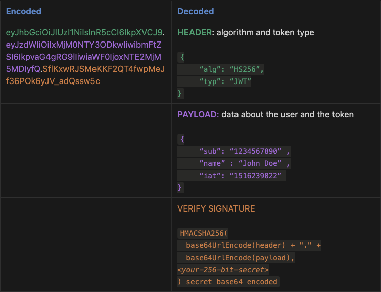
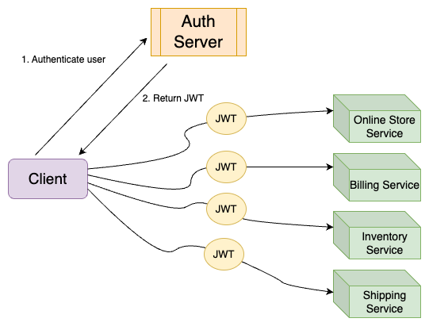

Even though JWTs (JSON Web Tokens, pronounced “jots”) have been around since [2010](https://en.wikipedia.org/wiki/JSON_Web_Token), it’s worth examining their more recent rise to become the dominant standard for managing authentication requests for application access.

When JWTs were first introduced, it was immediately clear that they were already an improvement on using a single string to represent the user information needed for authentication. The single string credential method was simple, but not as secure. There was no way to provide additional data or internal checks about the validity of the string or its issuer. With JWTs, there are expanded capabilities with more parts; there is a **header**, JSON-encoded **payloads** (called “claims”, which hold data about the user and about the token itself, such as an expiration date), and a **signature** (either a private key or a private/public key combination).

Let’s look a bit more closely at what a JWT is, review a short history of JWT evolutions and adoption, then discuss how JWTs are used in authentik.

<!--truncate-->

## What is a JWT?

As briefly described above, a JWT is a security token that is to used securely and efficiently pass signed payloads containing the identity of authenticated users between servers and applications or other services. JWTs are a structured format token, made up of encoded JSON content.

There are typically three parts to a JWT, and in an encoded JWT each part is separated by a period (.). In the table below, the entire encoded JWT is shown in the left column, with three different colors to highlight the three different parts, which are shown decoded in the right column.

Let’s take a closer look at each of the three parts, as shown above:

-   The **Header** is a familiar concept in authentication, as an HTTP Authorization \*\*\*\*request header can be used in APIs to hold user credentials. For a JWT, the two most common declarations in the header are `alg` (defines the hashing algorithm used to sign the JWT) and `typ` to declare the token as a JWT.
-   The **Payload** section of the JWT contains the _claims_, one of the most important and powerful part of JWTs. A claim is data, about the user and/or the token, in encoded JSON. There are seven official registered claims, plus many public claims that anyone can use. In addition, you can create private claims for use within you own environment. You can see a list of all registered and public `claims` on the official [website](https://www.iana.org/assignments/jwt/jwt.xhtml) maintained by IANA (Internet Assigned Numbers Authority).

In the example above, the following claims are included in the JWT: `sub` (the subject of the JWT), `name` (the name of person who requested/created it), and `iat` (the time at which the JWT was issued; this claim is used to determine the age of JWT).

**NOTE**: of course, in most cases you would not include sensitive information within the claims, because an encoded JWT can be easily decoded! However, there are certain use cases of including PII (such as user name) within a JWT, for use by internal processes within the application. For example, if application A uses authentik to login, the JWT should in most cases not be visible to the end user and should be treated as a password/credential/secret. If the JWT will be visible to the end user for some rare reason, then it should not include any PII.

-   In the **Verified Signature** part, we see more information about how the JWT was signed, as well as the signature that was created by the server using a secret key. The electronic signature is simply a unique mathematical computation, and this signature is for the specific payload of the JWT. If any data in the JWT is modified, then the JWT must be re-signed. In the case of malfeasance, the attacker would have to know the original secret or private key in order to re-sign. If they didn’t know the secret data, then the modified data is rendered useless because the server cannot validate the signature.

In the example above, the token is signed using a single secret key. This is known as _symmetric signing_, with the HMACSHA256 (HMAC + SHA256 checksum) algorithm. JWTs can also be signed with a public/private key pair (i.e using an RSA or ECDSA algorithm); this is known as _asymmetric signing_ because one single secret can not perform both operations (sign,validate / encrypt,decrypt).

There are two types of JWTs:

-   A **JWS** is an electronically signed JWT, but the content of the payloads is not encrypted. We use JWS in authentik, primarily because we (along with most in the industry) don’t see the overhead “cost” of encryption for users to be worth the benefits. Using a JWS also allows for developers to view data within the JWT (without having to do decryption). In authentik JWTs are, by default, symmetically signed, but you can select to use asymmetrically signed JWTs.

-   A **JWE** has encrypted payloads, so you cannot use a decoder tool such as [jwt.io](https://jwt.io/) to view the contents.

There are many websites and videos to help you learn more about the structure of JWTs and their benefits. Next let’s look at how they have evolved, and their rise in use.

## Evolution and industry adoption

JWTs were first [drafted as a concept in September 2010](https://jsonenc.info/jss/1.0/), and then [updated in 2015](https://www.rfc-editor.org/rfc/rfc7519). Along the way there have been some tweaks made, most notably strengthening how libraries handle a perfectly valid use of a `“alg”: “none”` setting in the Header.

Since 2015, JWTs have become one of the most common authentication methods. Given the stateless quality of JWTs, their improved security over single strings, and the fact that authorization and authentication data in a JWT token can be efficiently shared between multiple clients, servers, services, and microservices, their rapid adoption makes sense.

Consider how authentication and authorization are handled in a microservices setting. When a request is made on the client, the client first communicates with the authorization server and retrieves a JWT. This JWT contains user details and serves as the access token that is sent to microservices to gan access. All services within the environment can now validate and decode the token in order to determine the user who is requesting access.

This architectural workflow has proven to be effective in modern web applications that are often highly distributed. Indeed, JWTs are now the standard in most identity providers and cloud platforms, as well as many other enterprise systems and modern database platforms, such as Netflix, CockroachDB, MongoDB, VMWare, and the list goes on.

## Why use JWTs in authentik

Here at authentik we agree with the industry’s use of JWTs as the best method for managing user access (authentication _and_ authorization, but that’s a topic for a whole other blog!). In addition to building authentik to use industry standard best practices, we see only advantages to implementing JWTs.

JWTs are highly effective (and efficient) for enterprises; they are an improvement (more secure) than the old system of “pre-authentication”, with all application servers running behind a proxy on a private network, that replied only on the HTTP header to identify the user. With JWTs, the user info contained inside must first be authenticated, then access to all applications and services is authorized.

As discussed above and shown in the diagram, after the user info in the JWT is validated, it can be used to auto-approve access to all services within the environment, without the user needing to constantly supply credentials.

In authentik, this cross-services efficiency can be seen in a concrete example:

-   Application **A** (running in Kubernetes) wants to access application **B** (secured behind authentik). App **A** takes the JWT that it gets from Kubernetes (which acts as an auth server), sends that JWT to authentik, and authentik verifies it against the signing key from Kubernetes. Then, based on which namespace or other criteria App **A** is running in, authentik can give or deny access to App **B** or any other applications that are using authentik - all without any passwords being entered.

In the above example with authentik, you can view the authentik user interface to get insight and metrics into where these automated login happens. To learn more about authentik’s event logging for login activity, read our [documentation](/docs/events/#login) and take a look at the dashboards and metrics in the authentik user interface.

Another important factor about JWTs that we have not yet mentioned is the ability to define a expiration time for JWTs. Because JWTs cannot be revoked, it’s important to follow best practices and proactively set as short an expiration time as possible. In authentik, by default we set the expiration for access tokens at 5 minutes and refresh token at 30 days (while the refresh token is not a technically a JWT, it can be used to get new access tokens which are JWTs).

## What about you?

As always, we would be interested in hearing your thoughts on JWTs, in general and specifically within authentik. Were you already very familiar with JWTs, and their common adoption, and the advantages of the “cross-services” automated access provided in complex, distributed, microservices environments?

Let us know how our authentik users are implementing JWTs, and you are doing any type of customization, based on OpenID Connect. For example, the [machine-to-machine authentication feature](/docs/providers/oauth2/client_credentials) in authentik enables you to get a pre-configured JWT and use it in authentik to then get another JWT that is specifically for use within authentik.

Leave us a comment below, reach out to us at hello@authentik, and visit our [GitHub repository](https://github.com/goauthentik/authentik).
