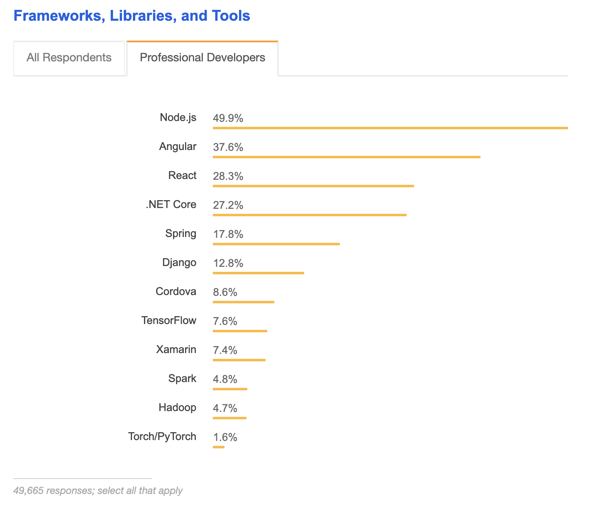
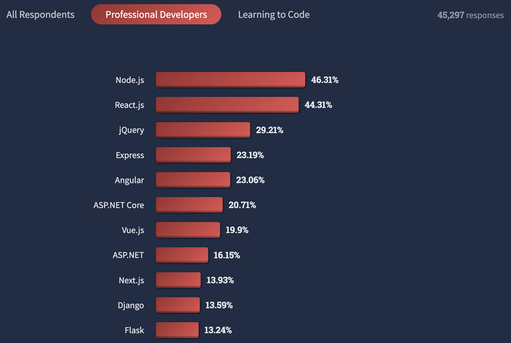
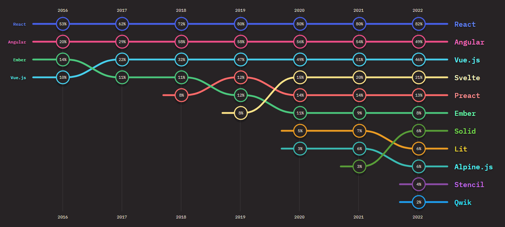

Back in 2018, I made a fateful decision: I chose to rebuild authentik using [Lit](https://lit.dev/) and not React.

We like to think that technical decisions are primarily, well, technical, but some of the biggest consequences of these decisions come from how a technology is adopted and used – not the technology itself.

So it was with React.

In this post, I’ll explain why I made this decision, how it did and didn’t pay off, and why, ultimately, I don’t regret it. The point isn’t to sway you toward or away from React or to make an argument about web frameworks in general, but to encourage a discussion about the choices early-stage startups have to make.

<!--truncate-->

And when I say startups here, I’m not talking about the scale-ups still calling themselves startups or the startup darlings with more dollars of venture capital than they can burn through, I’m talking about people like me: developers working full-time on trying to build a company out of a popular project.

## React vs. Lit: A brief history and a one-sided victory

React was first released in 2013 and when I was building the initial open source project that would eventually become Authentik Security, React was a known option but not, as it arguably is now, a default.

In 2015, Netflix and Airbnb started using React. Reactive Native for iOS came out that same year and later, React Native for Android. By 2018, the year I made the decision, 28.3% of developers had started using React.

_(data from 2018)_

React was popular and rising but not an obvious choice – not a choice that anyone would be surprised at for not choosing. Now, of course, it’s all different.

2022 StackOverflow [research](https://survey.stackoverflow.co/2022/) shows that 44.31% of developers now use React.

_(data from 2022)_

To get a sense of Lit’s popularity, in comparison, I had to narrow my search to JavaScript developers. Among JS developers, according to the [2022 State of JavaScript survey](https://stackdiary.com/front-end-frameworks/), Lit is used by only 6%.

It’s not a sheer popularity difference:

-   React has 232,063 packages on [NPM](https://www.npmjs.com/search?q=react) (Lit has [2451](https://www.npmjs.com/search?q=lit))
-   React has over [1600 contributors](https://github.com/facebook/react) (Lit has [149](https://github.com/lit/lit)).
-   React has over [14,000,000 users](https://github.com/facebook/react). (Lit has over [26,000](https://github.com/lit/lit)).

I won’t say this success was impossible to predict but it also wasn’t obvious.

These dynamics follow virtuous cycles: The more popular React became, the more developers wanted to try it; the more developers tried it, the more developers became proficient with it and the more they built with it; the more things built with React, the more companies demanded React skills and as demand rose, so did supply.

These numbers have real consequences in both technical and business contexts.

The more popular a framework, tool, or language is, the more we know about how to use it effectively and in which ways it’s most likely to fail.

Dan McKinley, VP of Engineering at Mozilla, [writes](https://mcfunley.com/choose-boring-technology) that “When choosing technology, you have both known unknowns and unknown unknowns.” He recommends choosing boring technologies (which React, arguably, has become) because “the capabilities of these things are well understood. But more importantly, their failure modes are well understood.”

And as a technology gets more popular, businesses that have adopted it benefit from a larger hiring pool. Just as it’s easier to find a Python developer than a COBOL developer, so is it easier to find a developer with React experience than it is to find one with Lit experience.

Ironically, I know this tradeoff well because I made essentially the same decision in reverse when I [picked Python](https://goauthentik.io/blog/2023-03-16-authentik-on-django-500-slower-to-run-but-200-faster-to-build) as Authentik’s primary programming language. Choosing Python made hiring easier but Python also imposes some performance limitations that we’ve had to mitigate and work around.

## Startups are made of informed gambles

The sum total of all the words written across the Andreesen Horowitz, Sequoia, and Accel blogs are aimed at one goal: _Reducing the amount of startup success that’s owed to successful gambling_.

This makes sense: The more that founding and building startups resembles a repeatable science, the safer venture capitalist funds are. But we don’t always take this idea to its logical conclusion.

Startups have often succeeded, broadly, due to correct (in retrospect) gambles on technology and consumer trends, but startups make a multitude of other bets – on people, on programming languages, on business models, and yes, on frameworks.

When we look backward, though, we tend to attribute too much credit to people who made gambles that turned out right. I’m not trying to take credit away from anyone, but rather to reframe the kinds of decisions people are making, so that present and future founders aren’t confused: these choices are always partially bets.

### Why I chose Lit

The most important context to this decision is in the header: Authentik Security is now a team and a company, but in 2018, Authentik Security was just me and Authentik Security was authentik, the open source project.

I was building authentik as a hobby and all the work I did on it was done outside my full-time work. In that period, a few limitations rose to the top:

-   I had few resources, both in terms of time and funds.
-   I wasn’t a front-end engineer.
-   I wanted to be able to build features over time, at my own speed, rather than work on nothing else for three months before having anything to show.

At the time, hiring potential wasn’t on my mind: Building and shipping was.

In the beginning, the project was entirely rendered server-side. With Django, I had some tooling available that made it easy to build forms for submitting and showing data as well as adding pagination, tables, and sorting.

But a few features emerged on the roadmap that soon made this setup feel less simple. I wanted to give users the ability to refresh data with a button press and complete searches without reloading the page, for example.

In late 2020, I started migrating to Lit, already knowing a lot of work was ahead. At that point it would often happen that when new features were introduced, they would be in the UI but not in the API, often due to forgetfulness. This turned things into a constant cat and mouse game to keep the API updated without knowing what endpoints were actually required.

Then, toward the end of 2022, with support from [Open Core Ventures](https://opencoreventures.com/), [authentik became Authentik Security](https://goauthentik.io/blog/2022-11-02-the-next-step-for-authentik). And once again, the product roadmap made some demands.

Inflexibility was an early flaw in authentik. Because we relied on server-side rendering, we also relied – and made our users rely – on browsers. But we had always wanted to go beyond that, to get to a point where there was a dynamic back-and-forth between the client and the server.

Flexibility, then, was the primary goal and that’s the primary lens through which I evaluated the libraries and frameworks available at the time.

### 3 reasons I chose Lit over React

My choice of Lit came down to three factors, all of which emphasized that goal of flexibility.

-   **Lit used a browser-native technology**. Traditional web development often involves a lot of clashing CSS files, making it difficult to use, say, a component from one library and a different component from another. Lit doesn’t have this problem because it uses a [shadow DOM](https://developer.mozilla.org/en-US/docs/Web/Web_Components/Using_shadow_DOM) and the shadow DOM is a standard accepted by all browsers. We had flexibility on one end, with browsers, but on the other end, because these web components were browser-native, we could also use them across numerous frameworks (including React).
-   **Lit offered better modularity.** With the shadow DOM functionality, I was able to isolate individual components and apply CSS to only those components. That meant greater flexibility because I could mix and match but it also meant more modularity. I didn’t need a giant CSS file that could cause all kinds of effects when changed. Instead, I had modular bundles of isolated components and individual CSS files.
-   **Lit didn’t require me to rebuild**. This was less an advantage of Lit and more so a disadvantage of React. If I had chosen React, I would have had to rebuild authentik from the ground up, or use a lot of hacky workarounds to migrate at a slower pace. And once I had done that, I would have been limited, to a degree, to what React and the React community offered. There were things that were standard to browsers that I wouldn’t have had access to or would have only had access to if they had explicit React support. There were bridges between standard components and React components, but they were built by community projects and I didn’t want to get stuck relying on a project some [random person in Nebraska is thanklessly maintaining](https://xkcd.com/2347/).

### Lit and React is apples and oranges

So far, I’ve skipped over what might be the most important way to compare Lit and React – Lit is a set of utilities for building web components and React is a web framework.

As React, and web frameworks in general, have become prominent, this kind of comparison has gone understated. If you only compare frameworks against other frameworks, you’re slipping into the assumption that you need a framework at all. As you compare pros and cons, you might be missing out on a whole world of pros and cons that a different approach provides.

The advantages I described above don’t come out of Lit being _better_ than React, really, but come from Lit offering an approach that suited my needs better than React did (at least at the time).

With Lit, we could render the main page server side but the HTML that the server was rendering would contain web components with different features. That made for a very different migration path, one that allowed us to migrate part by part.

If we wanted, for example, to add a new component for a table, we could have the server return it without changing too much on the server side. But on the client side, we could add logic and pagination and other features over time. That just wasn’t doable before we adopted Lit and Lit made that kind of migration path more doable than React would have.

## Tradeoffs all the way down

Scroll through HackerNews and you’ll find numerous, often tense or fiery, discussions of frameworks. Some people will be diligent about costs and benefits but many will be brand-loyal; arguing on the behalf of one framework and trashing all the others.

> “My fellow engineers, please stop asking ‘Is this process good or bad?’ and start asking “Is it well-suited to my situation?” - [Jocelyn Goldfein](https://review.firstround.com/the-right-way-to-ship-software)), former engineering executive at Facebook and VMware

The lesson I learned from choosing between Lit and React – and living with the consequences – is that these decisions are tradeoffs all the way down.

The tricky part of this question is that identifying your situation is harder than it seems. Scale-ups and enterprises can rely on better pattern-matching than true, early startups can. Each startup, like [unhappy families](https://www.goodreads.com/quotes/7142-all-happy-families-are-alike-each-unhappy-family-is-unhappy), is unhappy in its own way.

When I defined our situation, three factors came to the top:

1. Shipping was our top priority.
2. A faster shift in rendering approaches was more important than slower hiring speeds.
3. Flexibility was more valuable than the help a framework would offer.

Remember, at the very beginning, it was me alone working on an open source hobby project when I had time outside of a full-time job. Especially considering the work I had already done and my lack of frontend engineering skills, it was clear that it was more important to build and ship than to restart.

Here, the tradeoff was that I was able to build authentik faster and deliver it to users sooner, but now I’m missing out on the advantages that being involved with a thriving community like React would offer.

With Lit, we could migrate more easily and more practically, migrating more and more over time rather than either rebuilding or migrating all at once. Looking back, I don’t know if I could have completed such a major shift in how we were rendering and if I could have, I don’t know if it would even be done by now.

So Yes, finding and hiring developers with Lit experience is much harder than finding and hiring developers with React experience. Hiring developers is already notoriously hard and we made it harder. There is however the advantage that due to the smaller user-base of Lit, that in the rare case we do find a Lit developer, they tend to be very passionate about the same reasons why we chose Lit.

That said, there’s a tradeoff to the tradeoff: React is so popular and so approachable that you have to be careful about finding really good developers. Lit, because it’s less popular, has a better signal-to-noise ratio.

Since flexibility was our highest priority, the primary advantage of a framework became a disadvantage for us. The upside of a framework is that it helps; the downside is that it helps.

For some situations, having decisions taken away from you by the framework can make everything easier. But for other situations, including ours, it was better to take on more work so we could get the flexibility we knew our users would want.

That all said, the main takeaway from realizing the extent of these tradeoffs is that, as founders and developers, we will eventually, inevitably, realize a decision had tradeoffs we didn’t expect. We’ll think, mistakenly, that if we had only known everything in the beginning, then we would have made another choice. That can create a temptation to wait and plan and cower but instead, it should push us to build, ship, and iterate.

Way back in 2009, Jeff Atwood found the [perfect words](https://blog.codinghorror.com/version-1-sucks-but-ship-it-anyway/) and they still apply more than a decade later: “At the end of the development cycle, you end up with software that is a pale shadow of the shining, glorious monument to software engineering that you envisioned when you started.”

Imperfection is inevitable and gambling is necessary, meaning we’ll always have wins and losses, pros and cons, and benefits and costs – tradeoffs all the way down.

## Plot twist: We are React users after all

A different version of this post is a polemic, a hot take that says “Hey, you know the most beloved web framework in the past five years? It actually sucks.” But that’s not true and that’s not what I wanted to do.

I described a lot of reasons why I didn’t choose React back in 2018 but even now, to be transparent, I tend to be skeptical of the dominance of web frameworks. Even then, agnosticism has to be central.

Authentik uses a framework for our documentation website that uses React. I’m not opposed to using React elsewhere if it fits our needs best. Everything comes with tradeoffs and everything has a place.
