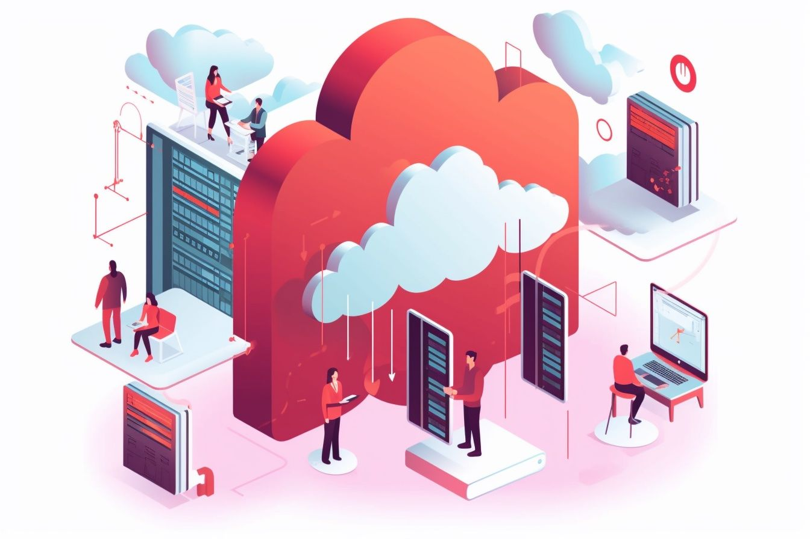

In today's digital landscape, businesses of all sizes increasingly rely on Software as a Service (SaaS) to streamline their operations and improve overall efficiency. However, as the adoption of SaaS applications continues to rise, so too do the security risks associated with these platforms. This has led to a growing demand for robust enterprise security features and Single Sign-On (SSO) solutions that can effectively safeguard sensitive data and protect businesses from cyber threats. In this blog, we'll delve into the intricacies of enterprise security, explore the benefits of SSO for businesses of all sizes, and examine the role of automation in ensuring robust security. We'll also discuss the importance of building SaaS apps with scalability in mind and highlight Authentik Security’s solution, [authentik](https://goauthentik.io/), as a unified authentication tool to help secure your organization.

<!--truncate-->

## The importance of enterprise security in SaaS applications

The increasing reliance on SaaS applications has made it more critical than ever for organizations to prioritize their security. With cyber threats on the rise, businesses must ensure that their SaaS platforms are protected from many risks, including data breaches, compromised credentials, and malicious insiders.

### Data breaches and their impact on businesses

Data breaches can have severe consequences for businesses, ranging from financial losses and reputational damage to legal implications. In recent years, [supply chain attacks](https://goauthentik.io/blog/2023-04-07-supply-chain-attacks-what-we-can-all-do-better) have surpassed malware-based attacks by 40%, highlighting the need for stringent security measures to protect sensitive data.

One of recent most significant supply chain attacks was the SolarWinds incident in 2020. In this attack, hackers inserted malicious code into the company's software updates, which were then unknowingly distributed to thousands of customers. This is a stark reminder of the potential dangers associated with inadequate enterprise security in SaaS applications.

### The role of SSO in enhancing enterprise security

Single Sign-On (SSO) solutions have become an essential component of enterprise security, providing users a convenient and secure way to access multiple applications with a single set of credentials. By streamlining the authentication process and reducing the need for multiple passwords, or better yet removing passwords and instead using tokens, [JWTs](https://goauthentik.io/blog/2023-03-30-JWT-a-token-that-changed-how-we-see-identity), MFA, and other more secure methods, SSO can help minimize the risk of compromised credentials and improve overall security.

SSO solutions can also provide additional layers of authentication within an organization's software ecosystem. This can include secure handshakes between components using internal-only tokens, as well as machine-to-machine authentication using internally generated JWT tokens.

By implementing SSO as part of a comprehensive security strategy, businesses can better safeguard their sensitive data and protect themselves from the growing threat of cyber attacks.

## Good security can't be automated: the human element in SaaS security

While automation has revolutionized many aspects of modern business, it also presents new challenges when it comes to cybersecurity. As businesses become increasingly reliant on automated processes, they can become complacent and overlook potential security risks in their SaaS applications.

### The dangers of over-reliance on automation

Automation has undoubtedly made it easier to update and manage software, but it has also created new opportunities for cybercriminals to exploit. With so many processes now automated, it's easy for businesses to overlook the security implications of their actions and inadvertently expose themselves to cyber threats.

For example, the widespread use of automatic updates can make it easier for hackers to insert malicious code into software packages, as seen in the SolarWinds attack. To mitigate these risks, businesses must strike a balance between automation and human oversight, ensuring that their security measures are not entirely reliant on automated processes.

### The role of human expertise in cybersecurity

While automation can streamline many aspects of security, there's no substitute for the expertise and vigilance of human security professionals. By combining automated processes with human oversight, businesses can more effectively identify and address potential security risks in their SaaS applications.

Some key areas where human expertise can make a difference in cybersecurity include:

-   Monitoring and analyzing security events: By regularly reviewing logs and other security data, human security professionals can identify potential threats and take appropriate action.
-   Managing privileged accounts: Ensuring that access to sensitive systems is strictly controlled and regularly audited can help prevent unauthorized access and minimize the risk of insider threats.
-   Implementing robust authentication and access controls: By combining SSO with other security measures, such as multi-factor authentication (MFA) and role-based access control (RBAC), businesses can create a more secure environment for their users.

By embracing a multi-layered approach that combines automation with human expertise, businesses can create a more secure environment for their SaaS applications, minimizing the risk of data breaches and other cyber threats.

## Building SaaS apps with scale in mind: preparing for growth and expansion

As businesses grow and evolve, so too do their security needs. Building SaaS applications with [scalability in mind](https://goauthentik.io/blog/2023-06-13-building-apps-with-scale-in-mind) ensures that they can accommodate this growth and continue to provide robust security as the organization expands.

### Designing for scalability from the ground up

When developing a SaaS application, it's essential to consider how the app will adapt to changing security requirements as the business grows. This involves designing the app's architecture and infrastructure with scalability in mind, ensuring that it can easily accommodate new users, features, and integrations.

Some key considerations for building scalable SaaS applications include:

-   Modular design: By breaking the app down into smaller, reusable components, it's easier to update and expand the app as needed.
-   Flexible infrastructure: Ensuring that the app's infrastructure can scale to accommodate increased demand helps prevent performance bottlenecks and other issues.
-   Integration with existing systems: Designing the app to work seamlessly with other tools and platforms can help streamline security management and reduce the risk of compatibility issues.

By taking a proactive approach to scalability, businesses can create SaaS applications that are better equipped to handle the security challenges of a growing organization.

### Authentik Security: a scalable solution for SaaS security

Authentik Security’s flagship product, [authentik](https://goauthentik.io/), is a unified authentication platform designed to help businesses protect their applications and safeguard sensitive data. With features such as SSO, IAM, and advanced authentication capabilities, Authentik Security provides a comprehensive security solution that can scale with your organization's needs.

Some of the key benefits of authentik include:

-   Seamless integration with popular identity providers: authentik supports a wide range of identity providers, making it easy to integrate with your existing systems.
-   Customizable session duration: authentik allows you to configure session durations to suit your organization's security requirements.
-   Machine-to-machine authentication: authentik uses JWT tokens for secure communication between components, providing an additional layer of security.
-   Robust access controls: With features such as RBAC, authentik enables businesses to implement strict access controls and minimize the risk of unauthorized access.

By choosing a flexible and scalable security solution like authentik, businesses can ensure that their SaaS applications are well-equipped to meet the security challenges of today and tomorrow.

## Embracing a collaborative approach to cybersecurity

In the face of ever-evolving cyber threats, businesses need to adopt a collaborative approach to cybersecurity. By working together and sharing information about known or suspected attacks and vulnerabilities, businesses can better protect themselves and their customers from the risk of data breaches and other cyber attacks.

### Building strong relationships with software vendors

To enhance their security posture, businesses should foster close relationships with their software vendors. This includes requesting Software Bills of Materials (SBOMs) to better understand the components used in their software and practicing "dependency vendoring" to ensure that all third-party tools and libraries are thoroughly reviewed by their security team.

In addition, businesses should stay informed about security updates, release notes from their vendors, and ensure that any security-related patches are promptly applied.

### Encouraging collaboration and information sharing

By embracing a culture of collaboration and information sharing, businesses can better protect themselves and their customers from cyber threats. This involves actively participating in industry forums and communities, sharing information about known or suspected attacks and vulnerabilities and seeking advice from fellow security professionals.

At the same time, businesses must also be willing to listen to the collective wisdom of the cybersecurity community and take on board the advice and insights provided by their peers.

### Investing in human expertise and in-house tooling

While automation can play a valuable role in security, it's essential to recognize the importance of human expertise and in-house tooling in protecting your organization's SaaS applications. By investing in skilled security professionals and developing custom security tools tailored to your business's unique needs, you can better safeguard your sensitive data and protect your organization from cyber threats.

## The future of SaaS security

As the adoption of SaaS applications continues to rise, businesses must prioritize their security and take proactive measures to protect their sensitive data. By implementing robust enterprise security features, such as SSO, and embracing a collaborative approach to cybersecurity, businesses can better safeguard their SaaS applications and prepare for future security challenges.

Authentik Security provides a comprehensive, scalable solution for SaaS security, offering businesses a powerful tool to help secure their organizations and protect their sensitive data. By choosing a cutting-edge solution like authentik, businesses can stay ahead of the curve and ensure their SaaS applications' ongoing success and security.
