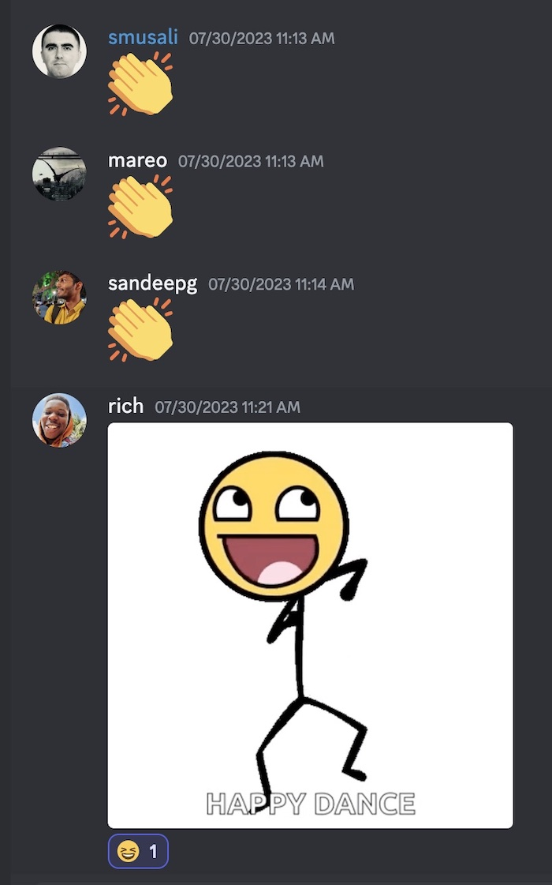
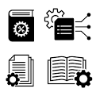

<aside>

🎉 Congratulations to all participants and to the Top Three prize winners!

</aside>

The first ever authentik hackathon just wrapped on Sunday, and we had a great time!

A huge thanks to our persistent hackers, who hacked from Wednesday through Sunday, and made some fantastic contributions to [authentik](https://goauthentik.io/). We are already looking forward to the next one (winter 2023, maybe?), and to another round of intense fun with our community members.

<!--truncate-->

### Our intrepid participants

We had folks spread across four continents and six time zones! From the US West coast (Pacific time zone) to Texas to Western Africa, Central Europe, Eastern Europe and Mumbai, India, we had a time difference spread of 12 and a half hours. So yes, time zones are, errrrmmm… interesting. But it was actually quite manageable, and thanks to those on the early and late extremes of the hours! While not all of the people who registered actually showed up and hacked with us, those who participated were energized and very ready to contribute to and learn about authentik.

Over the five days, we had regularly scheduled Check-in calls to stay in touch with each other using voice chat on our #hackathon channel in Discord, and throughout the day (and night!) we could check in with each other on team-specific channels or on the main #hackathon channel.

### What we hacked on

Take a look at our [GitHub repo](https://github.com/goauthentik/authentik) for specific Issues and PRs, but the contributions ranged widely, from email configurations to [define allow lists](https://github.com/goauthentik/authentik/pull/6426) (thanks [@sandeep2244](https://github.com/sandeep2244)!), to adding [Kerberos as an authentication protocol](https://github.com/goauthentik/authentik/pull/6391) (kudos to [@mareo](https://github.com/Mareo) and [@rissson](https://github.com/rissson) for this amazing and challenging contribution!), to a wonderfully surprising amount of documentation additions on [managing users](https://github.com/goauthentik/authentik/pull/6420) (way to win, [@Baloc](https://github.com/Baloc)!) and improving the [installation and Beta upgrade docs](https://github.com/goauthentik/authentik/pull/6429) (thank you so much [@richardokonicha](https://github.com/richardokonicha)!!)!

We also had PRs to improve the authentik UI (specifically the [Library page](https://github.com/goauthentik/authentik/pull/6409) of applications), and a detailed, in-depth answer to a question about how to prompt users, via authentik’s customizable Flows and Policies and also by using incentivization, to [configure a multi-factor authentication tool](https://github.com/goauthentik/authentik/issues/4571) (thank you [@smileyj](https://github.com/smileyj)!).

### And the top three winners are …

Congrats to the top prize winners:

 Our contributor @richardokonicha from Nigeria took third place for his hard work on our Beta upgrade docs... which led to improvements on the Docker Compose and the Kubernetes installation documentation. Richard will be forever famous for his insistence on testing the documentation (Every. Step. Of. It.) and for putting on the user’s hat in order to produce clear, simple instructions.

 The Wow Factor Contribution of adding Kerberos as a new authentication protocol came in at second place, and was worked on at a furious pace by two fellow Frenchmen, [@mareo](https://github.com/mareo) and [@rissson](https://github.com/rissson). Dramatic demos and happy tired faces are _de riguer_ at hackathons, and this substantial contribution did not disappoint!

 At top place is [@Baloc](https://github.com/baloc), who also hails from France, and added substantial value by contributing procedural docs about user management. The tech docs badly need more How To content, and [@Baloc](https://github.com/baloc) bravely dove right in. We now have shiny new docs for all of the CRUD operations plus a load of reference content about session details, events, tokens, group memberships, MFA authenticators… there’s a lot of powerful functionality in authentik’s user management, and now we have docs to prove it!

### Oh the [good] drama!

Working closely with others on a project, sharing screens back and forth, with a relatively tight timeline can add a level of excitement and energy. Maybe we were lucky and just happened to have the World’s Nicest People as our participants, or maybe software folk are just like that, but the energy was always positive and there were always helping hands (and eyes) available if things got sticky.

### Highlights

Some of the best takeaways from the event include:

-   Watching others work is fascinating…. we all have our own ways of moving around our IDEs, making quick edits to config files (vi anyone?) and navigating Git repos, but wow the variety of exactly how different people do the same task is amazing. Learning from others is going to happen for sure at a hackathon, and surprisingly you can even learn a bit about yourself and your own work patterns!
-   Embrace the rabbit holes! Sure, it can be exhausting for us introverts to interact with people and learn a TON from watching their work styles, and even more exhausting when you realize that your hacking partner is correct, we really _DO_ need to install a K8S cluster so that you can do some testing… but it is also immensely rewarding. A hackathon is the perfect time to give yourself permission to try something new, to spend a long while banging at something, guilt-free, and to put your real-world work responsibilities aside.
-   The strength of community, and the ever-fresh wonder of chatting with people from all over the globe, is invigorating. Everyone in software is a builder, and building with others, in cities or locales that you might never have even heard of, is simply amazing, refreshing, and fun.
-   authentik does a lot more than even our (relatively new) authentik team knew! (Well, our founder and CTO Jens knew, since he built it…) It was great fun to explore some of the deeper capabilities and functionality of authentik, and to have the original builder there to learn from.
-   We had fun and moved fast, but also pushed our discipline to follow the regular authentik build rules (like `make website`), naming standards for our PRs, coding guidelines, etc. A little standardization and rule-following didn’t dampen any of the fun, and made things easier when it was time to create PRs and merge our contributions.

### Join us for the next one!

We aren’t yet sure of the exact schedule, but authentik will definitely have another Hackathon! We will have more great prizes (we know money isn’t everything but a little competitive compensation for your time and effort is nice!), and celebrate the camaraderie and contributions.

In the meantime, drop into our repo anytime, look around, and see if there is anything to want to hack on and make a contribution!

See you there, and thank you all for being part of the authentik community.
