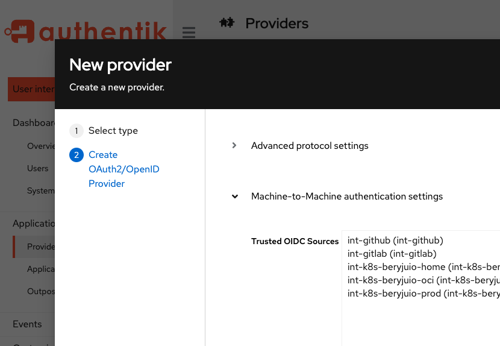

> **_authentik is a unified identity platform that helps with all of your authentication needs, replacing Okta, Active Directory, Auth0, and more. Building on the open-source project, Authentik Security Inc is a [public benefit company](https://github.com/OpenCoreVentures/ocv-public-benefit-company/blob/main/ocv-public-benefit-company-charter.md) that provides additional features and dedicated support._**

---

We have provided M2M communication in authentik for the past year, and in this blog we want to share some more information about how it works in authentik, and take a look at three use cases.

## What is M2M?

Broadly speaking, M2M communication is the process by which machines (devices, laptops, servers, smart appliances, or more precisely the client interface of any thing that can be digitally communicated with) exchange data. Machine-to-machine communication is an important component of IoT, the Internet of Things; M2M is how all of the “things” communicate. So M2M is more about the communication between the devices, while IoT is the larger, more complex, overarching technology.

Interestingly, M2M is also implemented as a communication process between business systems, such as banking services, or payroll workflows. One of the first fields to heavily utilize M2M is the [oil and gas industry](https://blog.orbcomm.com/onshore-to-offshore-how-m2m-is-changing-oil-gas-world/); everything from monitoring the production (volume, pressure, etc.) of gas wells, to tracking fleets of trucks and sea vessels, to the health of pipelines can be done using M2M communication.

Financial systems, analytics, really any work that involves multi-machine data processing, can be optimized using M2M.

> “Machine to machine systems are the key to reliable data processing with near to zero errors” ([source](https://dataconomy.com/2023/07/14/what-is-machine-to-machine-m2m/))

Where there is communication in software systems, there is both authentication and authorization. The basic definition of the terms is that _authentication_ is about assessing and verifying WHO (the person, device, thing) is involved, while **_authorization_** is about what access rights that person or device has. So we choose to use the phrase “machine-to-machine communication” in order to capture both of those important aspects.

> Or we could use fun terms like **AuthN** (authentication) and **AuthZ** (authorization).

So in some ways you can think of M2M as being like an internal API, with data (tokens and keys and certs and all thing access-related) being passed back and forth, but specifically for authentication and authorization processes.



<!--truncate-->

## M2M communication in authentik

As part of our providing a unified platform for authentication, authentik supports OAuth2-based M2M communication. By “unified platform” we mean that authentik provides workplace authentication for team members, B2C login by web site visitors, global communities and non-profit teams, educational societies, and [coming soon] mobile authentication. So that all authentications needs are met by authentik, as a unified platform.

### Use cases for M2M in authentik

Macine-to-machine communication speeds processing and adds a layer of security to inter-application and complex, multi-machine systems. With authentik’s M2M functionality, you can take advantage of these aspects, and optimize your workflow for authentication and authorization between servers, applications, and any provider or source in your ecosystem.

**Common workflow**

The workflow for all three of the use cases that we discuss below share several core common steps:

1. Obtain a token from the environment you are working in (i.e. a build/CI tool such as GitLab or GitHub, or Kubernetes for applications running on Kubernetes).
2. Pass the token, via [client_credentials](https://goauthentik.io/docs/providers/oauth2/client_credentials), to authentik.
3. In the response, authentik returns a JWT (JSON Web Token).
4. The token is then used to authenticate requests to other services elsewhere. (These other services need to check the token for its validity, which can be done with the [proxy provider](https://goauthentik.io/docs/providers/proxy/) in authentik for example).

**Three authentik use cases**

Lets take a look at three specific use cases for implementing M2M with authentik.

**1. Building Docker images and passing them to a [Docker registry](https://docs.docker.com/registry/)**

After building and testing your application, you might want to package your application as a Docker image and push it to a registry so that others can use it for deployment.

For this use case, you can use M2M with authentik to push the package to your registry without needing to login yourself, or needing a password, or even a pre-defined service account, to the registry. Instead, you can create a policy with authentik to allow a specific repository in your CI platform to push to the Docker registry. When logging into the registry, you can use the token you already have access to from the platform you’re running on, and the rest happens behind the scenes!

For a real-life example, with code samples, take a look at my blog “[Setup a docker registry for passwordless Docker builds with GitHub/GitLab using authentik](https://beryju.io/blog/2022-06-github-gitlab-passwordless-docker/)”, which provides step-by-step instructions with code blocks.

**2. Collect Prometheus metrics from multiple clusters**

If you use Prometheus to monitor multiple Kubernetes clusters, you might want to collect all Prometheus metrics and put them in one place, using something like [Thanos](https://thanos.io/) or [Mimir](https://grafana.com/oss/mimir/) in order to better analyze the data. Using M2M functionality in authentik, you can simplify authentication, so that the source (the cluster sending the metrics, in this case) can authenticate itself with the receiving target cluster.

In this use case, you will create an expression policy, in which you define service accounts to allow communication between that specific cluster and authentik.

-   You create an OAuth Source for each cluster (since each cluster usually has its own unique JWT Signing key). On the **Create a new source** panel, select **OpenID OAuth Source** as the type, and then click **Next**. Then you will need to populate the following fields:
    -   **Consumer key**, **Consumer secret**, **Authorization URL**, **Access token URL**, and **Profile URL, and OIDC JWKS** (to obtain the key for the cluster, run the command `kubectl get --raw /openid/v1/jwks`).
-   You can create a proxy provider to authenticate the incoming requests, where the proxy provider functions like a traditional reverse-proxy, sending traffic to Thanos or Mimir in the cluster but also requiring authentication for any requests. When defining your proxy provider, use the following syntax:

    ```python

    # Replace these values with the namespace and service-account name for your prometheus instance
    allowed_namespace = "prometheus-namespace"
    allowed_service_account = "prometheus-sa"

    jwt = request.context.get("oauth_jwt", None)
    if not jwt:
        return False
    allowed_sa = [
    f"system:serviceaccount:{allowed_namespace}:{allowed_service_account}",
    ]
    return jwt["sub"] in allowed_sa
    ```

    Then the rest is same as in the first use case; obtain a JWT from the K8s cluster, send the token to authentik, get back a diff token, then send that token to Thanos, Mimir, or where ever you want to store the metrics. Prometheus then uses that token to authenticate incoming requests from the other clusters. Actually, you can configure Promethesus to do the token exchange work, by using the `oauth2` configuration option. For an example of how this can be set up, refer to [this YAML file](https://github.com/BeryJu/k8s/blob/b4b26e5/common-monitoring/monitoring-system/prom-agent.yaml#L24-L39), where I configured `remote_write`.

**3. GitOps with M2M and Loki**

This third use case is a twist on the first two use cases, but even more simple.

We can utilize GitOps to configure [Loki alerting rules](https://grafana.com/docs/loki/latest/alert/), by using GitHub actions and a proxy provider to make Loki publicly accessible. This setup combines the use of a CI platform (as in the first use case) and using a proxy provider to authenticate requests (as in the second use case). In this third case, the authentication is for the requests from GitHub Actions to Loki.

-   Create an OAuth Source for GitHub, selecting **OpenID OAuth Source** as the type. Then, instead of populating the **OIDC JWKS** field, you use the **OIDC JWKS URL** field and set that to https://token.actions.githubusercontent.com/.well-known/jwks.
-   As with the second use case, create proxy provider, which acts like a traditional reverse-proxy, sending traffic to Loki, but also authenticating any requests.
-   Create an expression policy, using the following syntax:

```python
# Replace the two values below
github_user = "my-user"
github_repo = "my-repo"

jwt = request.context.get("oauth_jwt", None)
if not jwt:
  return False
if jwt["iss"] != "https://token.actions.githubusercontent.com":
  return False
if jwt["repository"] != f"{github_user}/{github_repo}":
  return False
return True

```

-   Finally, call a snippet in a GitHub composite action (this can be done manually or programmatically) to exchange the tokens between the GitHub action and Loki. The proxy provider then verifies the tokens and forwards the requests to Loki.

### What’s next

Look for our upcoming tutorial about configuring machine-to-machine communication using authentik. As part of the tutorial, we will provide a GitHub composite action that bundles the multiple steps involved in token creation and exchange into a single, reusable action, instead of needing multiple `run` commands.

We’d like to hear from you about how you use M2M, or how you plan to in the future. And as always, if you are interested in collaborating with us on our M2M functionality, or contributing to our documentation, visit us in our [GitHub repository](https://github.com/goauthentik/authentik) or reach out to us at [hello@goauthentik.io](mailto:hello@goauthentik.io).
