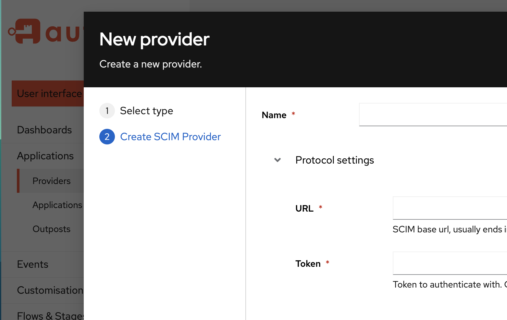

> **_authentik is an open source Identity Provider that unifies your identity needs into a single platform, replacing Okta, Active Directory, and auth0. Authentik Security is a [public benefit company](https://github.com/OpenCoreVentures/ocv-public-benefit-company/blob/main/ocv-public-benefit-company-charter.md) building on top of the open source project._**

---

As a young security company, we’ve been working on our implementation of SCIM (System for Cross-domain Identity Management), which I’ll share more about below. SCIM is in many ways a great improvement on LDAP, but we’ve run into challenges in implementation and some things just seem to be harder than they need to be. Is it just us?

<!--truncate-->

# Improvements on LDAP

From a security standpoint, it’s wise not to expose LDAP (Lightweight Directory Access Protocol) to the internet if you’re using Active Directory, OpenLDAP, FreeIPA or anything similar as your source of truth for authentication. SCIM fills a need for directory synchronization in a cloud-native world in which many companies aren’t hosting the software they use on their own servers.

SCIM, being an HTTP API specification, is much simpler and (in theory) gives you less to worry about than LDAP (being its own specific protocol). SCIM also offers time- and cost-saving advantages over Just in Time provisioning, especially for scaling companies. SCIM can save hours of company time for IT admins who no longer have to manually create individual accounts across multiple applications for new team members. Offboarding is also streamlined as departing team members can be deprovisioned automatically, preventing unauthorized access.

Most modern SaaS applications support SCIM, making it essential for security vendors to support the protocol, but it does come with its drawbacks.

# Growing pains

authentik currently supports SCIM going outwards; which means is that authentik is your source of truth/central directory, and you can use authentik together with a tool like [Sentry](https://sentry.io) that supports SCIM. In this case all your users or employees in authentik automatically get created in Sentry, with their correct group assignment, and they can just log in.

Most of the information and commentary I see about SCIM focuses on the advantages described above, but I don’t see a lot of talk about the pitfalls of SCIM. I’m sharing our experiences here and am curious if others have found the same or can tell me how they’re avoiding these (I would love to hear that we’re doing this wrong actually!).

## Deviation from standards isn’t well documented

Implementing a protocol based on reading the RFCs and then writing the code is in itself not fun (to be fair, this is true for implementing any protocol based on a standard). Having implemented SCIM in line with the specification though, once we actually started testing with different solutions that can receive SCIM, we discovered a lot of quirks along the lines of x solution doesn’t do y (which the documentation says they should) or they do it slightly differently, and so on.

This leads to a lot of workarounds which shouldn’t be necessary or things that simply don’t work without a clear cause. For example, when we started testing SCIM with Sentry, we ran into a lot of deviations (to their credit these were mostly listed in their [documentation](https://docs.sentry.io/product/accounts/sso/#scim-provisioning)). One of the issues I ran into when testing locally was when we created a user with SCIM, it just returned an error saying, “Please enter a valid email address” even though we _had_ sent it a valid email address. At least Sentry has the advantage of being open source, so we can just go and look at the code and see what’s happening, but this is still no small effort and you don’t have that option with closed source solutions.

You can see other examples of confusing/unexpected behavior from SCIM [here](https://github.com/goauthentik/authentik/issues/5396) and [here](https://github.com/goauthentik/authentik/issues/6695).

## Testing isn’t built out

Some protocols make a big effort to uphold the adherence to the standard. OpenID Connect is another standard that’s well defined by multiple RFCs, but also has a lot of room for vendor-specific quirks. However, with OpenID we have the reassurance that the [OpenID Foundation](https://openid.net/foundation/) is behind it.

The OpenID Foundation is a non-profit standards body of which Authentik Security is a member, but anyone can join to contribute to working groups that support implementation. OpenID Connect offers an [entire test suite](https://openid.net/certification/about-conformance-suite/) made up of hundreds of tests that you can run against your implementation, testing for edge cases and all the behaviors that they define. If you pass all the required tests you can send them the test results and get a [certification](https://openid.net/certification/) (which we are also working on) that your software adheres to the standards.

Instead of working in the dark and trying to make sure you’ve interpreted the specs correctly (while testing with vendors who might have their own interpretations), you have some reassurance that you’re doing the right things when developing with OpenID Connect.

To my knowledge there isn’t an official equivalent for SCIM—there are some smaller community projects that try to do something similar, but again, then you have to rely on someone’s interpretation of the standard. Even the [SCIM website’s overview page](https://scim.cloud/) says, “Information on this overview page is not normative.”

## Updating a user is unnecessarily complex

As mentioned above, authentik currently supports SCIM in one direction, but we are [working on making it so that another application can send SCIM to authentik](https://github.com/goauthentik/authentik/pull/3051), to create users in it. In this process we’ve discovered that updating a user is surprisingly annoying to implement. With SCIM [you have two options to update a user](https://datatracker.ietf.org/doc/html/rfc7644#autoid-22):

-   You can either send a request to replace the user (for which you have to send _all_ the user’s data), or
-   You can send a patch request

A lot of vendors use the patch request option to update group membership: they send a patch request for a user and just say, for example, “Add that group,” or “Remove that group.” This approach makes more sense in the case of an advanced user with tons of groups, as you’re not replacing everything, just making adjustments to their membership. However, this patch request is done with a custom filtering expression language which is extremely and needlessly complex.

My first thought when I encountered this was, “Okay, can I just parse this with RegEx?” but it’s not possible. The correct way to parse it is with [ANTLR](https://www.antlr.org/), a parser generator for different kinds of grammars. The thing about ANTLR is that it’s a type of tool usually used to build a compiler: it allows you to define a grammar for which it generates a parser that can then parse things in said grammar. It’s not typically used for filtering language for directories and there are a lot of existing syntaxes that could have been used for this purpose. While luckily some people have written a full grammar for this, I was hoping that there would at least be an official definition for an ANTLR grammar.

# Immaturity bites

LDAP, being the more mature protocol (introduced in the ‘90s), has the advantage that deviations have been well documented and kinks ironed out. There are a handful of “standard” implementations like Active Directory, FreeIPA and some others. Similar to SAML support—there’s just been a lot more time to document edge cases and workarounds.

SCIM, despite being around since 2015, is still subject to a lot of different interpretations of the standard, which leads to varying implementations and quirks with how vendors do SCIM. There’s a maturity challenge at work here in both senses—from the vendors but also from ourselves. Since we’ve added SCIM to our product a lot later than LDAP, there’s still a lot of room for us to catch up and make our implementation better.

_Have you worked on SCIM implementation? Got advice for us? We’d love to hear from you in the comments._
