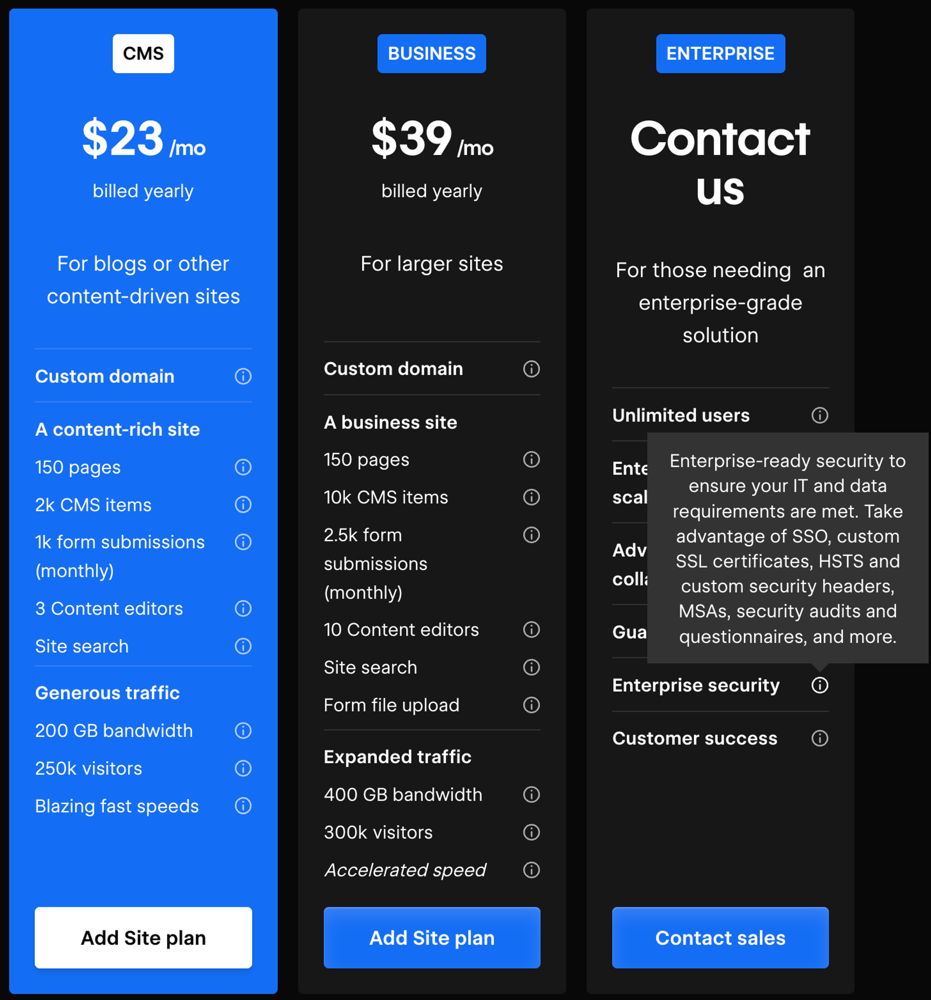

> **_authentik is an open source Identity Provider that unifies your identity needs into a single platform, replacing Okta, Active Directory, and auth0. Authentik Security is a [public benefit company](https://github.com/OpenCoreVentures/ocv-public-benefit-company/blob/main/ocv-public-benefit-company-charter.md) building on top of the open source project._**

---

Let’s say you’re working at a small startup: You’re the CTO, your CEO is a good friend, and you have a couple of developers working with you from a previous company. You’re building your initial tech stack, and you start – where else? – with GitHub.

The [pricing](https://github.com/pricing) is simple enough. There’s a pretty feature-rich free plan, but you’re willing to pay up because the Team plan includes features for restricting access to particular branches and protecting secrets.

But the enterprise plan, the plan that costs more than four times as much per user per month – the plan that seems targeted at, well, enterprises – promises “Security, compliance, and flexible deployment.”

> **Is security… not for startups?**

The feature comparison bears this out: Only the enterprise plan offers single-sign-on (SSO) functionality as part of the package – a feature that security experts have long agreed is essential. But don’t get mad at GitHub.

Do you want [Box](https://www.box.com/pricing)? You’ll have to pay twice as much for external two-factor authentication.

Do you want [Mailtrap](https://mailtrap.io/pricing/)? The team, premium, and business plans won’t do. Only the enterprise plan, which costs more than $300 per month more than the team plan, offers SSO.

Do you want [Hubspot’s marketing product, but with SSO?](https://www.hubspot.com/pricing/marketing/enterprise?products=marketing-hub-professional_1&term=annual) Prepare to pay $2,800 more per month than the next cheapest plan.

And these are only a few examples. [SSO.tax](https://sso.tax/), a website started by Rob Chahin, gathers many more. If you look through, you’ll see companies like [SurveyMonkey](https://www.surveymonkey.com/pricing/details/) and [Webflow](https://webflow.com/pricing) even restrict SSO to enterprise plans with a _Contact Us_ option instead of a price.

<!--truncate-->

You’ll also notice that many of the listings are outdated (the Hubspot listing was last updated in 2018, for example, but we quoted the current price).

Many developers are likely already familiar with the concept of an SSO tax, and some are familiar with the broader idea of a security tax. Fewer know why, despite these concepts entering the lexicon, vendors can still get away with quietly restricting basic security and sign-in features to expensive enterprise plans.

## Three types of security taxes

Vendors have managed to normalize charging exorbitant prices for basic security features. Here, we’re not even necessarily talking about often complex logging or monitoring features – the mere ability to sign in to the software itself is an opportunity to upcharge.

It’s a blurry line, but it’s worth distinguishing between _valuable_ features and _value-added_ features. Unlike other features, which are valuable but part of the base product, value-added features add incremental value on top of the base product. So, we expect GitHub to be basically operational on the free plan but look to other plans to see whether we want to add, say, a wiki feature.

Security taxes are baseline features pretending to be value-added features, and vendors can charge them by bundling them with those features. These security taxes are often exploitative because companies have to pay for more features than they need just to get a security feature that should have been in the base product.

A baseline feature is turned into a revenue-generation tool often far out of step with its actual maintenance costs.  “If your SSO support is a 10% price hike,” Chahin writes, “you’re not on this list. But these percentage increases are not maintenance costs, they’re revenue generation because you know your customers have no good options.”

Research from Grip, an identity risk management company, shows how the [lack of good options](https://www.grip.security/blog/why-sso-doesnt-protect-80-of-your-saas) plays out. Grip’s research shows that 80% of the SaaS applications employees use are not in their companies’ SSO portals. In their interviews with CISOs, SSO licensing costs – i.e., the SSO tax – were the top reason.

The same logic that applies to the SSO tax also applies to two other security taxes: the MFA tax and the user tax.

Security experts widely agree that SSO is essential for security, but multi-factor authentication is more basic still, making the act of charging extra for MFA even more egregious. But, as we saw in the intro, companies like Box charge extra for multiple authentication methods.

The user tax is more subtle. When companies charge excessive amounts per-user to secure those users' accounts, users must either choose to pay the security tax or engage in the highly insecure practice of sharing credentials among several individuals. To be clear, many companies charge on a per-user or per-seat basis (including Authentik), so you can’t call it a tax until the additional costs really become exorbitant.

## Why the anti-SSO tax movement failed

The SSO tax has become the most recognized of the three security taxes above.

By now, there seems to be broad acceptance that the SSO tax is unfair – largely thanks to the SSO Wall of Shame – but there hasn’t been much change from software vendors.

A grassroots effort like the SSO Wall of Shame would seem effective at public embarrassment. Still, even companies that target users who know better, such as [Docker](https://www.docker.com/pricing/) and developers, or [JFrog](https://jfrog.com/pricing/) and security engineers, charge an SSO tax.

Future efforts against security taxes will have to keep in mind the three reasons the SSO tax movement failed if change is ever going to happen.

**1. The SSO tax is too profitable and too easy to charge**

The most obvious reason is also the strongest. The very thing we’re complaining about – vendors charging too much for a feature that isn’t even that expensive to build or maintain – is exactly why they charge it.

Ben Orenstein, co-founder and CEO of remote pair-programming app Tuple, writes about [why SSO should be “table stakes”](https://tuple.app/blog/sso-should-be-table-stakes) and why so many other companies (including Tuple, before this post) charged it.

“If you’re a new SaaS founder and you want to maximize your revenue,” he writes, “I recommend you create an enterprise tier, put SSO in it, and charge 2-5x your normal pricing.” He even explains that because “SSO costs close-to-nothing after a little automation, this price increase is all profit.”

The math is pretty undeniable, proving Chahin’s basic idea: Vendors can add SSO to an enterprise tier and charge much more than it costs to maintain it.

Patrick McKenzie, formerly from Stripe, has tweeted about the [same logic](https://twitter.com/patio11/status/1481293496506253321?s=20&t=GSqe0KHLuJaY7TYPS-p4_w). “SSO is a segmentation lever,” he writes, “and a particularly powerful one because everybody in the sophisticated-and-well-monied segment is increasingly forced to purchase it.”

Both McKenzie and Orenstein emphasize customers being “forced” to adopt an SSO plan. Many companies are selling into regulated industries, so they’ll likely be forced to upgrade all of their software to whichever plan includes SSO.

**2. The PR risk is too low, and security taxes are too normalized**

Orenstein writes, “People will get a little mad at you, but not much, because just about everyone does this,” and _just about everyone does this_ links to the SSO.tax site. By now, the SSO Wall of Shame is proof the SSO tax exists, not so much a viable effort at change.

A big part of the explanation is that the Wall of Shame was primarily one person’s effort, whereas the companies that wanted to keep charging these taxes were larger and much more powerful. The vendors charging the SSO tax had the resources to simply outlast the Wall of Shame.

Many of these vendors also received some benefit of the doubt. SSO generally takes some effort to build and some resources to maintain – especially custom SAML setups – so vendors have been able to rely on a little plausible deniability.

A few companies have tried to make some attention by removing the SSO tax – including Tuple and [Scalr](https://www.scalr.com/blog/sso-tax) – but none have really gone viral for the effort.

**3. The “tragedy of the commons” effect**

The “tragedy of the commons” is an idea that came out of ecological research in the late 1960s. The “commons” refers to a shared resource, such as a water source, and the “tragedy” is that individuals will each use more of the resource than it can withstand.

Each individual wants to get as much as possible from the commons, but when everyone takes as much water as they want, in this example, the entire resource dies off, and everyone is worse off.

![!["Cartoon of the tragedy of the commons by <a href="https://sketchplanations.com/the-tragedy-of-the-commons">Sketchplanatons</a>"]](./image2.png)

The idea has since spread to politics, economics, and business. If there’s a situation where individual incentives can defeat collective incentives and shared resources can be destroyed by individuals thinking for themselves, a tragedy of the commons effect is likely.

As the software supply chain has evolved, open-source adoption has grown, and software companies have become increasingly interconnected, software security has begun to resemble a commons.

In the past, companies considered security in an organization vs. attacker model, as one entity building a perimeter to defend itself against targeted attackers. But in modern security, organizations are so interconnected that attackers can leap from organization to organization and move laterally from low-value vulnerabilities to high-value exploits.

When attackers [hacked Target in 2013](https://slate.com/technology/2022/04/breached-excerpt-hartzog-solove-target.html#:~:text=In%20caper%20movies%2C%20the%20criminals,party%20vendor%20hired%20by%20Target.), they didn’t go after Target directly; they entered via a third-party vendor Target had hired. And when Log4j became [headline news in 2022](https://builtin.com/cybersecurity/log4j-vulerability-explained), it wasn’t because one attacker found one exploit; a vast range of companies suddenly realized they were vulnerable because they had all adopted the same open-source component.

The more interconnected organizations are, the more security becomes a commons, and the more the SSO tax becomes a tragedy. Ed Contreras, Chief Information Security Officer at Frost Bank, said it well in an [interview with CISO Series](https://cisoseries.com/we-shame-others-because-were-so-right-about-everything/): “With single sign-on, we’re protecting both of our companies” and that the SSO tax, as a result, is an “atrocity.”

## Compromise is the only way out

For the reasons above, the movement to remove the SSO tax has seemingly ground to a halt. Vendors are still profiting, companies are still paying, and the further outdated the Wall of Shame becomes, the less anyone feels ashamed.

But that doesn’t mean progress hasn’t been made. Coining the term “SSO tax” named the issue and expanding the idea of security taxes has pushed people toward new ways of thinking about security. If pricing plans are to change, however, we need to acknowledge the strong reasons for charging the SSO tax and offer compromises that satisfy all parties.

### Offer cheaper ways to authenticate

Sometimes, heated discussions about the SSO tax on Hacker News miss the fact that SSO technology isn’t always easy to build and maintain.

For example, Klaas Pieter Annema, engineering manager at Sketch, [writes](https://twitter.com/klaaspieter/status/1562353404143435776), “I was briefly EM for the team maintaining SSO at Sketch. Supporting Google and Microsoft is easy. Supporting whatever wonky homebuilt some large enterprises use is a huge time sync [sic].”

One compromise is to split these two situations apart. Vendors can offer simple ways to provide SSO for cheap or free but charge for the more complex, customized ways.

Bitrise, for example, offers [standard SSO](https://bitrise.io/plans-pricing) across its Hobby, Starter, and Teams pricing tiers but only offers custom SAML at its Velocity and Enterprise tiers.

![!["pricing tiers for Bitrise with included free SSO"]](./image3.png)

### Charge less

Even in the original Wall of Shame, Chahin writes, “While I’d like people to really consider it a bare minimum feature for business SaaS, I’m OK with it costing a little extra to cover maintenance costs. If your SSO support is a 10% price hike, you’re not on this list.”

A compromise is already available: Vendors can charge for the labor to offer SSO but not use SSO as a tool for revenue generation. Vendors can charge less outright or move SSO to cheaper pricing tiers.

As it turns out, this shift might benefit vendors in the long run. According to research from [Gergely Orosz](https://newsletter.pragmaticengineer.com/p/vendor-spend-cuts), nearly 90% of companies now consider it a goal to reduce vendor spend.

![!["diagram to illustrate a poll showing that nearly 90% of companies now consider it a goal to reduce vendor spend from <a href="https://pragmaticengineer.com">pragmaticengineer.com</a>"]](./image4.png)

The SSO tax has become an obvious target. Any vendor charging an SSO tax is more likely to face spending cuts from customers and less likely to get conversions from newly price-conscious customers.

Orosz writes, “Consider removing the ‘SSO tax’ to boost conversions for smaller companies. CTOs at early-stage companies have mentioned they are selective when onboarding to SaaSes that charge an SSO tax.”

Orosz also quotes a few anonymized executives, with one CTO saying, “We're trying to roll out SSO, but many SaaS vendors charge a security tax, so we've had to be selective about which services we upgrade.”

### Unbundle security, support, and value-added features

Security and value-added features, as we covered earlier, are very different kinds of features. One way vendors disguise the SSO tax is by charging for these features as a bundle; therefore, one way to compromise is to unbundle these features so that vendors can charge for value-added features but not for baseline security features.

Once vendors unbundle these features, the previous two compromises make more sense: they can either charge less or introduce separate, cheaper SSO features. Similarly, companies can also distinguish between SSO feature costs and SSO support costs.

In the previous example, when Klaas Pieter Annema, engineering manager at Sketch, mentioned how SSO frequently became a huge time sink, he also wrote that Sketch “ended up with a rotating support role largely to free up time for these customers.”

When companies refer to the costs of SSO, this cost is often what they’re referring to – not the sheer cost of building and maintaining the feature but the ongoing support costs. That points to another potential compromise: Vendors could charge for an SSO feature with 24/7 support and charge less for an SSO feature that leaves maintenance up to the customer.

## Security vendors are caught in the middle, but developers can build a way out

Throughout this article, we’ve hardly mentioned a central party: SSO vendors. Despite the obvious centrality of SSO vendors and SSO products and tools, security vendors have little leverage when it comes to the SSO tax.

What we can do, however, is argue for a shift in industry norms: As we’ve written before, the buy vs. build framework is outdated, and it’s no longer obvious that companies should be buying by default.

The SSO tax persists because it’s easy for vendors to charge, and companies don’t consider other options. As companies consider those options and rediscover why [identity is fun](https://goauthentik.io/blog/2023-08-16-lets-make-identity-fun-again), the SSO tax will become less and less viable.
