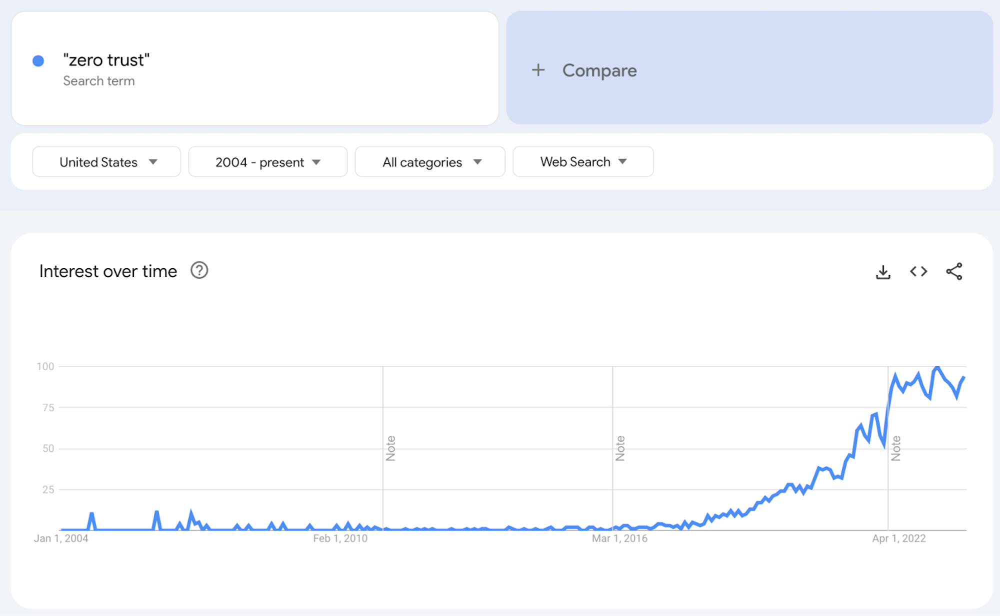

> **_authentik is an open source Identity Provider that unifies your identity needs into a single platform, replacing Okta, Active Directory, and auth0. Authentik Security is a [public benefit company](https://github.com/OpenCoreVentures/ocv-public-benefit-company/blob/main/ocv-public-benefit-company-charter.md) building on top of the open source project._**

---

Buzzwords are the scourge of the tech industry – reviled by developers, pushed by vendors, and commanded by executives.

All too often, a buzzword is the first signal of rain ([or worse](https://media.licdn.com/dms/image/C4E12AQGspNcRlqpg0A/article-inline_image-shrink_1000_1488/0/1593238107360?e=1700092800&v=beta&t=SCKZ-7W_R9swJPwEpBB35OsVc0jE093ylcjxFPm6FZc)): Marketers have created a trend; vendors are using the trend to explain why you need to buy their software right now; executives are worried about a problem they didn’t know existed before they read that Gartner report; and the downpour rains on developers.

“_Implement zero trust!_”

“_Why aren’t we shifting left?_”

“_Are we resilient? Well, can we get more resilient?_”

After a while, buzzwords start to look like trojan horses, and the invading army feels like a swarm of tasks that will result in little reward or recognition. It’s tempting to retreat to cynicism and to ignore every Term™ that comes your way.

But this can be risky. For better or worse, good ideas inevitably get branded, and if you want to keep up, you need to see past the branding – even if it involves stripping away the marketing fluff to see the nugget of an idea within.

There’s no better example of this than zero trust. In this post, we’ll briefly explore the term's history, explain how it became such an untrustworthy buzzword, and argue that thanks to a few advancements (mainly Wireguard), zero trust will soon go from buzzword to reality.

<!--truncate-->

## Zero trust: An idea ahead of its time

Ideas tend to emerge at inconvenient moments.

Sometimes, there are innovators who think so far ahead that people can’t keep up (think Van Gogh), and sometimes, everyone understands the idea, but few can implement it – sometimes for quite a while.

Zero trust falls into the latter category, and in the past decade, the term’s popularity has outpaced its real-world implications.

### A brief history of zero trust

The term “zero trust” originated in Stephen Marsh’s [1994 doctoral thesis](https://www.cs.stir.ac.uk/~kjt/techreps/pdf/TR133.pdf) “Formalising Trust as a Computational Concept.” The thesis is complex and stretches far beyond sheer computing concerns (Marsh wrote it for his doctoral program in philosophy).

A decade and a half later, John Kindervag revived the term in 2010 while writing articles for Forrester Research. Around the same time, in 2009, Google debuted [BeyondCorp](https://cloud.google.com/beyondcorp), an implementation of numerous zero-trust concepts. This is when we see the emergence of what we know as zero trust today.

Zero trust is simultaneously a critique of the traditional security mindset and a gesture at a new framework.

The argument is that the previous mindset is, essentially, a veneer of strength over a fundamentally brittle defense. Traditional security systems follow a perimeter-based structure and a “trust but verify” philosophy. Users and endpoints within an organization’s perimeter are granted implicit trust, meaning that malicious internal actors and stolen credentials can cause significant damage.

If your company has an office, that means a breach can start when people access the network, and if your company is virtual, that means a breach can open as soon as people start logging into things they shouldn’t.

The zero trust model instead eliminates implicit trust and, as the name implies, trust altogether. The framework is “zero trust” because it considers trust a vulnerability. In zero trust, all users are authenticated, authorized, and continuously validated before gaining or maintaining access to systems, applications, and data.

In the traditional model, there’s one seemingly strong but ultimately brittle barrier; in the zero trust model, trust is never given, and validation is continuous.

### So, why didn’t zero trust take off?

Zero trust, when you think about it, is fairly intuitive, and its advantages are clear. Despite that, zero trust didn’t take off in 2010.

When the zero trust model emerged, it had clear advantages, and many security experts agreed on its value. But practical realities meant that many organizations couldn’t adopt it.

At the time, when many enterprises were still shifting software to the cloud and before remote work became truly normal, many organizations thought perimeter-based security worked well enough. Leaders could read a Forrester paper on zero trust, find it interesting, and agree in theory but not feel compelled to rebuild their entire security system.

Security concerns already suffer from a “But it won’t happen to me” effect, and the prospect of making a huge investment for the sake of an abstract benefit (the ROI of _not_ getting a breach, maybe) was hard to calculate.

Vendors didn’t make these calculations easier. When it debuted, zero trust was more an abstract idea than a practical methodology, and security vendors did little to clarify things. Most vendors were not ready for zero trust at all, and even those that claimed to be couldn’t integrate and interoperate well because the ecosystem wasn’t mature yet.

[NIST](https://www.nist.gov/) (National Institute of Standards and Technologies), which published [Zero Trust Architecture in 2020](https://nvlpubs.nist.gov/nistpubs/SpecialPublications/NIST.SP.800-207.pdf), agreed, writing, “During the technology survey, it became apparent that no one vendor offers a single solution that will provide zero trust.” They argued, too, that because there’s “no single solution” for zero trust, “It is impossible to have a single protocol or framework that enables an enterprise to move to a ZTA.”

We’re in an awkward spot. Everyone agrees zero trust is good but few know how to implement it. Vendors have coalesced around zero trust messaging, but few can actually meet the promises on their landing pages. Many companies that claim to be zero trust aren’t, and many companies that haven’t thought much about zero trust have almost stumbled into it.

## Zero trust for the “zero trust” buzzword

In the decade after the “zero trust” concept was popularized, adoption proved so difficult that the term began to resemble a nearly meaningless buzzword.

Until NIST defined the term better in their above-mentioned Zero Trust Architecture article in 2020, there was no clear definition. Without clarity, it was hard for any developer, security engineer, or business leader to verify a vendor's claim that their solution was truly zero-trust. (And that’s not even considering whether one solution could claim to offer zero trust at all).

Given the hype and the lack of clarity, many vendors, marketers, and “thought leaders” pushed zero-trust products that were, at best, partial solutions. This push created a lot of cynicism amongst developers and security engineers.

As Den Jones, CSO at Banyan Security, [writes](https://www.linkedin.com/pulse/little-reflection-zero-trust-hype-den-jones/?trk=pulse-article_more-articles_related-content-card), “the level of marketing BS,” including frameworks, papers, and more, became overwhelming: “My concern now is that there’s an overwhelming amount of information related to zero trust, so much so that people struggle to decipher it into something meaningful, something that actually solves their problems.”

This isn’t the first time hype and vendor pitches outpaced reality, but it was particularly troublesome because zero trust, the concept, was too good to dismiss, and zero trust, the products, were too lacking to evaluate and adopt.

The source of the problem is a terminology problem: Zero trust is more like a framework or methodology than a single solution, meaning almost every zero trust vendor is and was exaggerating.

And because zero trust depended on the rise of cloud and SaaS products, it also resembled a parallel paradigm shift that depended on those other shifts and, at the same time, superseded any given product.

The move to SaaS, for example, created a lot of incidental zero trust security just because so many resources and tools moved to the browser and behind login pages. People who’d never thought about zero trust effectively implemented zero trust (at least partially) by having employees log in to Jira, Slack, Gmail, AWS, etc., every day.

Zero trust stumbled forward while the term lagged behind. A glance at Google Trends illustrates the narrative.

Google Trends shows that the search volume for zero trust increased way after the term originated but before the methodology really became practical. And now, search volume is flagging just as the full zero trust model becomes realistic.

## How Wireguard makes zero trust achievable

Wireguard, [started by Jason Donenfield in 2015](https://en.wikipedia.org/wiki/WireGuard), points to a future where zero trust is finally achievable and when the term can exceed its current buzzword nature.

Wireguard, at its most basic, is a simple, fast, modern VPN that uses cutting-edge cryptography to make it more secure than IPsec (the current standard network protocol suite). As the [Wireguard site](https://www.wireguard.com/) says, “It is currently under heavy development, but already it might be regarded as the most secure, easiest to use, and simplest VPN solution in the industry.”

According to [research](https://cybernews.com/what-is-vpn/wireguard-protocol/), WireGuard is about 15% faster than OpenVPN in normal conditions and 56% faster when OpenVPN is using its TCP mode. Numerous VPN providers have adopted the Wireguard protocol, including NordVPN, Surfshark, and IPVanish.

The company that best illustrates Wireguard’s potential, however, is Tailscale. Tailscale is a VPN service that provides mesh VPNs with remote access and a site-to-site network. If you’re frequently on Hacker News, you’ve probably seen their fantastic technical articles.

In [one of those articles](https://tailscale.com/blog/why-not-why-not-wireguard/), Avery Pennarun, founder of Tailscale, writes, “[Wireguard] is increasingly widely accepted as the future of secure VPN connectivity.” He has three main reasons:

-   Wireguard is open source.
-   Wireguard can run in a pure software VM and avoid hardware lock-in and bottlenecks.
-   Wireguard supports a single cipher suite that is fast and secure but can work with the key exchange mechanisms you want to layer on top.

Unlike the previous era of zero trust-adjacent vendors, the focus is shifting from an all-in-one zero trust solution to protocol-level technologies that enable a range of products that can, together, help companies pursue zero trust.

With Wireguard, for example, vendors can build stateless VPNs that don’t require an open, less secure connection. The customers of those vendors can then build multi-hub networks that are much more secure.

## Why it’s finally time for zero trust

Wireguard is the leading edge cutting the way to zero trust, but a few other shifts are making the movement more necessary and practical.

NIST, mentioned above, is removing ambiguity around zero trust and providing [clear guidance](https://www.nccoe.nist.gov/projects/implementing-zero-trust-architecture). As companies shop for vendors purporting to offer or support zero trust solutions, they can rely on this guidance to question vendors, and vendors can use the guidance to clarify their positions.

Big institutions, such as the United States Federal government, are [pushing zero trust](https://www.whitehouse.gov/briefing-room/presidential-actions/2021/05/12/executive-order-on-improving-the-nations-cybersecurity/). In an executive order, for example, the White House wrote that the Federal government needed to “advance toward Zero Trust Architecture” and that it would “develop security principles governing Cloud Service Providers (CSPs) for incorporation into agency modernization efforts.”

Vendors are also catching up. With Tailscale, for example, companies can [build a zero trust architecture over time](https://tailscale.com/blog/how-tailscale-works/) instead of lifting and shifting their entire security infrastructure. Curious companies can now pursue that curiosity bit by bit.

Zero trust arose because of a few macro trends, as we covered above, but the key ones–cloud and SaaS–have only become more dominant and more undeniable. Security isn’t always the fastest-moving field, especially among enterprises, but as more companies see success, even more companies will follow.

Finally, different organizations are starting to reclaim zero trust, translating it from a buzzword to an organizing principle. Zero trust is returning to its roots, again becoming an architecture that organizations build and assemble, not a single purchase.

For example, in a post about [building software for a zero trust world](https://blog.palantir.com/building-software-for-a-zero-trust-world-61d440e5976e), Palantir writes that “Palantir is continuously looking for innovative ways to extend the Zero Trust paradigm, even if that requires radically re-thinking our infrastructure.” Zero trust isn’t a solution to be adopted but a paradigm to be pursued.

## Incident by incident, zero trust will become inevitable

Even still, the achievement of zero trust is likely to lag as organizations continue to rely on “good enough” security practices. Now that many of the zero trust pieces are in place, however, adoption will rise more and more steeply as more and more incidents demonstrate what zero trust could have prevented.

For example, code search provider Sourcegraph recently [leaked tokens with long-lasting high-permission access](https://goauthentik.io/blog/2023-08-11-sourcegraph-security-incident). Attackers relied on the implicit trust these tokens granted, but a zero trust model wouldn’t have allowed for implicit trust at all.

In another example, a breach at Okta (not [that one](https://goauthentik.io/blog/2023-01-24-saas-should-not-be-the-default); [this one](https://goauthentik.io/blog/2023-10-23-another-okta-breach)) proved the limits of a more ramshackle zero trust approach. The breach was embarrassing for Okta (primarily because several clients, including BeyondTrust and Cloudflare, noticed it first and alerted Okta), but Okta did manage to prevent a worse breach. As we wrote, “one layer of prevention succeeded when the hacker attempted to access the main internal Okta dashboard, but because Okta still views dashboard access as a new sign-in, it prompted for MFA, thus thwarting the log-in attempt.”

The two types of breaches above will drive further interest in zero trust. On the one hand, we see companies fail because they are too trusting; on the other hand, we see other companies fail in some ways but prevent further damage thanks to a few solid elements in their security postures. The potential becomes clear – if companies embrace zero trust, they can do even better.

As always, we look forward to hearing your thoughts! Send us an email at hello@goauthentik.io, or join us on on [Github](https://github.com/goauthentik/authentik) or [Discord](https://discord.com/invite/jg33eMhnj6).
