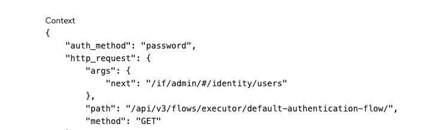

> **_authentik is an open source Identity Provider that unifies your identity needs into a single platform, replacing Okta, Active Directory, and auth0. Authentik Security is a [public benefit company](https://github.com/OpenCoreVentures/ocv-public-benefit-company/blob/main/ocv-public-benefit-company-charter.md) building on top of the open source project._**

---

Automation plays a large and increasingly important role in cybersecurity. Cybersecurity vendors promote their Machine Learning and Artificial Intelligence products as the inevitable future. However, thanks to the work of security experts like [Bruce Schneier](https://en.wikipedia.org/wiki/Bruce_Schneier), we have more insight into the human adversaries that create the underlying risks to network security, and a better understanding of why teaching humans to have a security mindset is the critical first step to keeping your network safe.

> The best response to these malicious actors is to think like a security expert and develop the security mindset.

In this blog post, we examine why automation is such a popular solution to cybersecurity problems—from vulnerability scanning to risk assessments. Then, we will look at those tasks in which security automation by itself proves inadequate, with particular focus on automatic scanning. Next, we make a positive case for why the human factor will always be needed in security. Finally, we will propose that good security isn't a feature. It's a proactive security mindset that's required—one with a human element at its core.

<!--truncate-->

## Why automate security in the first place?

Automated security is such a popular option purely because of the current dynamics:

-   On the one hand, there is a growing number of security incidents, instigated by systematic threat actors who may use the exact same auto security testing tools to find and target weaknesses
-   On the other, there is a shortage of trained cybersecurity professionals with adequate time resources to deal with those threats

Meanwhile, companies concerned about the security of their networks are facing the demands of savvy insurers keen to reduce their risks, while CISOs are coming under increasing personal pressure, considering some have faced new warnings of personal liabilities (including jail time, as we wrote about in a [recent blog](https://goauthentik.io/blog/2023-11-22-how-we-saved-over-100k#repercussions)) from government legislators.

But it's not just a personnel problem. The nature of some cybersecurity approaches, such as penetration testing, also plays a part. Many of a security engineer’s tasks are repetitive and prolonged. Automated security testing means time can be freed up to make the best use of an internal security engineer or external pentester's resources.

Finally, it is impossible to deny that securing the perimeter (running regular scans for misconfigurations and unusual behavior) and enforcing robust security policies are all impossible to deploy without some automation. 24/7/365 monitoring, processing massive data sets, and rapid threat detection and remediation all call for significant automated elements. Automated security is also key in helping scale cybersecurity operations to match company, staffing, system, and platform growth.

### What is the role of automation in security tasks?

Let’s not throw the baby out with the bath water. Automation has a place and positive role to play in cybersecurity. Auto security testing tools are best deployed for tasks that are repetitive and routine, and that require high volume processing.

Examples of these tasks include:

-   Scheduled tasks such as vulnerability scanning
-   24/7 user and other activity monitoring
-   Actions that require speed such as detecting and immediately responding to malicious intrusions

Removing tasks like these from the manual operations of your SOC (security operations center) aids efficiency, supports your security team, and helps ameliorate any skills shortage.

What are the benefits of an automated security system?

Automated security also excels in:

-   Reducing human error
-   Eliminating manual steps
-   Lowering the number of false positives
-   Updating software
-   Helping with compliance
-   Enhancing incident response and threat intelligence

## Why automation is a threat to cybersecurity

If automation is such a popular and necessary asset in the cybersecurity field, why can't we automate everything?

_Let’s think: Could over-reliance on automated security testing ultimately prove detrimental to cybersecurity and threaten the safety of your systems?_

To help avoid this, we need to acknowledge that automation can't:

-   Keep security teams up to date with new standards, such as the NIST Cybersecurity Framework; the ISO/IEC 27001 standard for information security management; the CIS Critical Security Controls; the OSSTMM; the Web Application Security Consortium (WASC 2.0); or the finance standard of PCI Data Security Standards for the payment card industry
-   Adjust your internal security policies and practices to all the nuances of relevant industry, country or regulations such as NIST SP 800-52; The California Consumer Privacy Act: the Canadian PIPEDA; the EU’s GDPR; or HIPAA’s personal health data legislation
-   Rapidly respond to every new CVE or every item that makes an appearance in the SANS Top 25, or the most common vulnerabilities listed in the OWASP lists
-   Ensure that your own internal cybersecurity protocols and policies are enforced

_But what else?_

The first point to remember is that automated solutions can only reliably alert and respond to the threats to your network, services, databases, APIs, and applications that they've been configured to detect. This configuration is limited to the settings available in the particular software. Automated processes are only as good as the rules human engineers give them. Security processes must still be configured and employed correctly.

And, your own company’s internal business logic must be factored in. This is where pentesters (who may, of course, rely on some automated tools to help them identify some vulnerabilities across your network) can delve deep on specific vulnerabilities and apply your company’s custom business logic and data breach implications. Resultant summary reports must explain the business, financial, reputational, data, and user implications of likely breaches, investigations and penalties.

Also, malicious hackers can use automated security techniques just as much as defenders to find potential security flaws in an organization’s network. They use novel attacks inspired by vulnerabilities that automated tools are unable to detect at all, by exploiting mistakes made by users that automation by itself can't solve. Examples include social engineering attacks that can begin with an innocuous looking email, or an SMS or email phishing scam. Given that over 80% of bad actors gain illegitimate entry using social engineering attacks, it is obvious that company-wide staff training is an excellent deployment of resources.

## Against automatic scanning in favor of a proactive security mindset

In the case of social engineering attacks that we’ve just mentioned, a security-oriented mindset is what will keep your staff watchful—not the knowledge of automated tools.

_Could mindset, then, be the greatest weapon in your defensive arsenal? Let’s explore further._

### What elements are crucial to a security mindset?

Despite the advantages of automation in security scanning, the element of human expertise is needed in many steps of the scanning process. There is no purely automatic way to proactively identify all new threats and preempt sophisticated or unconventional attacks, for example. Security engineers must wait for the tools on which they rely to be updated with the latest CVEs, and they must then have the expertise to understand the reasons and logic behind threats. They will sometimes have to manually validate these threats where required, then plan mitigation activities for future avoidance.

Further, it is the practice and discipline of working in cybersecurity that give developers the mindset and expertise to build software that is ‘secure by design’. We expect vulnerabilities, and we write more secure code because of it.

### Some of the drawbacks of vulnerability scanning tools

While automated scanning tools can provide a major asset in the arsenal of any cybersecurity professional, we must honestly acknowledge their weaknesses when set side-by-side with a human:

-   An automated scanner can miss vulnerabilities if they are new and not in its database, or if the vulnerability is complex and adaptive. Scanners can only hunt for known vulnerabilities, and according to how automated scans are further configured by users.
-   The problem of false positives can never be completely eliminated even by the most accurate scanners. In the end, a human expert is needed to filter them out.
-   Detecting vulnerabilities is only the start. While some scanners assign an urgent priority to their findings, human expertise is needed to assess the _specific_ implications of these vulnerabilities for the platform, system or business.
-   Once vulnerabilities are detected, fixing and patching them is a manual process. A vulnerability report is a starting point. Identifying a vulnerability is one thing; successfully remediating it is another. Further, security engineers will sometimes also have to further reengineer their code, to ensure a similar problem does not recur.

Of course, automatic scanners are excellent assets for speed and quick action, repeatability, ease of use, and constant monitoring. They can provide a good starting point for further investigations, not an end point. But they are not equivalent to a full penetration test and can only find risks that are known.

### What about AI in automated security scanning?

AI and machine learning contribute to the speed and accuracy of dealing with risks posed by known threats. But, for all these advances, the mind of the security engineer is still required when dealing with unknown or new threats, threats that are chaotic and unpredictable or morphable, and threats that don't follow the rules.

## The human factor in cybersecurity will always be required

The fact that there are automated tasks and processes in cybersecurity does not mean that the good security as a whole is autonomous or automatic. Security is more about developing a _security mindset_ than a set of features.

For further information on the human element in SaaS security, see [Securing the future of SaaS: Enterprise Security and Single Sign-On](https://goauthentik.io/blog/2023-07-28-securing-the-future-of-saas#good-security-cant-be-automated-the-human-element-in-saas-security).

### Human cyber risk

Humans are at the forefront of cybercrime. Cyber crimes are committed by human beings using adaptation and innovation to invent fresh attack tactics. It is the human mind that continually develops new techniques to hack, infiltrate, and bypass security systems.

For example, if your company does not have a 2FA/MFA credential policy, vulnerabilities exist around whether your staff share user credentials to save them time and stress. If these credentials are not updated regularly, or worse, if they’re shared by email, any moderately skilled, malicious hacker could attempt to access the email account of a single user,  and use it to find other company passwords. It is these human weaknesses and errors that most bad actors hackers rely on.

_Over 80% of malicious hacks are as a result of the exploitation of the widest weakness of all—predictable human behavior._

### Human elements of cybersecurity

Even in a cybersecurity system that is maximally automated there is human input that can never be removed. Obviously, human experts are needed to guide the automated systems in their functioning. Automation technology depends on humans to set rules and workflows, monitor results over time, and rapidly prioritize then respond to alarming findings.

Once new and significant threats are detected by the automated security, it is human experts again who have to adjust the performance of the automated system as a response to this changing environment. Any further changes need humans to evaluate the performance of automated systems in real-time. Finally, it is humans who train staff in cyber threat detection for these new dangers.

### Human-centered cybersecurity

Despite the growing technology around automated security, and the temptation to relax when it is deployed, there are human factors that are irreplaceable in the practice of cybersecurity. We recently wrote about the importance of the "Blue Team" and how [organizational and product hardening](https://goauthentik.io/blog/2023-11-22-how-we-saved-over-100k#hardening) are an integral part of our human-centered security mindset.

-   The human ability to think creatively and rapidly adapt to changing situations is invaluable to good security processes.
-   The higher the security risk, the more you need skilled security professionals to supervise the security process.
-   After automation has quickly gathered information, humans are needed to make any well-informed security and organizational decisions that may arise.
-   Exclusively human tasks include containment, triage, remediation, and launching new initiatives such as better responses (see [Okta got breached again and they still have not learned their lesson](https://goauthentik.io/blog/2023-10-23-another-okta-breach)).
-   Only humans can know the commercial implications of a data breach.

## The security mindset is not a feature

One misconception is that for every cybersecurity problem or threat, there is an automated feature in some software somewhere that can match it.

> Some cybersecurity software plans seem to promote feature-rich products but forget to promote highly skilled and aware cybersecurity teams with a proactive security mindset.

Companies have become too dependent on automation, due to the overwhelming volume of threats and frequency of attacks. This overreliance can cause all sorts of unintended problems—alert fatigue, data overload, devaluing human expertise and input, and an inability to handle zero-day (previously unknown) vulnerabilities.

Automated security platforms and measures assist and augment human expertise; they do not replace or supersede it. If their corresponding strengths and shortfalls are properly acknowledged, automation and teams with a healthily skeptical security mindset can collaborate for success.

Let us know if you'd like to learn more about how authentik works as a primary component in a security stack. You can send an email to hello@authentik.io, or find us on [GitHub](https://github.com/goauthentik/authentik) or [Discord](https://discord.com/channels/809154715984199690).
