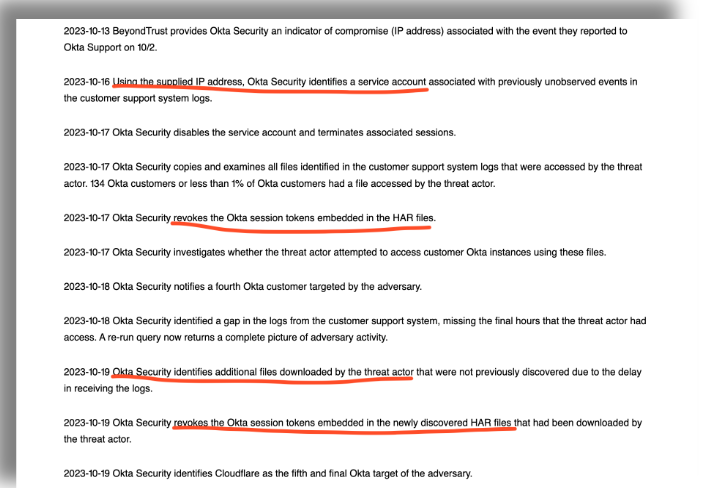

> **_authentik is an open source Identity Provider that unifies your identity needs into a single platform, replacing Okta, Active Directory, and auth0. Authentik Security is a [public benefit company](https://github.com/OpenCoreVentures/ocv-public-benefit-company/blob/main/ocv-public-benefit-company-charter.md) building on top of the open source project._**

---

On November 29th, 2023, Okta [revealed](https://sec.okta.com/harfiles) that a breach they announced in October was much worse than originally conveyed. The number of impacted users went from less than 1% of customers to every single customer who had every opened a Support ticket in the Okta Help Center.

> So the impact leapt from [134 users](https://sec.okta.com/articles/2023/11/unauthorized-access-oktas-support-case-management-system-root-cause) to [18,400 users](https://www.beyondtrust.com/blog/entry/okta-support-unit-breach-update).

We wrote in October about Okta’s poor response to breaches (see [Okta got breached again](https://goauthentik.io/blog/2023-10-23-another-okta-breach)), but since our blog doesn’t seem to be changing Okta’s behaviour, let’s take a closer look at the new revelations from Okta about what happened back in October, how it is impacting users now, and why Okta is still dealing with it in December.

> Now all of Okta’s customers are paying the price… with increased phishing and spam.

Our take is that any company can be hacked, but it is the response that matters. How quick is the response, how transparent are the details, how forthright are the acknowledgments? Okta’s initial announcement about the October breach (remember the [HAR file](https://goauthentik.io/blog/2023-10-23-another-okta-breach) that contained a session token?) was less-than-timely, devoid of details, and titled with one of the worst titles ever given such a serious announcement.

<!--truncate-->

## Looking back at October’s breach

With the original incident, probably what most people now recall is not only the technical details of the session tokens that were exposed in HAR files, but also the very slow response time. Turns out 1Password reported the breach to Okta on September 29, and [BeyondTrust](https://www.beyondtrust.com/blog/entry/okta-support-unit-breach) reported the breach to Okta on October 2. But Okta waited three weeks before announcing the breach on October 20th.

In this October 20th announcement, Okta CISO David Bradbury stated that the malicious actor had gained access to Okta’s Support dashboard and retrieved only names and emails addresses for a very small number of customers. He explained that the hacker used session tokens that were not scrubbed from a HAR file (which Okta support routinely asks their customers to submit, for troubleshooting purposes) to gain access to specific customer’s accounts. But what wasn’t revealed at the time (because Okta themselves did not yet know) was _how_ the hacker obtained access to the Customer Support dashboard to access customer accounts and then download associated HAR files.

### The second **Okta shoe fell in early November**

As mentioned above, the new information revealed by Okta came from their security team retracing the steps of the original malicious actor. Okta’s research and analysis was greatly aided by the fact that [BeyondTrust shared a suspicious IP address with Okta](https://www.beyondtrust.com/blog/entry/okta-support-unit-breach-update); the IP address that BeyondTrust believed to be the hacker’s.

**Initial access gained via a service account**

This new finding, based on retracing the steps of that IP address, show that the initial breach occurred when the hacker obtained the credentials for a service account "stored in the system", which provided access to the Customer Support dashboard and had permissions to view and update customer support cases. The hacker then reviewed customer support cases, downloaded the associated HAR files, and retrieved the session tokens.

From the [November 3rd announcement](https://sec.okta.com/articles/2023/11/unauthorized-access-oktas-support-case-management-system-root-cause), we now know that the service account credentials were exposed through an Okta employee’s personal Google account, which the employee had accessed on the Okta-issued work laptop.

In announcing the service account’s role in the breach, Okta’s CISO stated:

> "During our investigation into suspicious use of this account, Okta Security identified that an employee had signed-in to their personal Google profile on the Chrome browser of their Okta-managed laptop. The username and password of the service account had been saved into the employee’s personal Google account."

The use of the service account was discovered on October 16, by examining the activities of the IP address of the hacker that BeyondTrust had supplied Okta. This begs the question of why Okta did not revel the malicious use of the service account in their October 20th announcement. Perhaps they did not yet want to show details of their internal investigation?

### And a third shoe in late November

Now fast-forward to Okta’s [November 29th announcement](https://sec.okta.com/harfiles). Back in October, it was known that after the hacker accessed Okta’s Support dashboard they ran queries on the support database to create reports containing customer data. In the November 3rd announcement Okta shared that the report was thought to be quite small is scope; this is the infamous "less than 1% of Okta customers" statement.

But after more internal investigation and recreating the reports that the malicious actor ran, Okta announced on November 29th that their original statement that less than 1% of their users were impacted by the October breach was incorrect. Instead, Okta revealed that the scope of the report was much larger, and indeed concluded that "[the report contained a list of all customer support system users](https://sec.okta.com/harfiles)". A total of 18,400 users. The only customers that were not impacted are those in FedRAMP and DoD IL4 environments, who are on a separate support platform.

> An aside, perhaps, but the timing of Okta’s update is interesting; the announcement was released on the same date as the quarterly earnings report. This could be seen as transparency, or it could be seen as damage control. (Also, why in the heck is Nov 29th within Okta’s 3rd quarter of **fiscal year 2024**? But we aren’t writing here about Okta’s financial schedules; I digress.)

**Filters removed from report**

Apparently when the hacker ran queries to gather customer data, they used a standard template available from the dashboard. However, they removed all filters on the templated report, thus grabbing much more data then the original template would have returned.

In addition to removing all filters on the report, it seems that Okta’s original analysis of the logs pertaining to the breach failed to take in to account exactly HOW the hacker accessed and downloaded data:

> "For a period of 14 days, while actively investigating, Okta did not identify suspicious downloads in our logs. When a user opens and views files attached to a support case, a specific log event type and ID is generated tied to that file. If a user instead navigates directly to the Files tab in the customer support system, as the threat actor did in this attack, they will instead generate an **entirely different log event** with a different record ID."

## Now what?

The third shoe has dropped, but it feels like there might still be a fourth. Maybe even more data was stolen, beyond just email addresses. Perhaps the malicious actor gained more sensitive customer data when they were able to log into specific customer’s accounts, but are sitting on it waiting to use it. Perhaps the explorations by the hacker form within the customer support system reveled other weaknesses that have yet to be exploited.

So while we are all waiting with baited breath to see if Okta can squeeze even more drama into 2023, here are a few tips to consider:

-   If you are an Okta customer, do indeed follow each and every one of their recommendations, listed under the "**Implementing recommended best practices**" section of their [November 29th announcement](https://sec.okta.com/harfiles).
-   Be aware of Okta’s plan for a 90-day pause on new features. During the [earning report call](https://seekingalpha.com/article/4655057-okta-inc-okta-q3-2024-earnings-call-transcript) on November 29th CEO Todd McKinnon stated "During this hyper-focused phase, no other project or even product development area is more important. In fact, the launch dates for the new products and features that we highlighted at Oktane last month will be pushed out approximately 90 days."
-   As Okta advises, be on the lookout for more phishing attempts and stay hyper-vigilant.
-   In general, across the board, be vigilant and adopt a "[security mindset](https://goauthentik.io/blog/2023-11-30-automated-security-versus-the-security-mindset)" (as valuable and maybe more than any technology).
-   Consider breaking out of vendor lock-in and using an on-premise, open core solution such as [authentik](https://goauthentik.io/). We realize change is hard, but continual breaches and uncertainty around when a breach has been fully contained is also painful.

We’d be happy to talk with you more about your security and identity management needs; reach out to us with an email to [hello@goauthentik.io](mailto:hello@goauthentik.io) or on [Discord](https://discord.com/channels/809154715984199690/809154716507963434).
