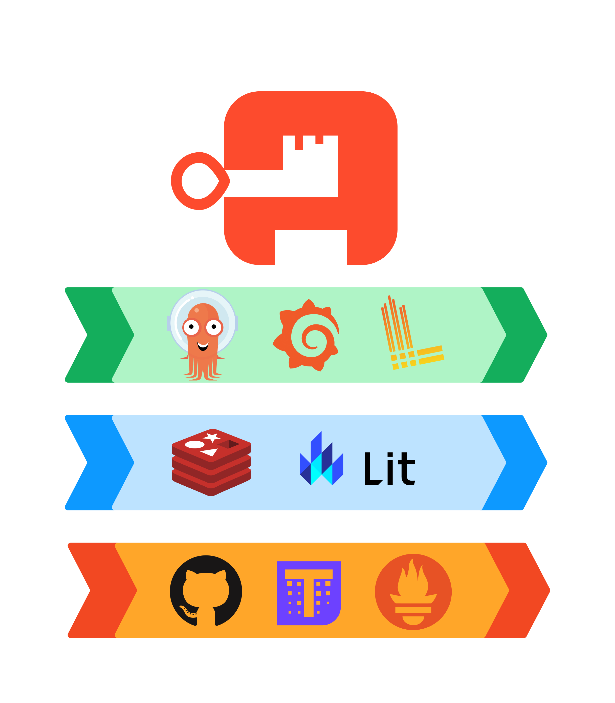

> **_authentik is an open source Identity Provider that unifies your identity needs into a single platform, replacing Okta, Active Directory, and auth0. Authentik Security is a [public benefit company](https://github.com/OpenCoreVentures/ocv-public-benefit-company/blob/main/ocv-public-benefit-company-charter.md) building on top of the open source project._**

---

With great power (to choose your own tools) comes great responsibility. Not inheriting a legacy toolchain is an infrastructure engineer’s dream, but it can be hard to know where to start.

As the first infrastructure engineer hired to work on authentik, I saw the greenfield opportunities, but also the responsibility and long-term importance of choosing the best stack of tools and build processes. From my past roles, I already knew many of the considerations we would need to factor in.

For example, we know that ease of maintenance is a primary consideration, as is the stability and probable longevity of the tool, how well the tools integrate, and of course the level of support we were likely to get for each tool.

In this post we share some of what we are using to build authentik, and the lessons behind those choices.

<!--truncate-->

## #1 Choices are often human, not technical

If there isn’t much difference between two tools, the choice isn’t a technical decision. It’s going to come down to human factors like ease of use or the team’s familiarity with the tool. This is why we use [GitHub Actions](https://docs.github.com/en/actions) for our CI—[we’re already on GitHub](https://github.com/goauthentik) so it just makes sense.

> Familiarity with a tool means that you and your team can move faster, leading to higher business efficiency and a happier team.

### We use Argo CD for GitOps

When I joined Authentik Security, we were using [Flux CD](https://fluxcd.io/). Jens, our founder and CTO, had set up a small Kubernetes cluster to run an authentik instance for us to log into different services (some monitoring tools), and he was deploying all of this using Flux CD.

If you’re not familiar, Flux and [Argo CD](https://argo-cd.readthedocs.io/en/stable/) enable you to do GitOps: whatever you want to deploy, you push that to a Git repository and then synchronize whatever is in production from that Git repository. Everything is committed and tracked in the Git history (helping you to understand what has changed and why).

You also don’t need to do anything manually on the production servers or clusters—it’s all done in Git. This helps with auditing, as history is tracked, and you can easily find who made a change. You don’t need to give access to your production servers and cluster to whoever is conducting the audit, since they can see how everything is configured in the Git repo.

#### Flux and Argo CD essentially do the same thing

Despite Flux and Argo CD both being good at what they do, I advocated for switching to Argo CD because I have always worked with it and that familiarity with the tool meant I’d be able to work with much greater efficiency and velocity.

Since switching to Argo CD, we’ve automated deployment of new pull requests with the `deploy me` label. A developer can add that label to one of their open PRs, and the changes get deployed to a production-like environment so they can test those changes with a real domain and real certificates—it’s exactly the same as how a client would interact with those changes. It’s especially useful for mobile app development because instead of launching an authentik instance locally, you can test the mobile app against a production-like environment. This ability to access this “test deployment” is great for QA, tech writers, technical marketing teams, and anyone else who needs early access to a feature before it even gets merged.

#### Setting us up to scale

Argo CD also comes with a built-in UI, which Flux does not. This is useful because as we grow as a company, we will have more developers and we want to enable self-service and a culture of “you build it, you run it.”

With the Argo CD UI, a developer can make changes in Git, view the changes in the UI, and validate if the application started correctly and if everything is running. There’s no need to build another tool or set up Grafana dashboards or some other solution for developers to check if the application is running correctly.

“You build it, you run it” in this case isn’t about operations or infrastructure leaving developers to figure things out on their own. What we actually want is to empower devs to run things themselves so that:

1. Everyone shares the burden of production.
2. Developers have a shorter feedback loop to see how their app behaves in production.

This type of choice is about setting things up for scalability down the road, which leads me to our next lesson.

## #2 Build with scale in mind

Our founder, Jens, has written before about [building apps with scale in mind](https://goauthentik.io/blog/2023-06-13-building-apps-with-scale-in-mind) and [doing things the ‘right’ way first time](https://goauthentik.io/blog/2023/10/26/you-might-be-doing-containers-wrong/).

As an infrastructure engineer especially, it can be so hard to deal with legacy tools and solutions (sometimes you just want to burn it all down and start over). It’s just so much easier to maintain things if you do it properly from the beginning. Part of why I wanted to join Authentik Security was because there wasn’t any legacy to deal with!

Yes, premature optimization is the root of all evil, but that doesn’t mean you can’t think about scalability when designing something. Having a design that can scale up if we need it to, but that can also run with few resources (human or machine)—even if a few compromises are necessary to allow it to do so—is oftentimes better that having a design that wasn’t built with scale in mind. This can spare you having to redesign it later (and then on top of that, migrate the old one).

### We use Transifex for translation

Internationalization isn’t often high on the list for open source projects or developer tool companies, but we’ve been doing it with [Transifex](https://www.transifex.com/).

If your users are developers they are probably used to working with tools in English. Whoever administers authentik for a company in France, for example, probably knows enough English to get by. But that company’s users may not need to speak English at all in their role because they’re on the legal or finance side. Those users still need to log in using authentik, so it’s great to be able to provide it in their language.

We use [Lit](https://lit.dev/) for our frontend (Jens has written about [choosing Lit over React](https://goauthentik.io/blog/2023-05-04-i-gambled-against-react-and-lost)), which supports translation by default:

-   With Lit, we’re able to extract strings of text that we want to translate.
-   Those strings are sent to Transifex, where we can crowdsource translations.
-   We do this by marking strings as “source strings” with just three extra characters per string, which is not that much of an effort if you’re doing it from the outset vs implementing afterwards.

Native speakers of a given language can help us polish our translations; this is a great way to enable people to contribute to the project (not everyone can or wants to contribute code, for example).

## #3 Think about product-specific requirements

As a security company, some of our choices are influenced by product- and industry-specific needs.

As you’re building your own stack, you may need to think about the requirements of your own product space or industry. You might have customer expectations to meet or compliance requirements, for example.

### We use Redis for reputation data

Most of our storage is done in [PostgreSQL](https://www.postgresql.org/), but for some types of storage we use [Redis](https://redis.io/) for latency reasons, as it’s much faster to fetch data from.

We have two use cases for Redis:

#### Reputation data

If someone tries to log in and fails, we temporarily store ‘bad reputation’ weights associated with their IP address in Redis. This enables authentik admins to manage logins more securely; if someone has a reputation of less than a certain threshold (because they tried bad login details a few too many times), the authentik admin can block them.

That data is stored in Redis temporarily; we have a subsequent task that fetches it from Redis and stores it in the database. That way, if you want to keep updating the reputation data for a user (because they keep trying to log in with bad inputs), we’re just updating Redis and not PostgreSQL every time. Then when that data is moved from Redis to PostgreSQL, it’s compacted.

#### Session data

This use case is more common: with every request, we check that the user is still logged in or if they need to log in. Again, we store this data in Redis for latency reasons.

# #4 Your choices will cost you, one way or another

Of course, budget is going to play a role in the tools you choose. You have to balance your investments of money OR time spent on your tooling.

### We use Loki for logging

We talked about this in our recent [post about building a security stack with mostly free and open source software](https://goauthentik.io/blog/2023-11-22-how-we-saved-over-100k). As we wrote, [Loki](https://grafana.com/oss/loki/) is free, open source, and cheap to run. We could have gone with something like Elasticsearch (and the whole Elastic Stack) but it’s so expensive to run in terms of processing power and memory resources. Loki isn’t as easy to run, but we save on costs.

> It comes back to the idea of “you either pay in time or money” for software, and for most of authentik’s tooling I’ve already paid in time for it.

## #5 Optimize for stability and support

Infrastructure people just want to be able to sleep at night and not get paged at all hours (for that we use [Alertmanager](https://prometheus.io/docs/alerting/latest/alertmanager/), just in case). I just wanted to set up things that work and are reliable—pragmatic reasons similar to [why we chose Python and Django](https://goauthentik.io/blog/2023-03-16-authentik-on-django-500-slower-to-run-but-200-faster-to-build).

These next tools (all open source) were easy choices because I’ve already used them and know how to configure them properly and what pitfalls to watch out for.

### We use Grafana and Prometheus for monitoring and metrics

[Grafana](https://grafana.com/grafana/) is widely used and comes with a lot of existing resources, so we don’t have to build everything ourselves. We use it to display our logs and metrics in dashboards so we can view and correlate data from Loki and [Prometheus](https://grafana.com/oss/prometheus/) together. Prometheus scrapes metrics from our infrastructure tools, authentik instances, and other applications.

#### We use Thanos to manage metrics data

I used Thanos for a large-scale deployment in a previous role—storing something like 20TB of metrics per six months—so I knew it would work for us now and later as we scale.

Prometheus stores metrics for ~1 day before [Thanos](https://thanos.io/) fetches them and pushes to S3 storage for longer-term retention. We do this because Prometheus doesn’t do well storing large amounts of data. We’re also running Prometheus in highly available fashion, which would mean storing the data twice, which would be expensive.

Thanos compresses the metrics data and also does downsampling:

-   For 30 days we keep everything that’s scraped (every 30/60 seconds)
-   Beyond that, for 90 days we keep only a metric point every five minutes
-   For a year, we keep just one metric point per hour

By retaining less data as time passes, queries are faster and storage is cheaper. Why keep metrics for such a long time? It gives us a view of the seasonality of traffic so we can do better capacity planning.

## Final thoughts

This isn’t a groundbreaking stack. We aren’t optimizing for the latest edge technology. (The only somewhat controversial choice we’ve made has been moving to an [IPv6 only](https://goauthentik.io/blog/2023-11-09-IPv6-addresses) network.) For the most part we’ve gone with options that are tried and tested, well known to the team, and play nicely with the other parts of our stack.

As always, we would be interested in hearing your thoughts about the stack we use, and about the tools that you and your team have chosen and the reasons behind those choices. Send us an email to hello@goauthentik.io or chime in on [Discord](https://discord.com/channels/809154715984199690/809154716507963434).
