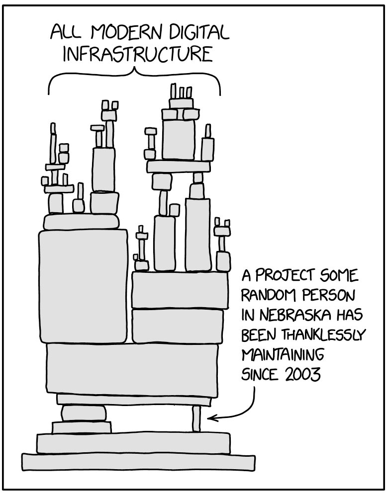
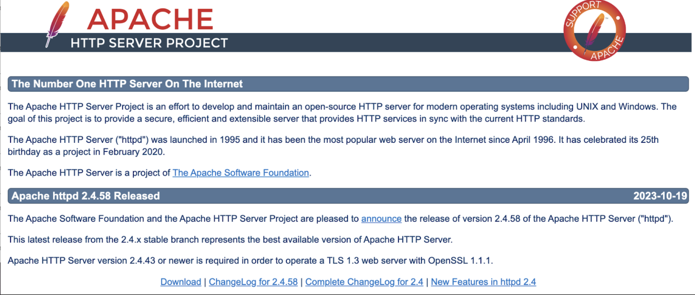
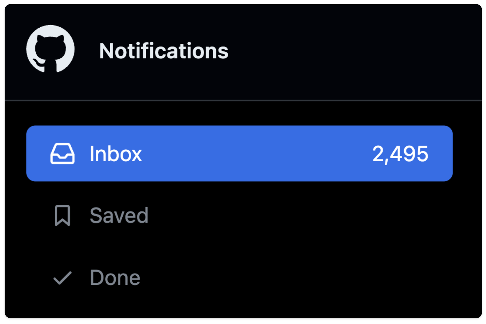
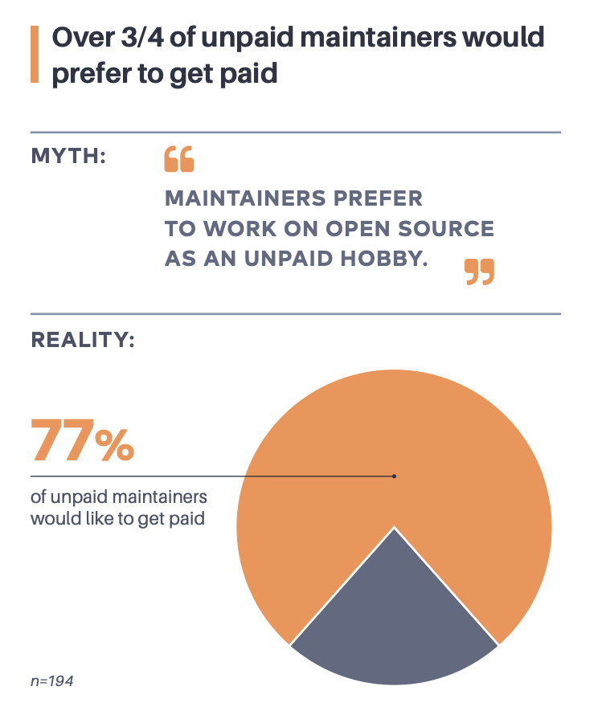

> **_authentik is an open source Identity Provider that unifies your identity needs into a single platform, replacing Okta, Active Directory, and auth0. Authentik Security is a [public benefit company](https://github.com/OpenCoreVentures/ocv-public-benefit-company/blob/main/ocv-public-benefit-company-charter.md) building on top of the open source project._**

---

In 2024, Tom Scott and Jynn Nelson, otherwise different people in different worlds, faced very similar problems.

-   Tom Scott is a YouTuber who, as of this writing, has gotten nearly 2 billion views across over 700 videos. Nearly 6.5 million people subscribe to Tom Scott’s [YouTube channel](https://www.youtube.com/@TomScottGo/videos).
-   Jynn Nelson, a senior engineer, is a major maintainer of Rust, an open-source project that 2023 StackOverflow research showed was the [most admired language](https://survey.stackoverflow.co/2023/#productivity-impacts-knowledge-ic) among developers. About [2.2 million people](https://yalantis.com/blog/rust-market-overview/) are Rust developers.

In a [goodbye video](https://youtu.be/7DKv5H5Frt0?feature=shared), Scott announced an extended break from his channel, saying, "I am so tired. There's nothing in my life right now except work.”

In a post called [the rust project has a burnout problem](https://jyn.dev/the-rust-project-has-a-burnout-problem/), Nelson wrote, articulating sentiments across the Rust community, “you want a break, but you have a voice in the back of your head: ‘_the project would be worse without you_.’”

It’s unfortunate that this comparison makes the best opening to the point of this post: open source developers are much more like content creators than most people tend to assume.

> If anything, when you look at the history of the Internet and the history of distributing content online, open source developers might be the _original_ content creators.

By looking at the paths they have both paved and recontextualizing their work within a broader view of the creator economy, we can come to a better understanding of the shared futures of content creators and open source developers.

<!--truncate-->

## Open-source maintainers were creating content before it was cool

In the past decade, a series of similar “economies” have risen and fallen, including the creator economy, the passion economy, and much of web3.

Evan Armstrong captured these collapses well, writing about the [crash of the creator economy](https://every.to/napkin-math/what-happened-to-the-creator-economy) in 2023. “Dollars invested are down 86% to $123M,” he wrote. “Next came the layoffs. The giants of the space have had issues: Patreon laid off 17% of staff, Linktree first sacked 17% of staff, then a few months later another 27%, Cameo has laid off 160 (probably 33%+ of staff).”

But unlike other economies, say, [the paper industry in Maine](https://www.jstor.org/stable/10.7591/j.ctvxkn85v), the factories haven’t left: influencers are still posting on Instagram, newsletter writers are still growing subscriber numbers on Substack, and TikTok creators are still going viral.

> It’s a contradiction with a simple answer: typical conceptualizations of the creator economy are too limited, and the history of content creation is much longer and broader than most thought leaders and investors realize.

### A very brief history of open source

In 1974, software became copyrightable and it quickly shifted from free-by-default to paid. Once companies could control it, closed-source software took off.

Companies enforced copyrights and trademarks and leased the right to use their software. In 1976, Bill Gates wrote an [open letter to hobbyists](https://archive.nytimes.com/www.nytimes.com/library/cyber/surf/072397mind-letter.html), arguing that “most of you steal your software,” and in 1983, IBM stopped distributing source code to people who purchased IBM software.

In reaction to developments like these, Richard Stallman founded the GNU Project in 1983 and the Free Software Foundation in 1985.

He wrote in [The GNU Manifesto](https://www.gnu.org/gnu/manifesto.html) that “Many programmers are unhappy about the commercialization of system software. It may enable them to make more money, but it requires them to feel in conflict with other programmers in general rather than feel as comrades.”

Here, Stallman laid out one of the visions that’s continued driving open source to this day: “Once GNU is written, everyone will be able to obtain good system software free, just like air.”

Over the following decades, open-source developers and maintainers used the nascent and eventually mature Internet to build software projects that were hobbies, industry-supporting keystones, and everything in between.

Amongst this growth, another economy surfaced, too: a huge crop of companies that built tooling and platforms for open source as well as a variety of business models, such as open core, to support open source. Open source, once primarily adversarial to private industry, has become integral to it.

### Is software content?

Open-source developers were creating content and distributing it on the Internet long before everyone else. The pioneering work of what we might now call the creator economy often goes unrecognized for three major reasons:

-   Software isn’t always seen as content in the same way video content and text content are.
-   The original philosophy of open source emphasized community and collaboration – emphasizing a movement that extended beyond any individual developer.
-   Early open-source developers emphasized a “[gift culture](http://www.catb.org/~esr/writings/cathedral-bazaar/homesteading/index.html),” with people like Eric Raymond arguing that software should be “freely shared.” Content creators, however, have long depended on centralized platforms like YouTube that often offer built-in monetization tools.

These distinctions, as significant as they might seem at first glance, are collapsing. Two decades after Raymond’s _The Cathedral and the Bazaar_, Nadia Eghbal wrote _Working in Public,_ and in it, she notes: “Like any other creator, these developers create work that is intertwined with, and influenced by, their users, but it’s not collaborative in the way that we typically think of online communities. Rather than the users of forums or Facebook groups, GitHub’s open source developers have more in common with solo creators on Twitter, Instagram, YouTube, or Twitch.”

Of all people, considering the open letter cited earlier, Bill Gates might have been the first to realize this, [writing in 1996](https://medium.com/@HeathEvans/content-is-king-essay-by-bill-gates-1996-df74552f80d9) that “When it comes to an interactive network such as the Internet, the definition of ‘content’ becomes very wide. For example, computer software is a form of content–an extremely important one, and the one that for Microsoft will remain by far the most important.”

Open source led the way, but now, this pioneering work is curling back on itself and the future of open source requires recognizing its connection to the creator economy as a whole.

## 5 ways open source paved the way for content creators

Open source developers pioneered new ways of creating and distributing content on the Internet – lessons that are worth re-contextualizing and re-learning for the sake of open source and for a new, larger understanding of the creator economy.

### 1. Misleading margins abound

One of the major reasons the creator economy took off as a target for venture capital is because content creation has zero margin – in theory. Like software, these venture capitalists proposed, you could create once and reproduce freely forever.

Theoretically, a YouTube creator should be able to make a library of great videos and make ad money for as long as the videos remain online. Unless it’s covering breaking news, a great video should still be great in six months, two years, and five years. Create once. Profit forever.

This isn’t how it works. On YouTube, views can plummet if you don’t stay in people’s minds and if you don’t keep on trend. YouTube creators are building a brand and benefit from uploading regularly – even if it leads to creators like Tom Scott uploading a video every week for ten years without break.

Of course, investors could have learned this lesson sooner by looking at open source. A similar mistaken assumption applies: build the software once and distribute it forever. But, again, this isn’t how it works.

As Eghbal writes, open source maintainers are “expected to maintain the code they published for as long as people use it. In some cases, this could be literally decades, unless the maintainer formally steps away from the project.”

[Apache](https://httpd.apache.org/), for example, launched in 1995, celebrated its 25th anniversary in 2020, and released its most recent version in 2023.

Software degrades over time (think of tech debt, integration issues, changing standards, etc.) in much the same way a YouTuber’s brand degrades over time. Both need maintenance just to persist, much less grow.

### 2. Firewalls require vigilance

In traditional journalism, the “firewall” (sometimes referred to as a separation between church and state) is a conceptual and logistical distinction between the editorial department and the advertising department. If the two were to mix, advertising needs would bias editorial goals and subscribers wouldn’t trust the publisher that mixed them.

The same distinction extends to content creation and open source.

In content creation, the trust a creator has built with their audience is paramount, and maintaining the firewall between their content and their sponsors is essential.

On Instagram, for example, an influencer needs to be very clear about whether a given post is an ad or not. There are legal standards around this issue – the [SEC charged Kim Kardashian](https://www.sec.gov/news/press-release/2022-183) a fine in 2022, for example, for not disclosing that the crypto company she was promoting had paid her – but the bigger issue is maintaining audience trust.

Without trust, you can’t influence.

These kinds of controversies are not novel for open source developers. Similar discussions arise when vendors offer to support or acquire an open source project and when an open source maintainer starts taking sponsorships.

Charity Majors, CEO and cofounder of Honeycomb, came up through open source and when she founded a for-profit company, the firewall singed her. “I came from open source,” she writes in a [2023 post](https://charity.wtf/2023/03/29/questionable-advice-people-used-to-take-me-seriously-then-i-became-a-software-vendor/), “where contempt for software vendors was apparently _de rigueur_.”

Back then, she writes, she and others assumed vendors were “liars” that would “say anything to get you to buy.” Majors eventually learned that vendors weren’t all bad, but her experience exemplifies how the separation between open source and vendors (as well as content creators and advertisers) can be fraught.

She now recommends vendors “lead with [their] bias” and says that she “discloses [her] own vested interest up front.” The boundaries can be crossed, either by projects seeking sponsorships or by developers seeking employment, but the boundary requires respect.

### 3. Audiences are a source of survival and stress

Influencers require a significant level of fame to achieve success: enough viewers to earn brand deals, enough fans to clamor outside makeup stores, enough listeners to sell out live shows.

But even though creators depend on their audiences, those same audiences can be a huge source of stress. A big audience can mean pressure and it can also sometimes mean a [public pillorying](https://www.distractify.com/p/influencers-canceled-quickly).

Open source developers rarely have fans in the same way but they frequently run into a similar dynamic. As an open source project becomes popular, more people want to contribute but because contributions are rarely perfect, PR review can become a job unto itself.

Nolan Lawson, for example, a major contributor to PouchDB told Eghbal that open source popularity can create “a perverse effect where, the more successful you are, the more you get ‘punished’ with GitHub notifications.”

As [Alex Danco writes](https://danco.substack.com/p/making-is-show-business-now), “Success brings attention, interaction, and maintenance - both of the code itself, and of the creator’s reputation. This all takes work, and it’s often not the kind of work the creators like doing.”

Success can then breed disillusionment and sometimes burnout. Many early open source proponents imagined free-flowing collaboration sustaining the movement, but many maintainers aren’t finding as much collaboration as they’d like or need. As Eghbal writes, “It’s not the excessive consumption of code but the excessive participation from users vying for a maintainer’s attention that has made the work untenable for maintainers today.”

Both open source developers and content creators can suffer from success.

### 4. Sustainability vs. selling out

Open-source maintainers faced the issue of “selling out” long before content creators faced it. And yet, ironically, even current open source developers struggle with monetization more than content creators do.

The modern, if limited, definition of the creator economy arose after numerous important creator platforms were established (YouTube, Instagram, etc.). With YouTube, especially, monetization was eventually built in. The highest-earning creators tend to seek partnerships but advertising money flows through the platform itself.

In open source, the original culture has proven much more resistant to monetization. Raymond emphasized an abundance mindset and a gift culture, fostering a perspective that sometimes prioritizes the movement above any individual maintainer’s sustainability.

But things might be changing. When Majors worked at Facebook, for example, she realized that “Open source successes like Apache, Haproxy, Nginx, etc. are exceptions, not the norm; that this model is only viable for certain types of general-purpose infrastructure software… If steady progress is being made, at the end of the day, somewhere somebody is probably paying those developers.”

On the other side of these success stories are open source developers working for little recompense. Alex Clark, for example, maintains Pillow, an open source project that has been downloaded millions of times and has even been used by NASA in its Mars Ingenuity helicopter.

But the income didn’t [keep up with the influence](https://www.techtarget.com/searchitoperations/feature/Who-profits-from-open-source-maintainers-work). “Our income is disproportionate if this thing is everywhere – across the entire globe, used by Fortune-whatever companies,” Clark said. “It's disproportionate. And there's no easy way to fix that."

This isn’t an isolated feeling. According to [2023 Tidelift research](https://4008838.fs1.hubspotusercontent-na1.net/hubfs/4008838/Tidelift-2023-open-source-maintainer-survey.pdf), 77% of the maintainers who are not paid would prefer to get paid, 22% have quit open source, and 36% have considered quitting.

Open source developers learned the hard way that monetization is hard – even if influence is indisputable.

### 5. Building despite the bus factor

Mr. Beast, the YouTube channel, has gotten over 42 billion views across nearly 800 videos and [employs about 250 people](https://www.businessinsider.com/whats-it-like-to-work-for-mrbeast-biggest-youtuber-world-2023-11#:~:text=MrBeast%20is%20likely%20the%20most,June%202023%2C%20according%20to%20Forbes.).

But if Mr. Beast, the person, were hit by a bus tomorrow, a channel that routinely earns hundreds of millions of views per video would likely plummet in popularity. It’s a grim example of the [bus factor](https://en.wikipedia.org/wiki/Bus_factor) – the idea that companies with employees who have centralized knowledge or power create immense risk for the companies as a whole.

Few open source maintainers have anything nearing the celebrity status of Mr. Beast and few open source projects could even really be considered personality-driven. And yet, many open source projects would suffer a similar fate from a similar bus factor.

Tidelift research shows that nearly half of all open source maintainers work alone; [Synopsis research](https://thenewstack.io/open-source-needs-maintainers-but-how-can-they-get-paid/) shows that 91% of codebases contained open source software that had had no developer activity in the past two years; and [Linux Foundation research](https://thenewstack.io/open-source-needs-maintainers-but-how-can-they-get-paid/) found that only 35% of projects had a strong new contributor pipeline.

In other words, the bus factor is alive and well in open source. If anything, the differences between open source and content creation make the result of this dynamic relatively worse for open source.

If Mr. Beast retires, every one of his fans will know; if a key open source maintainer retires, their project could continue on, zombie-like, until a security issue reveals everyone was depending on a project with no one at the helm.

## The bazaar will outlast the creator economy

Open source developers are frequently undervalued but between Raymond and Eghbal, as well as some lessons from traditional content creators, we can see a path toward greater recognition.

Raymond writes that in open source, “the only available measure of competitive success is reputation among one's peers,” but reputation is not automatically granted upon merging code.

Eghbal clarifies, writing that “Open source developers are chronically undervalued because, unlike other creators, they’re tied to a platform that doesn’t enable them to realize the value of their work. Instead of operating quietly in the background, open source developers ought to come to the forefront again.”

More and more open source developers are coming to the foreground, including [Cassidy Williams](https://cassidoo.co/), who has a strong Twitter and TikTok presence, and Shawn Wang (popularly known as @swyx) who runs an influential blog and advocates for devs [learning in public](https://www.swyx.io/learn-in-public).

As Danco writes, “Making technology seems like a world apart from entertainment and show business. But in this new world, making _is_ show business.”

The more that open source developers and the content creators that came up after them can learn from each other, the more sustainable the whole creator economy will be.

As always, we want to hear your thoughts. Reach out to us via email at [hello@goauthentik.io](mailto:hello@goauthentik.io) or on [Discord](https://discord.com/channels/809154715984199690/809154716507963434)!
