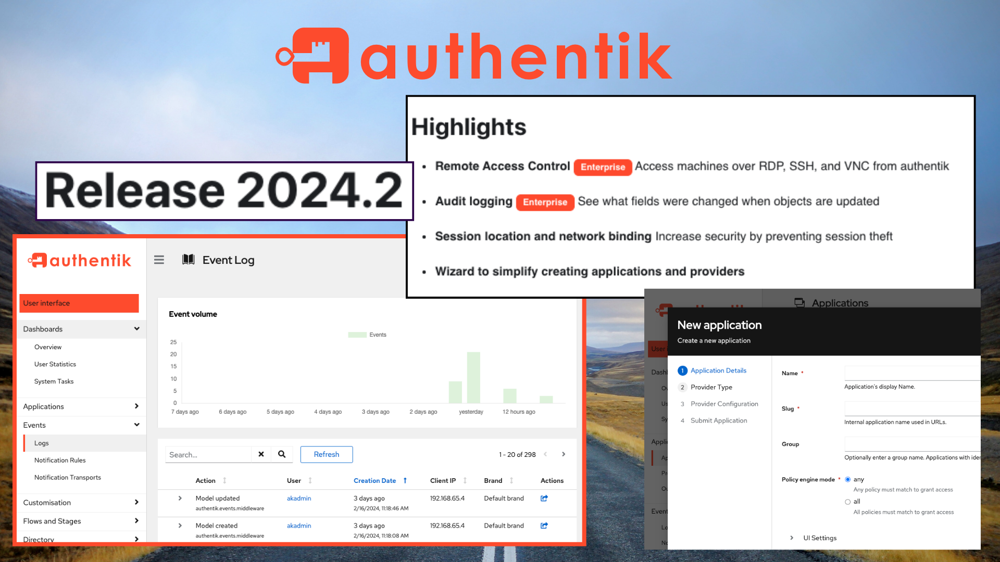

> **_authentik is an open source Identity Provider that unifies your identity needs into a single platform, replacing Okta, Active Directory, and auth0. Authentik Security is a [public benefit company](https://github.com/OpenCoreVentures/ocv-public-benefit-company/blob/main/ocv-public-benefit-company-charter.md) building on top of the open source project._**

---

We are happy to announce that 2024 is starting off great, with our first release of the year chock full of new features. Take a look at the new features and functionality included in the release, check out the [Release Notes](https://goauthentik.io/docs/releases/2024.2) for more details and upgrade instructions, and enjoy the new features!

We confess we are possibly the most excited about this release than any in a while, with some new Admin-level capabilities, enhanced functionality for developers (our DX game is heating up!), and some great UX/usability and customization enhancements.

Let’s start with some of the big features, the ones that kept us busy over the holidays and into the new year.

<!--truncate-->

### **Remote Access Control** (Enterprise)

The Remote Access Control provider allows you to remotely connect to other machines over RDP, SSH and VNC through authentik. With the RAC provider, we kept implementation consistent with our other providers; you use the same policy engine and customization options that are possible with other providers and use the same user and admin interface.

Typical use cases for remote access include being able to access a legacy application on a Windows VM, access an application that isn’t web-based, or give people access to a machine that does not have direct network access.

### Create new apps (and providers!) with an easy Wizard (Preview)

We are very happy to announce our new App Wizard. It's still in Preview, so please send us your feedback!

Gone are the days when you started to create a new application, then realized you needed to first go create a provider (a means of authentication against a remote application), then back to the app to finish up… now the steps for creating both a new app and a new provider are managed by the wizard; easy-peasy. We know this was a too-many-hoops hurdle for some new users, so our new App wizard is a new feature that we are particularly pleased to release. Be sure to check out our [YouTube video](https://www.youtube.com/watch?v=broUAWrIWDI) covering the wizard!

### Audit logging now with field-level changes (Enterprise)

Audit all changes made to models, including which fields were changed with previous and new values of the fields. The values are censored if they are sensitive (for example a password hash), however a hash of the changed value will still be logged.

### Improve security through automated session binding

Sessions for any users can now be bound to a specific geolocation (Continent, Country, City) or network (Autonomous System, subnet, IP address). If the session is accessed from a location/network that is different than that from which it was initially created, the session will be terminated.

## Sure, there are some breaking changes

For the first release of the year, we purposefully included several changes that are required for future product growth, some of which might require manual changes to your system configurations. Be sure to refer to the [Release Notes](https://goauthentik.io/docs/releases/2024.2) for instructions about any actions you might need to take. In general, we strive to reduce the number of breaking changes, and to always be transparent about the actions needed and the reasons for the changes. Please be sure to reach out to us via email to hello@goauthentik.io, or in [GitHub](https://github.com/goauthentik/authentik) or [Discord](https://discord.com/channels/809154715984199690/809154716507963434) with any questions and feedback!

### Tenants renamed to brands

Perhaps the biggest change is that _tenants_ (which were previously used to change branding configuration, default flows, and several other settings) have been renamed to *brands*. The term "Brands" more accurately reflect their usage; to configure branding, logos, colors, and overall login flow behavior. For more information, refer to the [Release Notes](https://goauthentik.io/docs/releases/2024.2) and to our documentation for _brands_.

### Helm chart breaking changes

The Helm Chart used for running authentik in Kubernetes has a number of breaking changes. Find out more in the [chart release notes](https://github.com/goauthentik/helm/releases/tag/authentik-2024.2.0).

## More new functionality, DX, and UX enhancements

Release 2024.2 contains even more; the following additional enhancements will make running and operating authentik even more valuable, no matter your role.

-   ### AWS S3 file storage

    Media files can now be stored on AWS S3. To learn more and get started with using S3, follow the [setup guide](https://goauthentik.io/docs/installation/storage-s3).

-   ### *Pretend user exists* option for Identification stage

    Previously the Identification stage would only continue if a user matching the user identifier exists. While this was the intended functionality, this release adds an option to continue to the next stage even if no matching user was found. "Pretend" users can neither authenticate nor receive emails, and don't exist in the database.

-   ### Flows can now be restricted to outposts

    You can now configure a flow to restrict its use, using the flow’s **Require Outpost** setting. This capability is mainly used for LDAP flows.

-   ### Admin can see all of a user’s apps

    A new tab on the **User** details page now displays all applications to which the user has access. From the list of applications, the admin can drill down into a specific app and see details about the app, including a changelog of app modifications, any bindings, and the permissions on the app.

-   ### View Event volume with a new graph

    Another UX improvement that we are really pleased with is the new graph showing the volume of events over the past 7 days. With a quick glance at the **Event Log** page, admins can spot anomalies in event volume and then dig deeper.

-   ### Keep a closer eye on your System Tasks

    You can now search through system tasks, and view task start time and duration calculation as well as the status (Successful!).

    ## Happy upgrading and authenticating!

    There are even more capabilities and enhancements beyond what we covered here in this post, so be sure to read the [Release Notes](https://goauthentik.io/docs/releases/2024.2) for version 2024.2, and as always, let us know your thoughts.
