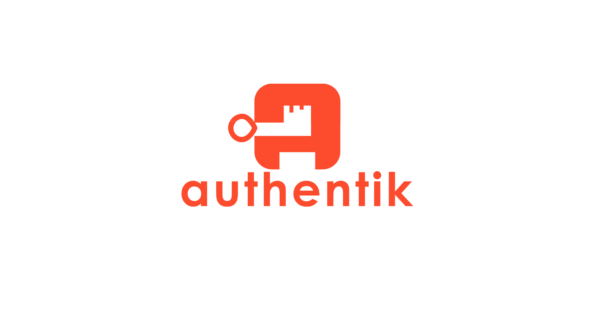
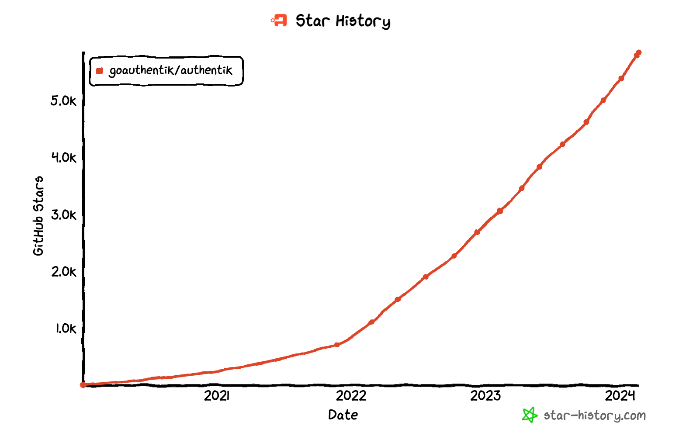

> **_authentik is an open source Identity Provider that unifies your identity needs into a single platform, replacing Okta, Active Directory, and auth0. Authentik Security is a [public benefit company](https://github.com/OpenCoreVentures/ocv-public-benefit-company/blob/main/ocv-public-benefit-company-charter.md) building on top of the open source project._**

---

Hello world! I'm excited to be joining Authentik Security as CEO. I wanted to take this opportunity to share the experience of my first week with the community and a bit about my background.

At the start of my very first "official" day on the job, I got an overview of the various applications we use from Jens, our founder and CTO. If you have ever been through a company onboarding process, you know that it might take a few days up to a couple weeks to get access to everything, sometimes even longer. In a small and agile startup, that might be as little as a day if you're lucky.

<!--truncate-->

_While on our first call_, in the first few minutes, Jens provisioned me as a new user to our own internal authentik instance. I logged in, added MFA, and _within one minute_ I had access to all of the applications I needed to dive in. It's always good to [dogfood](https://en.wikipedia.org/wiki/Eating_your_own_dog_food) your own products, and even better when those products help you get your own work done faster! Onboarding new employees might seem like a specific edge case for an SSO, but it's a great example of how having a flexible identity platform in place can make a broad set of day-to-day chores so much easier.

My next step was to spin up my own local authentik instance. I don't plan on contributing code every day, but I did want to start learning my way around the internals of the application. Especially at a startup, this often this involves a lot of back-and-forth with a developer or two, a couple days of gathering up necessary keys, managing dependency conflicts, deciphering outdated documentation, etc...

I went to our [docs](https://goauthentik.io/docs/installation/docker-compose). I had [Docker Desktop](https://www.docker.com/products/docker-desktop/). I pulled our Docker Compose file. I added a password and secret key to a `.env`. I spun up the image. Ta da! A working instance ready to go, in about three minutes total.

Containerized apps are nothing new, but packaging alone can only take a project so far in helping new users to get started. Jens and the team have made careful decisions and thoughtful choices about our technology, along with how it's organized and documented, that manage to make a very complex product very straightforward in its use.

> The ease with which I was able to dive in is a direct reflection of our mission: **make authentication simple**.

The choice of Python and Django for building the backend of authentik was another sign to me that Jens and the team are focused on **making authentication simple** by building the best platform for the job. A long while back, I founded [Real Python](https://realpython.com/), a set of online resources and community for Python developers. And while I don't think there's only ever one tool for the job, I have a longstanding belief in Python's ability to be a good tool for most jobs! Python is by far the [most popular programming language in the world](https://www.tiobe.com/tiobe-index/). It allows us to move fast, and it helps make contributing to the platform as accessible as possible for the broadest set of developers.

I am also a big believer in the power of open source, so the fact of Authentik Security being formed as a [public benefit company](https://opencoreventures.com/blog/2022-11-introducing-authentik-security/) was a major positive to me. A company, culture, and technology that is open by default has so many inherent advantages. Most of our users get to benefit from a fully featured, completely free version of authentik. We in turn get the benefit of feedback, word of mouth, and code contributions from our amazing community.

The confidential source code for both of Okta's main products was stolen in [separate](https://www.bleepingcomputer.com/news/security/auth0-warns-that-some-source-code-repos-may-have-been-stolen/) [incidents](https://www.bleepingcomputer.com/news/security/oktas-source-code-stolen-after-github-repositories-hacked/), which now means that while their customers don't get to know the details of how these proprietary systems work, potential attackers can now review the code at length for flaws and vulnerabilities. Imagine relying on other security-critical applications in this context; would you use a cryptography library that could only be reviewed by adversaries?

By contrast, since all of our application code is open (even the paid Enterprise features are [source available](https://en.wikipedia.org/wiki/Source-available_software)), our users can freely inspect how we go about prioritizing their security in the platform. This means that we have the continuous benefit of review, suggestions, and direct contributions from experts across our community. It also means that our users can make their own modifications to the existing code to suit their custom needs.

I also believe in helping fix broken systems - and we all know that there is a lot to be fixed in the world of security! I previously created Hunter2 (now Veracode Security Labs), a security training platform where developers get hands-on practice hacking and patching real applications. This was a big step forward for the industry, when the most common alternative was to watch a series of boring videos about SQL injection once a year and consider "training" complete.

Right now, authentication as a whole is a series of broken and often frustrating systems, patched together with custom code that's impossible to maintain. Authentik Security has already been building the groundwork for the past few years to help replace these fragile, fragmented setups with a single, simple identity solution, and the community has shown that it's eager to join us as we scale up our efforts.

Authentik Security can help pave the way to make it simple for anyone to implement identity and access management, from an individual developer with a hobby project to a Fortune 100 company with a 100,000-employee rollout. I'm looking forward to being a part of this journey, and want to hear from you, the community, about how we can best support you: reach out through email to [hello@goauthentik.io](mailto:hello@goauthentik.io) or on [Discord](https://discord.com/channels/809154715984199690/809154716507963434) or [GitHub](https://github.com/goauthentik/authentik).
