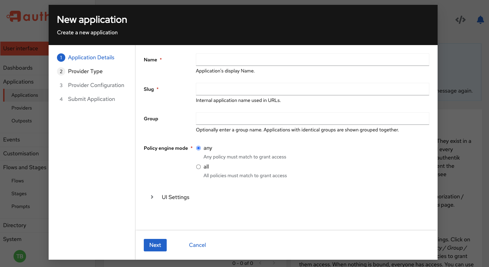

> **_authentik is an open source Identity Provider that unifies your identity needs into a single platform, replacing Okta, Active Directory, and auth0. Authentik Security is a [public benefit company](https://github.com/OpenCoreVentures/ocv-public-benefit-company/blob/main/ocv-public-benefit-company-charter.md) building on top of the open source project._**

---

A hearty Happy New Year to you all, from all of of us at Authentik Security, with sincere wishes that your 2024 may be filled with a maximum of joys (new features and elegant code) and a minimum of pains (bugs and the dreadful reality of not-enough-time).

> The start of a new year makes me want to first say **thank you** for the past year.

## Thank you!

**Thank you to our community**, from the newly joined members to our long-time friends and moderators and holders-of-knowledge. Without you all, well… we literally wouldn’t be here. No matter how deep your knowledge of authentik is, it’s really your willingness to explore and test and give feedback on new and old features, all while supporting each other and staying in touch with good humor and vibes, that make us such a vibrant community.

**Thank you to our users**, from those who run authentik in their homelabs to those who run authentik in production, and everyone in between. We appreciate your trust and guidance, and your input into how we can provide the most-needed features and grow our product in the ways that solve your business needs and challenges.

**And of course thanks to our small team** here at Authentik Security, who joined me on this adventure and brought your skills and talents, your experience and passions, and your dedication to our product and users. We built a lot together last year, and this year has a rock-star list of features and functionality coming up!

## Accomplishments in 2023

Looking back to the work we did in 2023, the new features are just a part of the overall achievements and celebrations (and challenges) of building a new [company](https://goauthentik.io/blog/2022-11-02-the-next-step-for-authentik), growing the team, celebrating our [1st year](https://goauthentik.io/blog/2023-11-1-happy-birthday-to-us), and [defining our tools and processes](https://goauthentik.io/blog/2023-12-21-five-lessons-from-choosing-infrastructure-tooling). But we released quite a few new features that I’m proud to share.

### RBAC

[RBAC](https://goauthentik.io/docs/user-group-role/access-control/) (role-based access control) is the gold standard of access control. RBAC provides the ability to finely configure permissions within authentik. These permissions can be used to delegate different tasks, such as user management, application creation and more to users without granting them full superuser permissions. authentik has had internal RBAC for a long time (and of course the policy engine for restricting access to applications), however access to different objects within authentik (like Users, Groups, etc) was not possible previously.

### Enterprise Support

Providing dedicated support with a proper ticketing system was a big accomplishment for 2023. Support was the flagship feature of our [Enterprise release](https://goauthentik.io/blog/2023-08-31-announcing-the-authentik-enterprise-release) in the fall of 2023.

### SCIM support

Our [2023.3 release](https://goauthentik.io/docs/releases/2023.3) added support for SCIM (System for Cross-domain Identity Management) protocol, allowing for the provision of users into other IT systems, where the provider synchronizes Users, Groups and the user membership.

### RADIUS Support

The [RADIUS protocol](https://goauthentik.io/docs/providers/radius/) for authentication allows for the integration of a wider variety of systems such as VPN software, network switches/routers, and others. The RADIUS provider also uses a flow to authenticate users, and supports the same stages as the [LDAP Provider](https://goauthentik.io/docs/providers/ldap/).

## What’s coming up in 2024?

Looking forward to new functionality for the new year, let me share some of the ones I am most excited about. As with any small development team, we tackle what we can, with an eye on which features will be most beneficial for you all, which have dependencies upon later features, maintainability as we further develop the feature, and how to best get them all out the door fully tested and documented.

### Wizardry

The task of adding the applications that you want authentik to authenticate is about to get a lot easier; we have a new wizard that combines the process of defining a new provider and a new application into one single task. This new wizard saves many steps and streamlines the process. Look for it in preview mode in our current 2023.10 release (navigate to the Applications page in the Admin UI), and let us know your thoughts. We will continue tweaking it, specifically the multi-select functionality, but feedback is always welcome!

### Remote Access Control (RAC)

With [RAC](https://goauthentik.io/docs/providers/rac/), in preview now with a full release in early 2024, authentik Admins are able to access remote Windows/macOS/Linux machines via [RDP](https://en.wikipedia.org/wiki/Remote_Desktop_Protocol)/[SSH](https://en.wikipedia.org/wiki/Secure_Shell)/[VNC](https://en.wikipedia.org/wiki/Virtual_Network_Computing). The preview version already has capabilities for using a bi-directoinal clipboard between the authentik client and the remote machine, audio redirection (meaning you can hear audio from the remote machine on your local instance), and resizing of the window you view of the remote machine.

### Mobile authenticator app for authentik

Soon you will be able to download our new authentik authentication app from Apple Store, and a bit further into 2024, from Google Play Store. This app can be used for 2FA/MFA verification when authentik users log in to authentik or access any application managed by an authentik instance. The first release of this app will use number-matching as the default verification process; users will view their authentik authenticator app on their phone, be prompted with a set of three numbers, and then need to select the same number that is displayed on their authentik instance login panel.

### Building out our SaaS offering

One of our most exciting, and definitely our biggest, projects for 2024 will be developing our SaaS offering, the hosted, fully-managed Enterprise Cloud. The Enterprise Cloud plan will provide the convenience of our enterprise-level product as a SaaS offering, hosted and managed by Authentik Security. For many organizations, the benefits of decreased operational costs and universal data access (no VPN, servers, and network configuration required) make SaaS the best choice. With the cloud offering, the same enterprise-level support plan is included, and migrating to self-hosted is always an option.

### DX and UX and quality-of-life improvements

As we mentioned in our blog about our one-year anniversary, we also plan to spend some time focused on user experience.

-   Increase our focus on UX and ease-of-use, templatizing as much as possible of the frontend components, and developing a UI Style Guide
-   A redesigned website, with more information about our solutions, use cases, and offerings
-   New structure for our technical documentation; leveraging information architecture and user research to make it easier to find what you are looking for in our docs
-   Defining even more robust tests and checks for our CI/CD pipeline and build process
-   Stronger integration and migration testing, both automated and manual
-   Spending more time on outreach and user research to learn what you all want

### Yes, a big year ahead

As most of us in the software and technology space know, the hard work of building new features and growing a company is, well, actually kind of fun. Challenging, yes, but always rewarding.

We’d love to hear from you all about our upcoming plans; reach out to us with an email to [hello@goauthentik.io](mailto:hello@goauthentik.io) or on [Discord](https://discord.com/channels/809154715984199690/809154716507963434).
