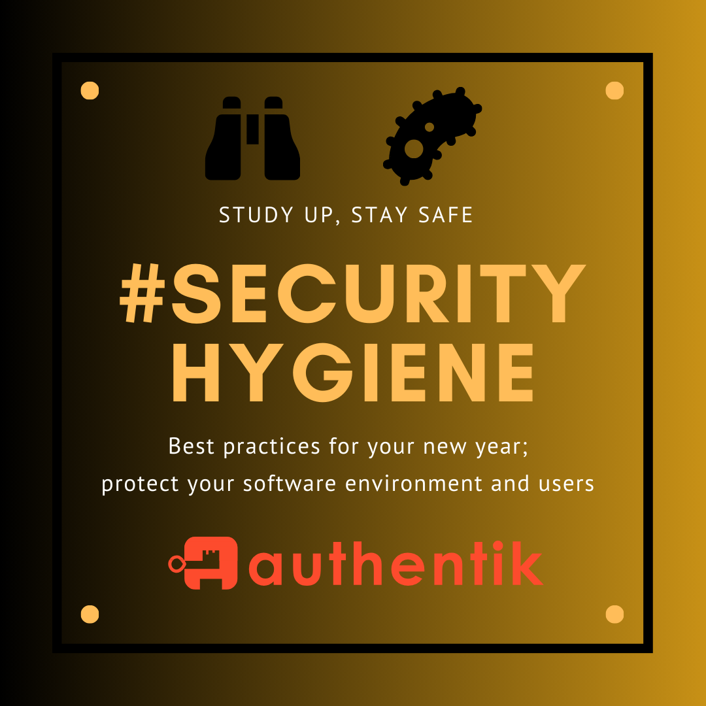
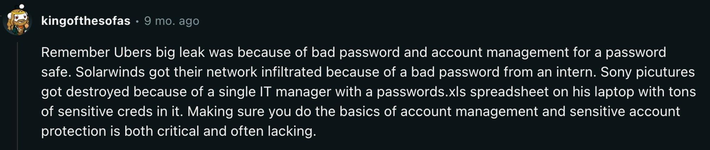
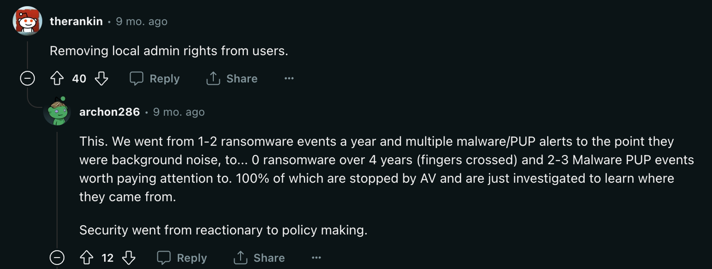

> **_authentik is an open source Identity Provider that unifies your identity needs into a single platform, replacing Okta, Active Directory, and auth0. Authentik Security is a [public benefit company](https://github.com/OpenCoreVentures/ocv-public-benefit-company/blob/main/ocv-public-benefit-company-charter.md) building on top of the open source project._**

---

Last year we shared [our (mostly free and open source) security stack](https://goauthentik.io/blog/2023-11-22-how-we-saved-over-100k), including tooling we use for basic security coverage like visibility, dependency management, penetration testing, and more. Even with these tools set up, there are still activities and practices you need to do routinely and proactively to ensure you’re not at risk.

There are frameworks you can look to (e.g. [NIST](https://www.nist.gov/cyberframework), [OWASP SAMM](https://owasp.org/www-project-samm/)) but these can be overwhelming if you’re a one-person team or new to security. If you’re coming into 2024 with a fresh resolve to improve your security posture, here’s our advice on what to prioritize (and where you can automate).

<!--truncate-->

## The biggest security risk is poor access management, not vulnerabilities

When was the last time you heard of a major breach where they actually exploited the company’s application to gain access? You are far more likely to be an unlucky victim of phishing, social engineering, stolen credentials, or insider threats than you are a targeted attack on your application.

It takes a lot of effort for hackers to study your app and infrastructure to find a way in. These types of attacks also don’t necessarily mean hackers gain access to all your data, which is what they’re usually after. Attacks that simply take you down are just not valuable for them.

> Most of the major security breaches in recent years have been [a result of compromised access](https://goauthentik.io/blog/2023-10-23-another-okta-breach).

The UK government’s [Cyber security breaches survey 2023](https://www.gov.uk/government/statistics/cyber-security-breaches-survey-2023/cyber-security-breaches-survey-2023) found that the percentage of businesses and charities with some basic cyber security hygiene practices actually _declined_ between 2021 and 2023:

| Security practice        | 2021 | 2023 |
| ------------------------ | ---- | ---- |
| Use of password policies | 79%  | 70%  |
| Restricting admin rights | 75%  | 67%  |

### At a minimum, resolve to review access this year

Access management is number one—both in terms of things that get neglected, and a relatively simple thing to get on top of that can significantly reduce the impact of a breach.

There are two nightmare access scenarios for a security engineer:

-   **Everybody has admin status** ([Sysdig reports](https://sysdig.com/2023-cloud-native-security-and-usage-report/) that 90% of accounts have excessive permissions!)
-   **Passwords are stored in plain text somewhere** (probably to enable shared logins)

These practices are risky for multiple reasons. If everyone has admin permissions, suddenly a hacker only needs one compromised account to gain access to everything and do a lot of damage. And we all agree that storing passwords in a spreadsheet is not secure, and makes it hard to isolate who has access to what, and why.

Big, mature corporations tend to have more strict permissions. One of the blessings/curses about working in startups is that they are usually more flexible—employees have fewer limitations on the scope of their role, which can be great for collaboration and people taking initiative. But that fluidity can make it harder to keep tabs on who should have access to what. Being overly permissive with admin status also opens the door to [shadow IT](https://en.wikipedia.org/wiki/Shadow_IT).

### Integrate access reviews into planning cycles

If your company is making quarterly or annual plans at this moment, now is a great time to introduce access reviews into that process. The second worst time to introduce new access policies and software is in the middle of a sprint when doing so disrupts a development team's cadence. (The worst time, of course, is after you've been breached.)

If you're partnering with engineering up front it's much easier to work with them to understand their needs. This will help you keep an eye open for unusual requests or network activity. Slotting access management reviews into an existing process helps to prevent the “security as blocker” problem (which often leads to friction between security and dev teams).

### Set up an Identity and Access Management solution

You can automate away some of the more routine/tedious aspects of Identity and Access Management (IAM) by implementing an identity provider. With SSO (Single Sign-on), you can map specific tasks to certain roles, and then further map refined-access roles to other roles, based on what tools a person is likely to need in their specific position at the company. For example, if someone has access to AWS, they automatically have access to your database. By using an SSO, especially one with [RBAC](https://goauthentik.io/docs/user-group-role/access-control) (Role-Based Access Control), you are only concerned with the initial setup being correct versus constant, ongoing reviews.

You can also set up alerts: these will send an email to the security team in the event that a new role is created so you can go and investigate.

Full disclosure: we make (and use in-house) [authentik](https://goauthentik.io/), which is an identity provider. There is an open source version, so even if you’re strapped for cash you can still implement IAM. You can [check if authentik integrates with your application here](https://goauthentik.io/integrations/).

## What else should you be doing (at least) quarterly?

While we’re on the topic of security hygiene, there are other practices that are worth doing routinely (especially if you’ve automated your access management with an identity provider).

If you’re on a path to a certification like SOC II or ISO/IEC 27001, you will already be implementing these on a quarterly basis. But as we’ve discussed on this blog before, [even if you’re not seeking certification, they’re still worth doing](https://goauthentik.io/blog/2023-11-22-how-we-saved-over-100k#do-you-really-need-certifications) to ingrain good practices that become more important as you scale. As the Redditor suggested above, [security then goes from reactionary to policy making](https://www.reddit.com/r/cybersecurity/comments/12ygfnw/comment/jhnqgnt/).

-   **Review and rotate long-lived credentials:** What was the last time AWS access keys were rotated? Rotating credentials every 30/60/90 days contributes to [“defense in depth”, which we touched on before here](https://goauthentik.io/blog/2023-11-22-how-we-saved-over-100k#organizational-security)). That way, if an access key is compromised, it’s no longer valid. Ideally, you would automate rotation so you can set and forget about this one.
-   **Identify gaps in coverage:** A lot of these routine activities have a second-order effect of exposing failures in process. You’re kicking over stones and seeing what’s lurking underneath. Anything you find is signal that there’s a gap in coverage. How do you make sure you catch those long-lived tokens without having to go looking for them? Apart from automating rotation of credentials as suggested above, with AWS, for example, you could write a simple Python script to query IAM and send out an email when access tokens exceed a certain threshold.

### Designate ownership

If you’re a small company and don’t have dedicated security professionals to “own” the security of your apps and services, share the responsibilities. For example, one team member owns one application hosted on these five servers, and is responsible for them:

-   They perform the routine hygiene checks (like access reviews)
-   They also have the context necessary in the event of a critical vulnerability or even an outage (beyond security, you don’t want people having to run around trying to figure out who does what or how to fix things in an emergency)
-   They're responsible for writing the runbook and updating its procedures after an outage or vulnerability has been identified and managed

## PS: Plugging vulnerabilities—should you bother?

“_Oh no, this SCA tool says I have 453 vulnerabilities!_”

If your company is just building up your security posture, it’s easy to get distracted by seemingly alarming reports from SCA (Software Composition Analysis) tools. If you don’t have dedicated security engineers and security is being shared among your development team, coding is probably much more familiar and attractive than taking on organizational security challenges. But, as mentioned above, breaches are far more likely to result from phishing than a vulnerability exploitation.

SCA tools notoriously produce a lot of [false positives](https://goauthentik.io/blog/2023-11-30-automated-security-versus-the-security-mindset#some-of-the-drawbacks-of-vulnerability-scanning-tools). This is not to say you should ignore vulnerabilities, but if you’re strapped for time or resources, getting on top of access is far more likely to have an impact than painstakingly fixing every vulnerable piece of code.

### Patching is a high-impact measure that you _can_ implement routinely

Policies to apply software security updates within 14 days was another measure that suffered a decline in the past few years, according to the UK government’s [Cyber security breaches survey 2023](https://www.gov.uk/government/statistics/cyber-security-breaches-survey-2023/cyber-security-breaches-survey-2023). Businesses and charities with this policy in place dropped from 43% in 2021 to just 31% in 2023.

The risk of falling behind on security patches is far greater than leaving a potential vulnerability unmitigated. If an attacker gains access to your server and your machines are out of date, they might be able to move from server to server. Now you have to go to your infrastructure team and figure out how to patch the server without taking it down. Instead, it’s wise to automate security patches, and you can use tools like [Chef](https://www.chef.io/products/chef-infra) or [Puppet](https://www.puppet.com/) to do so.

We’d be interested to hear what are the worst security hygiene practices that you have ever witnessed? What are some of your favorite good practices that you use, that we might not have mentioned above? Leave us a comment below, or connect with us via email at [hello@goauthentik.io](mailto:hello@goauthentik.io) or on [Discord](https://discord.com/channels/809154715984199690/809154716507963434)!

_[Rebecca Dodd](https://thebasementoffice.co.uk/) contributed to this post._

---
