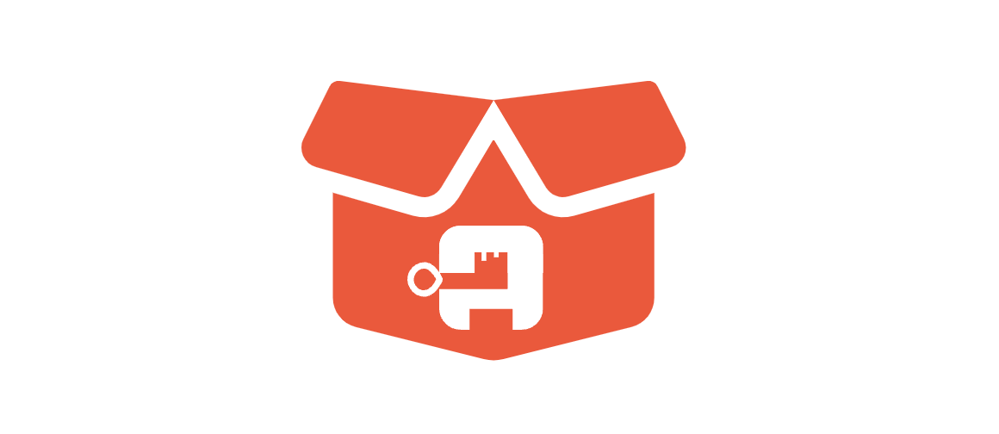

> **_authentik is an open source Identity Provider that unifies your identity needs into a single platform, replacing Okta, Active Directory, and auth0. Authentik Security is a [public benefit company](https://github.com/OpenCoreVentures/ocv-public-benefit-company/blob/main/ocv-public-benefit-company-charter.md) building on top of the open source project._**

---

At the time of writing this post, the downfalls of using YAML as a templating language are being debated on [Hacker News](https://news.ycombinator.com/item?id=39101828). The headache of trying to customize Helm charts is a gripe we share at Authentik, which we’ll get into below.

This post is about how we test and deploy [authentik](https://goauthentik.io/) using [containers](https://goauthentik.io/blog/2023/10/26/you-might-be-doing-containers-wrong/item), some gotchas we’ve encountered, and lessons we’ve picked up along the way.

When the [company founder](https://goauthentik.io/blog/2022-11-02-the-next-step-for-authentik) is from an Infrastructure background, and the first person he decides to hire (that's me!) is also from Infra, you can imagine that we end up with some pretty strong opinions about tools and processes.

This is part of an ongoing series about the tools and products that make up authentik’s stack (you can also read about our [infrastructure tooling choices](https://goauthentik.io/blog/2023-12-21-five-lessons-from-choosing-infrastructure-tooling) and what’s in our [security stack](https://goauthentik.io/blog/2023-11-22-how-we-saved-over-100k)).

<!--truncate-->

## How we use containers at authentik

### For development

For developing authentik on local machines, we use Docker for running external tools, like running the database in development and running Redis. Other tools we use are distributed using Docker images, like generating the frontend API client and other API clients. So, we use Docker for various purposes on local development machines or in CI.

### For deployment

To actually deploy authentik for our own, internal instance (Yes, we use authentik for all of our own apps here at the company, aka the proverbial dogfooding), we use Kubernetes. Users can choose either Docker Compose or Kubernetes for their authentik instances. Providing a Docker Compose file and container image plus a Helm chart for Kubernetes as part of the regular release package is becoming more and more standard, especially with new tools, so it made sense for us to follow suit. (The same applies for running Kubernetes internally—it’s what basically everyone in the industry is switching to.)

While customers don’t _need_ the Helm chart to be able to deploy on Kubernetes (anyone could just take the container image we provide, look at the Docker Compose and adapt it to use on Kubernetes), it’s not a big lift for us to provide it, to eliminate extra steps for people wanting to use Kubernetes. These aren’t lengthy processes and they don’t take much to maintain if set up correctly to begin with.

While writing Docker Compose files is pretty straightforward, the Helm chart can be tricky for developers who don’t have exposure to operations and infrastructure if there’s no dedicated infrastructure engineer on the team. So you may need an infrastructure engineer or at least a developer who runs their own homelab or is at least a bit interested in infrastructure, so they’re willing to spend the time learning how to do these things.

All of this is to say that we are not doing anything fancy here (in keeping with our approach of [optimizing for stability](https://goauthentik.io/blog/2023-12-21-five-lessons-from-choosing-infrastructure-tooling#5-optimize-for-stability-and-support)), but even though these are common paths, there are some pitfalls to watch out for…

## Don’t hardcode your secrets

There are a number of tools out there that offer container images, Kubernetes manifests, or Helm charts as ways of setting up their services. With some tools, you have to watch out for sensitive information inadvertently getting exposed, because their proposed setup doesn’t integrate well with GitOps philosophy nor with SecOps best practices.

For example, we mentioned in a previous post that [we use Wazuh for Security Information and Event Management](https://goauthentik.io/blog/2023-11-22-how-we-saved-over-100k#visibility-do-you-know-what-is-happening-in-your-environment). Wazuh is open source, well supported, and serves us well, but as mentioned in our previous post, it… takes some skill to deploy.

Instead of giving you a Helm chart that does everything nicely and automatically, you have to clone their repository, edit the manifest by hand, and then apply those changes manually on your Kubernetes cluster. Now here’s the tricky part, when you’re moving fast; if you hardcode those secrets into those manifests (which are just YAML files, so hardly secure), and then push them to Git (because you’re practicing GitOps), now your secrets are exposed.

What you want to do instead is have your secrets stored in a secret storage solution (e.g. [Vault](https://www.vaultproject.io/)) and then in your manifests instruct your Kubernetes cluster to go look for those secrets in Vault. That way you’re only exposing where the secret can be retrieved from, not exposing the secret in the manifest. You still have most of the advantage of the GitOps philosophy while preserving your security.

This pattern isn’t unique to Wazuh, plenty of software has this challenge. So it’s definitely worth taking care when you’re deploying a service and making sure that even if they’re not approaching things with a GitOps mindset, **you** are.

## Configurability & customization can bite you

For better or worse, Helm is widely used in the industry. It definitely has some annoying quirks. One of those quirks can lead to another common pitfall: not making your Helm charts configurable enough.

This is something to watch out for both as a _user_ of Helm charts (if you’re installing services for your company), as well as a *provider*  (if you offer a Helm chart for customers). The manifests that you apply to Kubernetes are, as you know, YAML files. Helm, being a templating tool, enables you to template out YAML from whatever data you provide at the time you install the Helm charts.

By default, any data, any variable that you have hardcoded in the template, is impossible to override later, so things can get messy quick...

[![Quote: "Your config becoming more and more complex until it inevitably needs its own config, etc. You wind up with a sprawling, Byzantine mess."
We're already there with Helm. People write YAML because it's "just data". Then they want to package it up so they put it in a helm chart. Then they add variable substitution so that the name of resources can be configured by the chart user. Then they want to do some control flow or repetitiveness, so they use ifs and loops in templates. Then it needs configuring, so they add a values.yaml configuration file to configure the YAML templating engine's behaviour. Then it gets complicated so they define helper functions in the templating language, which are saved in another template file. So we have a YAML program being configured by a YAML configuration file, with functions written in a limited templating language. But that's sometimes not enough, so sometimes variables are also defined in the values.yaml and referenced elsewhere in the values.yaml with templating. This then gets passed to the templating system, which then evaluates that template-within-a-template, to produce YAML.](./HN-quote.png)](https://news.ycombinator.com/item?id=39102395)

If you want to modify the manifests generated by the Helm chart templates, there’s no integrated way to do that in Helm, so you need to use [Kustomize](https://kustomize.io/) to override what has been generated from the Helm chart. You can also fork the Helm chart and modify the templates directly, but this is a cumbersome workaround and occasionally you might find licensing restrictions associated with doing this.

I can’t count the number of PRs I’ve opened to open source projects to fix their Helm charts because I couldn’t override something I wanted to. It could be as simple as not supporting [IPv6](https://goauthentik.io/blog/2023-11-09-IPv6-addresses) and allowing people to replace `IPv4` with `IPv6`.

We actually just finalized some powerful customization options for our authentik chart (take a [sneak peek at the PR](https://github.com/goauthentik/helm/pull/230)), and will include it with the first 2024 release.

## Do review and update Kubernetes resources (but maybe not automatically)

As a refresher: there are two ways to control resources (RAM and CPU) in Kubernetes. These two settings provide levers for managing resources in your container:

1. **Requests:** Requests guarantee a set number of resources that a container can use. You can use this lever for scheduling if you’re expecting an increase (e.g. for a launch).
2. **Limits:** This is the maximum threshold for resources that a container can use (so one container doesn’t starve another service by using too much of your resources).

As you grow your user base, you will likely have more traffic to your services and more activity, consuming more resources. Your resource setup from 18 months ago might not be appropriate for your current scale, so proactively checking resource usage and allocation can help prevent future problems (downtime or [wasted resources](https://sysdig.com/blog/millions-wasted-kubernetes/)).

At authentik, I use [Robusta KRR](https://github.com/robusta-dev/krr) to produce routine reports on Kubernetes resources. I review these and then make manual updates to requests and limits as necessary. There are tools that automatically update the resources directly on the cluster (i.e. without updating them in Git), however, updating resources automatically has ripple effects: if you’re increasing resources, you need more nodes to run the services, for example. In general, if automated changes OR manual changes are made, you want to be aware of it in case there are downstream effects that you need to adjust for.

> “There are some specific use cases where automatic adjustment to resources make sense, but otherwise it’s probably wisest to _automate the reporting, but manually conduct the reviews and updates_.”

## Consider setting up firewall rules at the outset

[We’ve talked](https://goauthentik.io/blog/2023/10/26/you-might-be-doing-containers-wrong/item#why-you-should-use-one-container-per-service) ([a lot](https://goauthentik.io/blog/2023-12-21-five-lessons-from-choosing-infrastructure-tooling#2-build-with-scale-in-mind)) [on this blog](https://goauthentik.io/blog/2023-11-22-how-we-saved-over-100k#do-you-really-need-certifications) about setting things up the right way from the beginning. One instance where we actually didn’t walk this talk was with firewalling within our Kubernetes cluster.

In general, we try to have best security practices for services that we deploy, like not running as root and not running privileged, which is by default not enabled. We’re still missing the firewall piece though, so all our services can talk to each other, which in retrospect was a mistake.

This isn’t a problem for now (and it’s not at all unusual), but we are working on [a SaaS version of authentik](https://goauthentik.io/blog/2024-1-12-happy-new-year-from-authentik-security#building-out-our-saas-offering), so there will be some customer code running on our infrastructure. Since we obviously don’t want them to be able to make requests to our internal services, we need firewalls.

### We can’t just turn off the tap

Currently all communication between services (apps, DBs, etc.) is allowed. As we’re trying to implement firewall rules, now we’re effectively saying nothing is allowed, and we’re just whitelisting things. It’s much harder to do it this way around: when you’re setting things up and saying nothing is allowed, things will fail if they need to communicate in some way. You get immediate feedback and then can go whitelist it.

The other way around, we can’t just block everything and whitelist nothing, because we’ll kill our services. We have to think very carefully about how we’re going to apply firewall rules and make sure everything is in place before we turn off the tap.

This is one area where we didn’t anticipate our changing needs as we grow, and didn’t set things up the right way from the outset. But then, we didn’t have a SaaS offering to start with, so we didn’t optimize for it. It just shows that you can’t anticipate everything. Technically, we are able to apply those firewall rules only in the SaaS context and leave the existing setup as is, but while we’re building for SaaS, we might as well retrofit firewall rules everywhere, and be more secure in that way, even if it will cost some engineering time to take all those precautions.

I have a homelab setup where I test new infrastructure configurations, so I was able to experiment with firewalling before implementing it at authentik. If someone on your team has a homelab, this is a great way to validate configurations, experiment, and learn in the process. But if you don’t have that as a resource, it’s still a good idea to have some kind of sandbox environment to iterate on your infrastructure before implementing it for real. That could be a Kubernetes cluster dedicated to sandboxing that’s available to the whole infrastructure team, or running a small Kubernetes cluster on a local machine (using something like [kind](https://kind.sigs.k8s.io/) or [minikube](https://minikube.sigs.k8s.io/docs/)).

Let us know what practices you use, or any practices to avoid, and how you do your testing to find just the right balance of automation, GitOps, SecOps, and sanity. Reach out to us with an email to [hello@goauthentik.io](mailto:hello@goauthentik.io) or on [Discord](https://discord.com/channels/809154715984199690/809154716507963434); we look forward to hearing from you!

_[Rebecca Dodd](https://thebasementoffice.co.uk/) contributed to this post._

---
