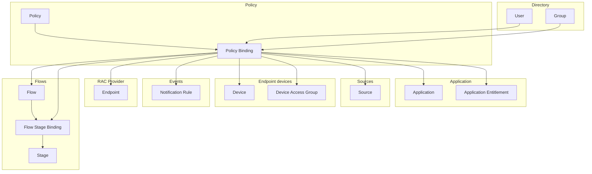

A binding is, simply put, a connection between two components. The use of a binding adds additional functionality to one the existing components; for example, a policy binding can cause a new stage to be presented within a flow to a specific user or group.

:::info
For information about creating and managing bindings, refer to [Work with bindings](./work-with-bindings.md).
:::

Bindings are an important part of authentik; the majority of configuration options are defined in bindings.

It's important to remember that bindings are instantiated objects themselves, and conceptually can be considered as a "connector" between two components. This is why you might read about "binding a binding", because technically, a binding is "spliced" into another binding, in order to intercept and enforce the criteria defined in the second binding.

## Relations with bindings

This diagram shows the relationships that bindings have between components. The primary components are _policy_, _user_, and _group_; these three objects can be bound to either an application, application entitlement, flow, flow-stage binding, source, device, device access group, notification rule, or endpoint.

### Types of bindings

The two most common types of bindings in authentik are:

- policy bindings (which can also bind to users and groups)
- flow-stage bindings

### Policy bindings

A _policy binding_ connects a specific policy (a policy object) to a flow or flow-stage binding. With the policy binding, the flow (or specifically the stage within the flow) will now have additional content (i.e. the rules of the policy).

With policy bindings, you can also bind groups and users to another component (an application, a source, a flow, etc.). For example you can bind a group to an application, and then only that group (or other groups also bound to it), can access the application.

Bindings are also used for [Application Entitlements](../../add-secure-apps/applications/manage_apps.mdx#application-entitlements), where you can bind specific users or groups to an application as a way to manage who has access to certain areas _within an application_.

::: info
Be aware that policy bindings that are bound directly to the flow are evaluated _before_ the flow executes, so if the user is not authenticated, the flow will not start.
:::

### Flow-stage bindings

:::info
Be aware that depending on context, user and group policy bindings are not evaluated (i.e. ignored). For example, if you are not authenticated or if authentik has not yet identified the user, a policy binding that depends on knowing who the user is cannot be evaluated.
:::

Flow-stage bindings are analyzed by authentik's Flow Plan, which starts with the flow, then assesses all of the bound policies, and then runs them in order to build out the plan.

A _flow-stage binding_ connects a stage to a flow in a specified order, so that the stage is executed at the desired point within the flow.

For example, you can create a binding for a specific group, and then [bind that to a stage binding](../flows-stages/stages/index.md#bind-users-and-groups-to-a-flows-stage-binding), with the result that everyone in that group now will see that stage (and any policies bound to that stage) as part of their flow. Or more specifically, and going one step deeper, you can also _bind a binding to a binding_.

Flow-stage bindings can have policy bindings bound to them; this can be used to conditionally run or skip stages within a flow. There are two settings in a flow-stage binding that configure _when_ these policies are executed:

- **Evaluate when flow is planned**
  Policies are evaluated when authentik creates a flow plan that contains a reference to all of the stages that the user will need to go through to complete the flow. In this case,user-specific attributes are only available if the user is already authentiticated before beginning the flow.

- **Evaluate when the stage is run**
  Policies bound to a flow-stage binding are evaluated before the stage is run (i.e after the flow has started but before the stage is reached in the flow). Therefore the context with which policy bindings to the flow-stage binding are evaluated reflects the current state of the flow.

    For example, when configuring an authentication flow with an identification stage bound to it, and a user bound to a Captcha flow-stage binding, with this setting (**Evaluate when stage is run**) enabled authentik can check against the user who has identified themselves previously.
