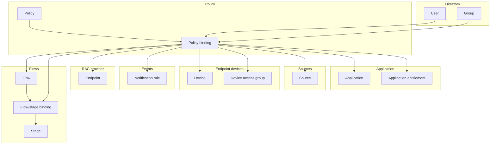

A binding connects one authentik object to another object that uses it. Bindings let authentik answer two common questions:

- Where should authentik evaluate this [policy](../../customize/policies/index.md), user, or group?
- Where should authentik insert this [stage](../flows-stages/stages/index.md) into a flow?

A policy answers "should this request pass?" A policy binding decides where authentik asks that question.

For step-by-step links, see [Work with bindings](./work-with-bindings.md).

## Binding types

The two most common binding types are policy bindings and flow-stage bindings.

- **Policy bindings** attach a policy, user, or group to a target that supports policy binding.
- **Flow-stage bindings** attach a stage to a flow and define where that stage runs.

Use a policy binding when you want to control whether a target is allowed, denied, or shown. Use a flow-stage binding when you want to place a stage into a flow and decide when it should run.

## Where bindings are used

The policy binding system is shared by several authentik objects. You can bind policies, users, and groups to these targets:

| Target                  | What the binding controls                                |
| ----------------------- | -------------------------------------------------------- |
| Flow                    | Whether the user can start or continue using the flow.   |
| Flow-stage binding      | Whether a specific stage applies to a user in that flow. |
| Application             | Whether the user can view and access the application.    |
| Application entitlement | Whether the user has access to an entitlement.           |
| Source                  | Whether the source can be used for login or enrollment.  |
| Device                  | Whether the device passes the configured access checks.  |
| Device access group     | Whether the device is part of the access group.          |
| Notification rule       | Whether the notification rule applies.                   |
| RAC endpoint            | Whether the user can access the Remote Access endpoint.  |

Stages themselves are not policy binding targets. A stage is attached to a flow through a flow-stage binding, so when you bind a policy to a stage in a flow, you are binding it to that flow-stage binding.

Because of this, the same stage can be reused in multiple flows, and each flow can apply different policies, users, groups, order, and evaluation settings to that stage.

## Relationships

```mermaid

flowchart TD
    subgraph Directory
        user[User]
        group[Group]
    end

    subgraph Policy
        policy[Policy]
        policy_binding[Policy binding]
    end

    subgraph Application
        application[Application]
        application_entitlement[Application entitlement]
    end
    subgraph Sources
        source[Source]
    end
    subgraph Endpoint devices
        device[Device]
        device_access_group[Device access group]
    end
    subgraph Events
        notification_rule[Notification rule]
    end
    subgraph RAC provider
        endpoint[Endpoint]
    end
    subgraph Flows
        flow[Flow]
        flow_stage_binding[Flow-stage binding]
        stage[Stage]
    end

    policy --> policy_binding
    user --> policy_binding
    group --> policy_binding

    policy_binding --> application
    policy_binding --> application_entitlement
    policy_binding --> source
    policy_binding --> device
    policy_binding --> device_access_group
    policy_binding --> notification_rule
    policy_binding --> flow
    policy_binding --> endpoint

    flow_stage_binding --> stage
    flow --> flow_stage_binding

    policy_binding --> flow_stage_binding
```

## Policy bindings

A policy binding attaches one policy, user, or group to a target:

- A policy object can evaluate runtime data, request context, source data, user attributes, and other conditions.
- A user binding passes when the current user matches that user.
- A group binding passes when the current user is a member of that group.

User and group bindings are useful when you want a direct allow or deny rule without creating a separate policy object.

Policy bindings are commonly used with applications, sources, flows, flow-stage bindings, and [application entitlements](../applications/manage_apps.mdx#application-entitlements). For example, you can bind a group directly to an application so that only members of that group can view and launch the application.

Bindings are evaluated according to the target's **Policy engine mode**:

- `Any`: the target passes when any binding passes.
- `All`: the target passes only when every binding passes.

authentik evaluates enabled bindings in ascending order. This order is most noticeable when you read logs or combine multiple policies that return messages.

Bindings also support these options:

- **Negate**, which flips the pass or fail result of the binding.
- **Timeout**, which limits how long authentik waits for policy execution.
- **Failure result**, which controls whether a policy error is treated as pass or fail.

Policy bindings attached directly to a flow are evaluated before the flow starts. In authentication and enrollment flows, that usually means that user- and group-based checks on the flow itself cannot pass until the user has already been identified elsewhere.

If a target has no applicable bindings, authentik treats the result as passing.

## Flow-stage bindings

A flow-stage binding attaches a stage to a flow and defines the order in which that stage runs. Flow-stage bindings are also called stage bindings.

authentik uses flow-stage bindings while building the [flow plan](../flows-stages/flow/planner.md). The flow plan determines which stages a user sees and in what order.

This matters because stages are reusable objects. The same stage can appear in multiple flows, but each flow-stage binding can have its own settings. When you bind a policy to a stage in a specific flow, you bind it to that flow-stage binding, not to the reusable stage definition itself.

### Stage-binding policy evaluation

Flow-stage bindings have two policy evaluation options:

- **Evaluate when flow is planned**: authentik evaluates policies while building the flow plan.
- **Evaluate when stage is run**: authentik evaluates policies immediately before presenting the stage.

At least one of these options must be enabled, and both can be enabled at the same time. For the full behavior and guidance on choosing the right setting, see [Flow Planner](../flows-stages/flow/planner.md#planning-and-stage-policies).

## What to remember

- Stages are attached to flows through flow-stage bindings.
- Policies, users, and groups can all be bound through the same policy binding system.
- The same stage can behave differently in different flows because each flow-stage binding has its own settings and bindings.
- A policy bound directly to a flow is evaluated earlier than a policy bound to a flow-stage binding.

## Common examples

### Restrict an application

By default, applications are accessible to all users. Bind a group or policy to an application when you want to limit access to specific users.

### Run a stage only for some users

Bind a policy, user, or group to the flow-stage binding when a stage should appear only for certain users in that flow. For example, require an MFA stage only for specific users.

### Scope access inside an application

Use [application entitlements](../applications/manage_apps.mdx#application-entitlements) when you need to control access to parts of an application after the user already has access to the application. For example, control which users have access to administrator functions within an application.
