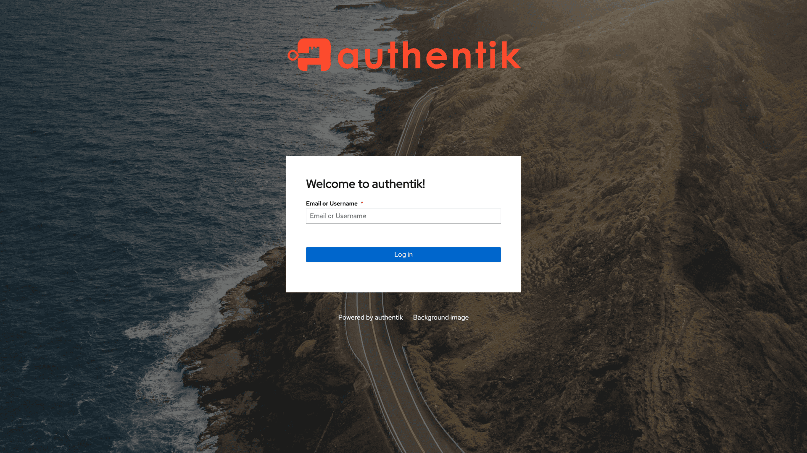
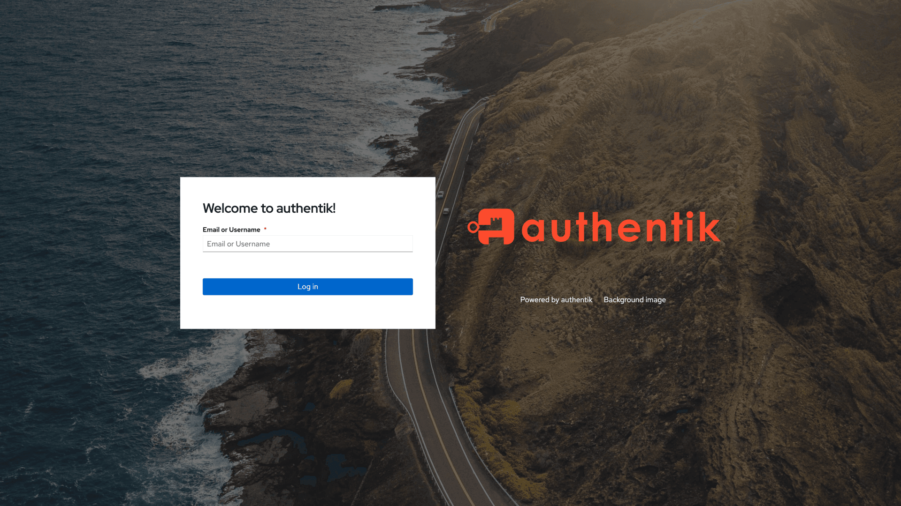
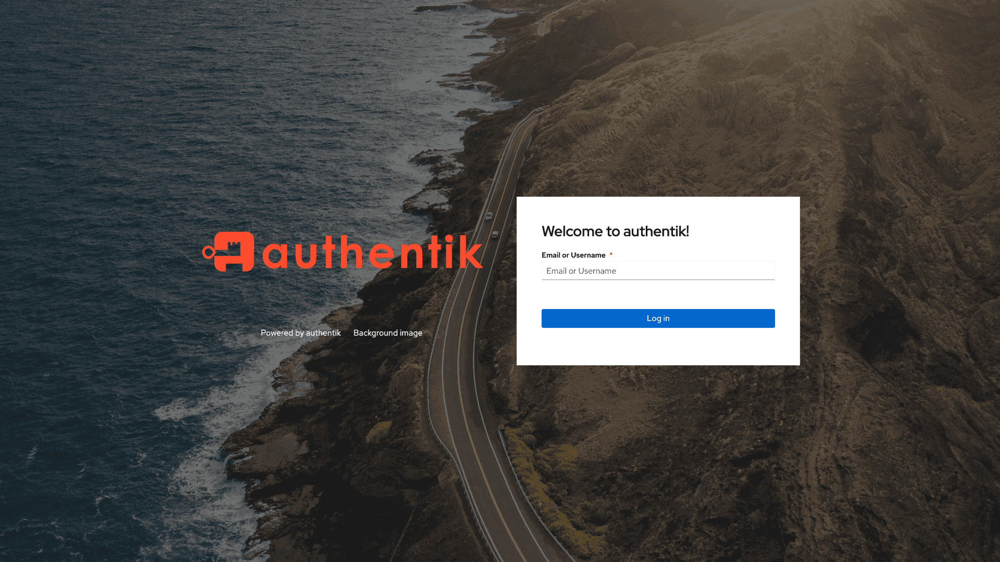

This is the default, web-based environment that flows are executed in. All stages are compatible with this environment and no limitations are imposed.

:::info
All flow executors use the same [API](/api/docs/flow-executor), which allows for the implementation of custom flow executors.
:::

## Layouts

Starting with authentik 2022.5, the layout of the default flow executor can be changed. Below are examples for the available options:

### Stacked (default)

### Content besides logo (left)

### Content besides logo (right)

### Sidebar (left)

### Sidebar (right)

