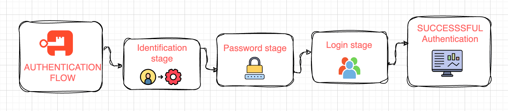
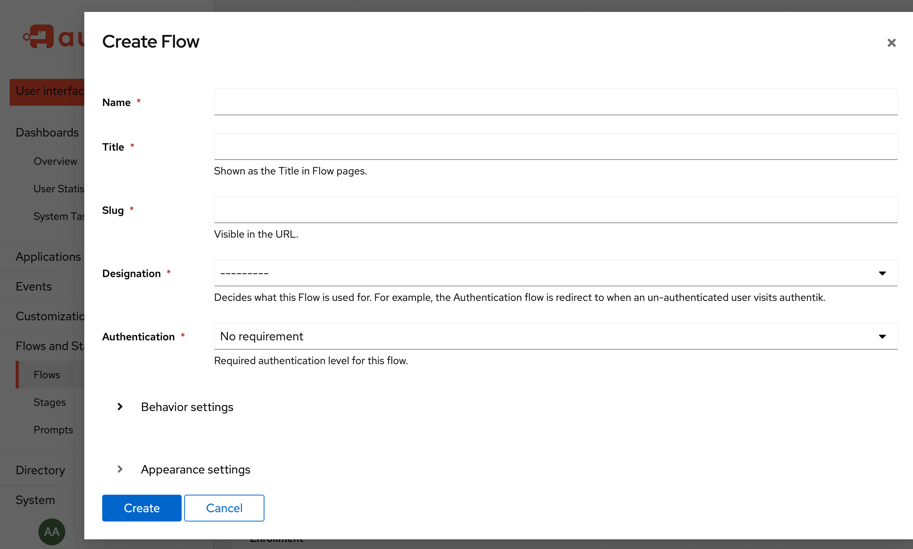

Flows are a major component in authentik. In conjunction with stages and [policies](../../../customize/policies/index.md), flows are at the heart of our system of building blocks, used to define and execute the workflows of authentication, authorization, enrollment, and user settings.

There are over a dozen default, out-of-the box flows available in authentik. Users can decide if they already have everything they need with the [default flows](../flow/examples/default_flows.md) or if they want to [create](#create-a-custom-flow) their own custom flow, using the Admin interface, Terraform, or via the API.

A flow is a method of describing a sequence of stages. A stage represents a single verification or logic step. By connecting a series of stages within a flow (and optionally attaching policies as needed) you can build a highly flexible process for authenticating users, enrolling them, and more.

For example a standard login flow would consist of the following stages:

- **Identification stage**: user identifies themselves via a username or email address
- **Password stage**: the user's password is checked against the hash in the database
- **Login stage**: this stage attaches a currently pending user to the current session

When these stages are successfully completed, authentik logs in the user.

By default, policies are evaluated dynamically, right before the stage (to which a policy is bound) is presented to the user. This flexibility allows the login process to continue, change, or stop, based on the success or failure of each policy.

This default behaviour can be altered by enabling the **Evaluate when flow is planned** option on the stage binding. With this setting a _flow plan_ containing all stages is generated upon flow execution. This means that all attached policies are evaluated upon execution. For more information about flow plans, read our [flow context documentation](./context/index.mdx).

## Permissions

Flows can have [policies](../stages/index.md) assigned to them. These policies determine if the current user is allowed to see and use this flow.

Keep in mind that in certain circumstances, policies cannot match against users and groups as there is no authenticated user yet.

## Import & Export

Flows can be imported and exported to share with other people, the community, and for troubleshooting. Flows can be imported to apply new functionality and apply existing workflows.

Download our [Example flows](./examples/flows.md) and then import them into your authentik instance.

Starting with authentik 2022.8, flows will be exported as YAML, but JSON-based flows can still be imported.

## Create a custom flow

To create a flow, follow these steps:

1. Log in as an admin to authentik, and go to the Admin interface.
2. In the Admin interface, navigate to **Flows and Stages -> Flows**.
3. Click **Create**, define the flow using the [configuration settings](#flow-configuration-options) described below, and then click **Finish**.

After creating the flow, you can then [bind specific stages](../stages/index.md#bind-a-stage-to-a-flow) to the flow and [bind policies](../../../customize/policies/working_with_policies.md) to the flow to further customize the user's log in and authentication process.

To determine which flow should be used, authentik will first check which default authentication flow is configured in the active [**Brand**](../../../customize/brands.md). If no default is configured there, the policies in all flows with the matching designation are checked, and the first flow with matching policies sorted by `slug` will be used.

## Flow configuration options

When creating or editing a flow in the UI of the Admin interface, you can set the following configuration options.

**Name**: Enter a descriptive name. This is the name that will appear on the list of flows in the Admin interface.

**Title**: This is the title that will appear on the flow as the end-user logs in and encounters the flow.

**Slug**: The slug will be used, and appear, in the URL when the flow is in use.

**Designation**: Flows are designated for a single purpose. This designation changes when a flow is used. The following designations are available:

import Defaultflowlist from "../flow/flow_list/\_defaultflowlist.mdx";

<Defaultflowlist />

**Authentication**: Using this option, you can configure whether the the flow requires initial authentication or not, whether the user must be a superuser, if the flow can only be started after being redirected by a [Redirect stage](../stages/redirect/index.md), or if the flow requires an outpost.

**Behavior settings**:

- **Compatibility mode**: Toggle this option on to increase compatibility with password managers and mobile devices. Password managers like [1Password](https://1password.com/), for example, don't need this setting to be enabled, when accessing the flow from a desktop browser. However accessing the flow from a mobile device might necessitate this setting to be enabled.

    The technical reasons for this settings' existence is due to the JavaScript libraries we're using for the default flow interface. These interfaces are implemented using [Lit](https://lit.dev/), which is a modern web development library. It uses a web standard called ["Shadow DOMs"](https://developer.mozilla.org/en-US/docs/Web/API/Web_components/Using_shadow_DOM), which makes encapsulating styles simpler. Due to differences in Browser APIs, many password managers are not compatible with this technology.

    When the compatibility mode is enabled, authentik uses a polyfill which emulates the Shadow DOM APIs without actually using the feature, and instead a traditional DOM is rendered. This increases support for password managers, especially on mobile devices.

- **Denied action**: Configure what happens when access to a flow is denied by a policy. By default, authentik will redirect to a `?next` parameter if set, and otherwise show an error message.

    - `MESSAGE_CONTINUE`: Show a message if no `?next` parameter is set, otherwise redirect.
    - `MESSAGE`: Always show error message.
    - `CONTINUE`: Always redirect, either to `?next` if set, otherwise to the default interface.

- **Policy engine mode**: Configure the flow to succeed in _any_ policy passes, or only if _all_ policies pass.

**Appearance Settings**:

- **Layout**: select how the UI displays the flow when it is executed; with stacked elements, content left or right, and sidebar left or right.

- **Background**: optionally, select a background image for the UI presentation of the flow.
