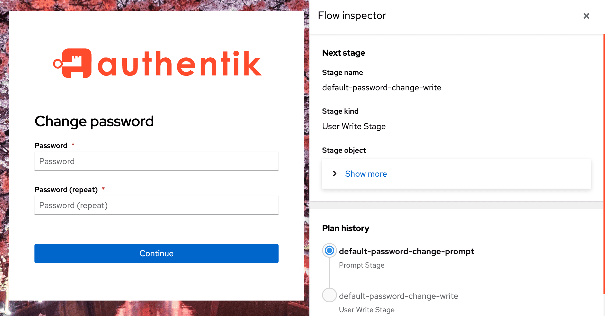

The flow inspector, introduced in 2021.10, allows administrators to visually determine how custom flows work, inspect the current [flow context](./context/index.md), and investigate issues.

As shown in the screenshot below, the flow inspector displays next to the selected flow (in this case, "Change Password"), with [information](#flow-inspector-details) about that specific flow and flow context.

## Access the Flow Inspector

:::info
Be aware that when running a flow with the inspector enabled, the flow is still executed normally. This means that for example, a [User write](../stages/user_write.md) stage _will_ write user data.
:::

The inspector is accessible to users that have been granted the [permission](../../../users-sources/access-control/permissions.md) **Can inspect a Flow's execution**, either directly or through a role. Superusers can always inspect flow executions.

When developing authentik with the debug mode enabled, the inspector is enabled by default and can be accessed by both unauthenticated users and standard users. However the debug mode should only be used for the development of authentik. So unless you are a developer and need the more verbose error information, the best practice for using the flow inspector is to assign the permission, not use debug mode.

Starting with authentik 2025.2, for users with appropriate permissions to access the inspector a button is shown in the top right of the [default flow executor](./executors/if-flow.md) which opens the flow inspector.

### Manually running a flow with the inspector

1. To access the inspector, open the Admin interface and navigate to **Flows and Stages -> Flows**.

2. Select the specific flow that you want to inspect by clicking its name in the list.

3. On the Flow's detail page, on the left side under **Execute Flow**, click **with inspector**.

4. The selected flow will launch in a new browser tab, with the flow inspector displayed to the right.

Alternatively, a user with the correct permission can launch the inspector by adding the query parameter `?inspector` to the URL when the URL opens on a flow.

:::info
Troubleshooting:

- If the flow inspector does not launch and a "Bad request" error displays, this is likely either because you selected a flow that has a policy bound directly to it that prevents access (so the inspector won't open because the flow can't be executed) or because you do not have view permission on that specific flow.
  :::

### Flow Inspector Details

The following information is shown in the inspector:

#### Next stage

This is the currently planned next stage. If you have stage bindings configured to `Evaluate when flow is planned`\_`, then you will see the result here. If, however, you have them configured to re-evaluate (`Evaluate when stage is run`), then this will not show up here, since the results will vary based on your input.

Shown is the name and kind of the stage, as well as the unique ID.

#### Plan history

Here you can see an overview of which stages have run, which is currently active, and which is planned to come next. Same caveats as above apply.

#### Current plan context

This shows you the current context. This will contain fields depending on the same, after an identification stage for example you would see "pending_user" defined.

This data is not cleaned, so if your flow involves inputting a password, it will be shown here too.

#### Session ID

The unique ID for the currently used session. This can be used to debug issues with flows restarting/losing state.
