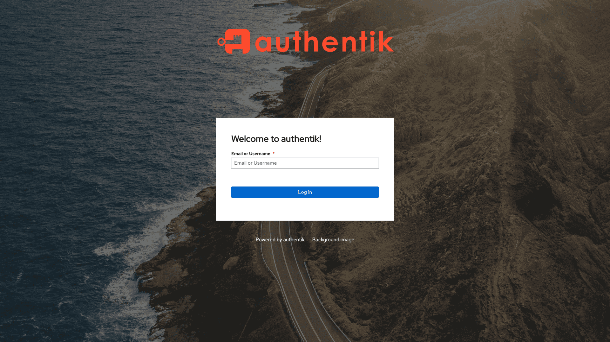
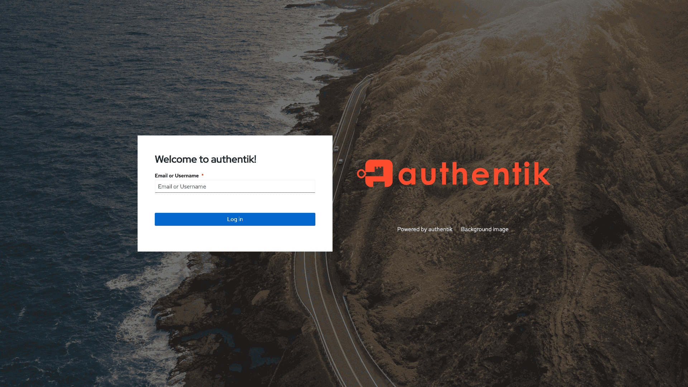
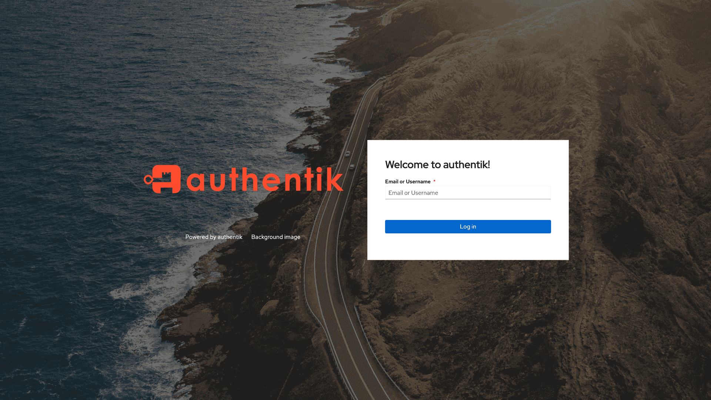
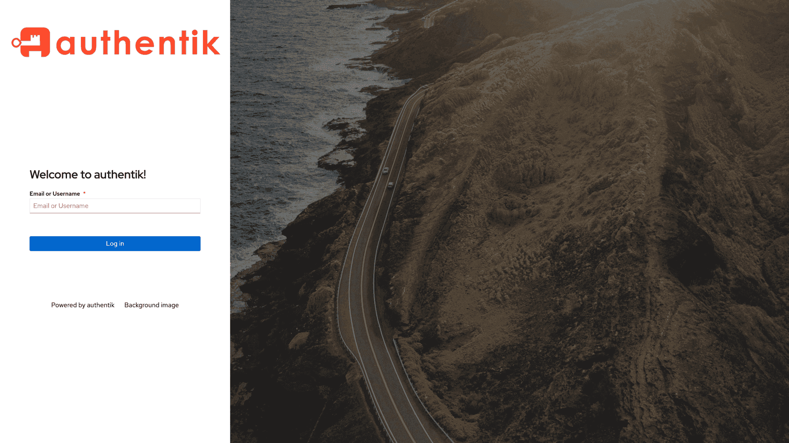

Starting with authentik 2022.5, the layout of the default flow executor can be changed. Below are examples for the available options:

### Stacked (default)

### Content besides logo (left)

### Content besides logo (right)

### Sidebar (left)

### Sidebar (right)

