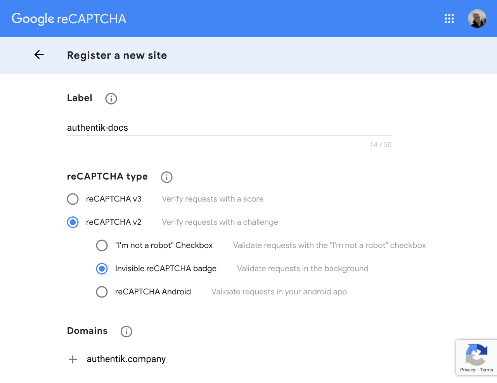

This stage adds a form of verification using [Google's ReCaptcha](https://www.google.com/recaptcha/intro/v3.html) or compatible services. Currently supported implementations:

-   ReCaptcha
-   hCaptcha
-   Turnstile

## Captcha provider configuration

### Google ReCaptcha

This stage has two required fields: Public key and private key. These can both be acquired at https://www.google.com/recaptcha/admin.

#### Configuration options

-   JS URL: `https://www.recaptcha.net/recaptcha/api.js`
-   API URL: `https://www.recaptcha.net/recaptcha/api/siteverify`
-   Score minimum threshold: `0.5`
-   Score maximum threshold: `1`

### hCaptcha

See https://docs.hcaptcha.com/switch

#### Configuration options

-   JS URL: `https://js.hcaptcha.com/1/api.js`
-   API URL: `https://api.hcaptcha.com/siteverify`

**Score options only apply to hCaptcha Enterprise**

-   Score minimum threshold: `0`
-   Score maximum threshold: `0.5`

### Turnstile

See https://developers.cloudflare.com/turnstile/get-started/migrating-from-recaptcha

:::warning
To use Cloudflare Turnstile, the site must be configured to use the "Invisible" mode, otherwise the widget will be rendered incorrectly.
:::

#### Configuration options

-   JS URL: `https://challenges.cloudflare.com/turnstile/v0/api.js`
-   API URL: `https://challenges.cloudflare.com/turnstile/v0/siteverify`

**Score options do not apply when using with turnstile**
