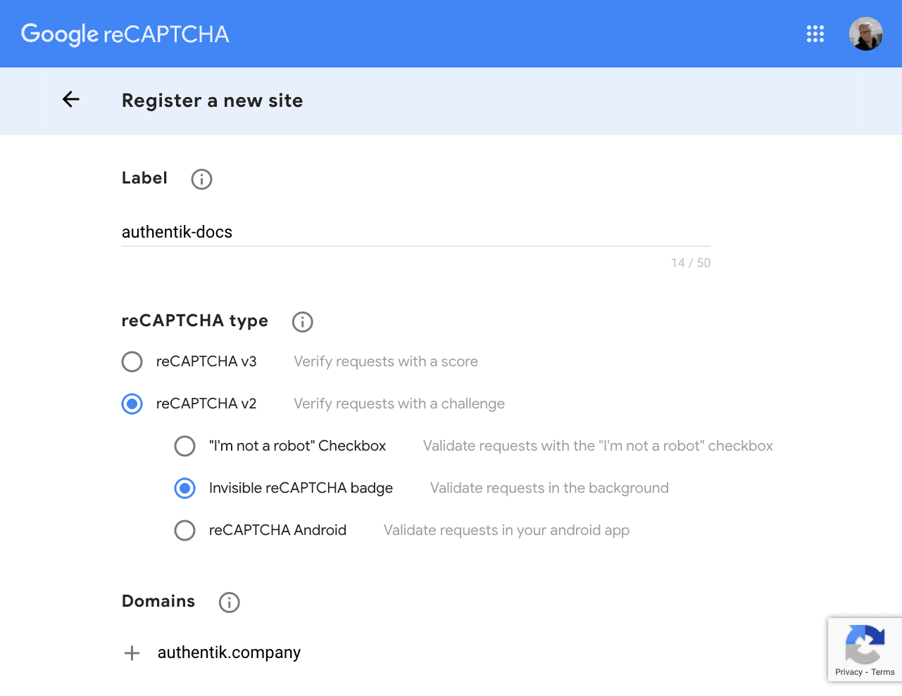

The Captcha stage adds CAPTCHA verification to a flow by using Google reCAPTCHA or compatible alternatives like hCaptcha, Cloudflare Turnstile, and Cap.

## About the Captcha stage

This stage verifies that the current interaction appears human before the flow continues.

It can either be bound to a flow or embedded inside the [Identification stage](../identification/index.md) by setting the Identification stage's **Captcha stage** option.

## Configuration options

- **Public Key**: CAPTCHA site key.
- **Private Key**: CAPTCHA secret key.
- **Interactive**: enable an interactive CAPTCHA widget instead of score-based verification.
- **Score Minimum Threshold**: minimum accepted score for score-based providers.
- **Score Maximum Threshold**: maximum accepted score for score-based providers.
- **Error on Invalid Score**: show an error immediately when the score is outside the configured threshold. If disabled, the flow continues and policies can inspect the result from context.
- **JS URL**: JavaScript loader URL for the provider.
- **API URL**: verification endpoint URL for the provider.
- **Request Content Type**: content type used when authentik verifies the CAPTCHA token with the provider.

## Flow integration

Use this stage anywhere a flow should require a CAPTCHA check, especially in enrollment, recovery, or other public-facing flows.

If you embed it in the [Identification stage](../identification/index.md), configure the CAPTCHA provider for invisible or background use.

## Notes

### Google reCAPTCHA

:::note Supported versions
Google reCAPTCHA Enterprise, reCAPTCHA v2, and reCAPTCHA v3 are all supported.
:::

Use the keys from https://www.google.com/recaptcha/admin.

Recommended defaults for reCAPTCHA:

- **Interactive**: disabled for score-based reCAPTCHA
- **Score Minimum Threshold**: `0.5`
- **Score Maximum Threshold**: `1.0`
- **JS URL**: `https://www.recaptcha.net/recaptcha/api.js`
- **API URL**: `https://www.recaptcha.net/recaptcha/api/siteverify`

### hCaptcha

See https://docs.hcaptcha.com/switch.

Recommended values:

- **Interactive**: enabled
- **JS URL**: `https://js.hcaptcha.com/1/api.js`
- **API URL**: `https://api.hcaptcha.com/siteverify`

Score thresholds only apply to hCaptcha Enterprise.

### Cap

Cap is a self-hostable CAPTCHA server that uses proof-of-work challenges.

See https://trycap.dev/guide/.

authentik supports Cap's default widget. The floating widget is not supported.

Recommended values:

- **Public Key**: public Cap endpoint for the site key path, for example `https://cap.example.com/site-key/`
- **Private Key**: Cap secret key
- **Interactive**: enabled
- **JS URL**: self-hosted Cap widget asset, for example `https://cap.example.com/assets/widget.js`. If you use a CDN, pin a reviewed release such as `https://cdn.jsdelivr.net/npm/cap-widget@<version>` instead of the unversioned package URL. See [Cap releases](https://github.com/tiagozip/cap/releases).
- **API URL**: Cap verification endpoint, for example `https://cap.example.com/site-key/siteverify`
- **Request Content Type**: JSON

Cap does not use score thresholds.

### Cloudflare Turnstile

See https://developers.cloudflare.com/turnstile/get-started/migrating-from-recaptcha.

Recommended values:

- **Public Key**: Turnstile site key
- **Private Key**: Turnstile secret key
- **Interactive**: enable when using invisible or managed Turnstile modes
- **JS URL**: `https://challenges.cloudflare.com/turnstile/v0/api.js`
- **API URL**: `https://challenges.cloudflare.com/turnstile/v0/siteverify`

Turnstile does not use score thresholds.

### Cloudflare Turnstile setup flow

If you are configuring Turnstile from scratch:

1. Create the Turnstile widget in Cloudflare.
2. Copy the **Site Key** into **Public Key**.
3. Copy the **Secret Key** into **Private Key**.
4. Enable **Interactive** if the Turnstile widget is configured as **Invisible** or **Managed**.
5. Leave score thresholds at their defaults because Turnstile does not use them.
