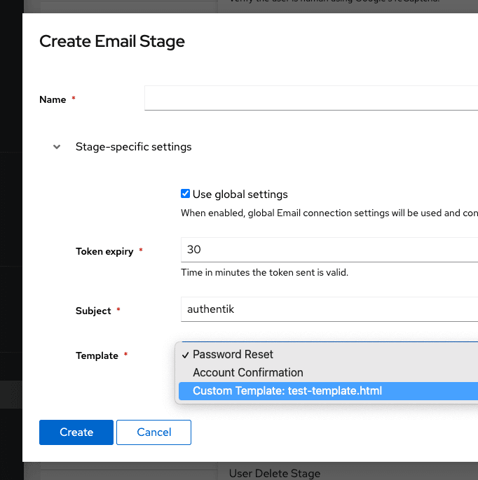

The Email stage sends a verification or action email from within a flow.

## Overview

This stage is used for email verification, account recovery, invitations, and similar flow steps where authentik should send a tokenized link or message to a user.

The email is normally sent to the current `pending_user`, but the target address can be overridden from flow context.

When an email cannot be delivered immediately, authentik retries delivery through its background worker.

## Configuration options

- **Use global connection settings**: use authentik's global email configuration instead of stage-specific SMTP settings.
- **SMTP host**: SMTP server hostname for stage-specific delivery.
- **SMTP port**: SMTP server port.
- **SMTP username**: optional SMTP username.
- **SMTP password**: optional SMTP password.
- **Use TLS**: enable STARTTLS for the SMTP connection.
- **Use SSL**: enable SMTPS for the SMTP connection.
- **Timeout**: SMTP connection timeout in seconds.
- **From address**: sender address used for flow emails.
- **Account recovery max attempts**: maximum number of recovery emails allowed in the configured time window.
- **Account recovery cache timeout**: time window used for recovery-email rate limiting.
- **Activate user on success**: activate the user after the stage succeeds.
- **Token expiry**: how long the email token remains valid.
- **Subject**: subject line used for the email.
- **Template**: template used to render the email body.

## Flow integration

Use this stage in recovery, enrollment, verification, or invitation flows where an email should be sent before the flow continues.

By default, the message goes to the current `pending_user`. To override the destination, set `email` in the flow plan context before the stage runs:

```python
request.context["flow_plan"].context["email"] = "foo@bar.baz"
return True
```

You can also source the address from prompt data or another user attribute:

```python
request.context["flow_plan"].context["email"] = request.context["prompt_data"]["email"]
return True
```

```python
request.context["flow_plan"].context["email"] = request.context["pending_user"].attributes.get("otherEmail")
return True
```

## Notes

### Rate limiting

The recovery rate-limiting fields only affect recovery-style email sends. They limit how many recent attempts a user can trigger within the configured time window.

### Custom templates

You can provide custom email templates.

:::info
You can also add a matching `.txt` file next to the `.html` file to send multipart text and HTML emails.
:::

import TabItem from "@theme/TabItem";
import Tabs from "@theme/Tabs";

<Tabs
defaultValue="docker-compose"
values={[
{label: 'Docker Compose', value: 'docker-compose'},
{label: 'Kubernetes', value: 'kubernetes'},
]}>
<TabItem value="docker-compose">
Place custom templates in the `custom-templates` directory next to your Compose file. The template becomes selectable in the Email stage configuration.

  </TabItem>
  <TabItem value="kubernetes">
Create a ConfigMap with your email templates:

```yaml
apiVersion: v1
kind: ConfigMap
metadata:
    name: authentik-templates
    namespace: authentik
data:
    my-template.html: |
        <tr>...
```

Then mount it into the worker container from your Helm values:

```yaml
volumes:
    - name: email-templates
      configMap:
          name: authentik-templates
volumeMounts:
    - name: email-templates
      mountPath: /templates
```

  </TabItem>
</Tabs>

If a custom template does not appear in the selector, check the worker logs.

### Template variables

Templates are rendered with Django's templating engine. Common variables include:

- `url`: the full URL the user should open
- `user`: the pending user
- `expires`: when the token expires

These templates are rendered with Django's templating engine, so you can also use standard template inheritance and translation tags.



### Example template

Templates can extend the base email template and use standard Django template tags. For example:

```html
{# This comment is not rendered in the final email. #}    
<tr>
    <td class="alert alert-success">
         Hi {{ username }},
    </td>
</tr>
<tr>
    <td class="content-wrap">
        <table width="100%" cellpadding="0" cellspacing="0">
            <tr>
                <td class="content-block">
                    
                </td>
            </tr>
            <tr>
                <td class="content-block">
                    <table
                        role="presentation"
                        border="0"
                        cellpadding="0"
                        cellspacing="0"
                        class="btn btn-primary"
                    >
                        <tbody>
                            <tr>
                                <td align="center">
                                    <table
                                        role="presentation"
                                        border="0"
                                        cellpadding="0"
                                        cellspacing="0"
                                    >
                                        <tbody>
                                            <tr>
                                                <td>
                                                    <a
                                                        id="confirm"
                                                        href="{{ url }}"
                                                        rel="noopener noreferrer"
                                                        target="_blank"
                                                    >
                                                        
                                                    </a>
                                                </td>
                                            </tr>
                                        </tbody>
                                    </table>
                                </td>
                            </tr>
                        </tbody>
                    </table>
                </td>
            </tr>
            <tr>
                <td class="content-block">
                     If you did not request a
                    password change, please ignore this email. The link above is valid for {{
                    expires }}. 
                </td>
            </tr>
        </table>
    </td>
</tr>

```
