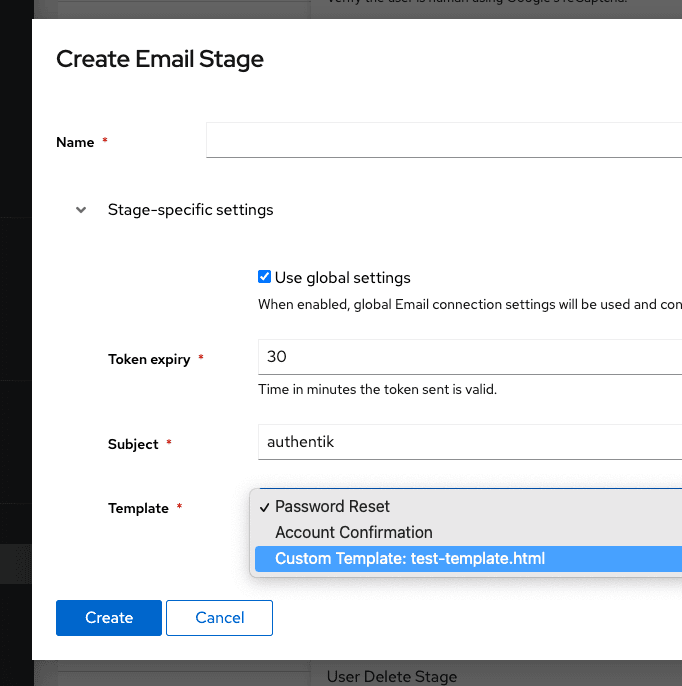

This stage can be used for email verification. authentik's background worker will send an email using the specified connection details.

When an email can't be delivered, authentik automatically retries periodically.

You can also configure rate-limiting for emails requested by users. See the [configure rate limiting](#configure-rate-limiting-for-emails) section for more information.

For information about creating a stage, refer to our [documentation](../#create-a-stage).

## Behaviour

By default, the email is sent to the currently pending user. To override this, you can set `email` in the plan's context to another email address, which will override the user's email address (the user won't be changed).

For example, create this [expression policy](../../../../customize/policies/expression.mdx) and bind it to the email stage:

```python
request.context["flow_plan"].context["email"] = "foo@bar.baz"
# Or get it from a prompt
# request.context["flow_plan"].context["email"] = request.context["prompt_data"]["email"]
# Or another user attribute
# request.context["flow_plan"].context["email"] = request.context["pending_user"].attributes.get("otherEmail")
return True
```

## Configure rate limiting for emails

You can configure the Email stage with _a maximum number of emails_ that can be sent within _a specified time period_.

To configure the rate limiting for recovery emails use these two fields when you create or edit an Email stage:

- **Account Recovery Max Attempts**: set the maximum number of emails to send.
- **Account Recovery Cache Timeout**: specify the time window used to count recent recovery emails sent to the user (account recovery attempts).

## Custom Templates

You can also use custom email templates, to use your own design or layout.

:::info
Starting with authentik 2024.2, it is possible to create `.txt` files with the same name as the `.html` template. If a matching `.txt` file exists, the email sent will be a multipart email with both the text and HTML template.
:::

import TabItem from "@theme/TabItem";
import Tabs from "@theme/Tabs";

<Tabs
  defaultValue="docker-compose"
  values={[
    {label: 'Docker Compose', value: 'docker-compose'},
    {label: 'Kubernetes', value: 'kubernetes'},
  ]}>
  <TabItem value="docker-compose">
Place any custom templates in the `custom-templates` Folder, which is in the same folder as your Compose file. Afterwards, you'll be able to select the template when creating/editing an Email stage.

  </TabItem>
  <TabItem value="kubernetes">
Create a ConfigMap with your email templates:

```yaml
apiVersion: v1
kind: ConfigMap
metadata:
    name: authentik-templates
    namespace: authentik
data:
    my-template.html: |
        <tr>...
```

Then, in the helm chart add this to your `values.yaml` file:

```yaml
volumes:
    - name: email-templates
      configMap:
          name: authentik-templates
volumeMounts:
    - name: email-templates
      mountPath: /templates
```

  </TabItem>
</Tabs>

:::info
If you have added the line and created a file, and can't see it, check the worker logs using `docker compose logs -f worker` or `kubectl logs -f deployment/authentik-worker`.
:::



### Example template

Templates are rendered using Django's templating engine. The following variables can be used:

- `url`: The full URL for the user to click on
- `user`: The pending user object.
- `expires`: The timestamp when the token expires.

<!-- prettier-ignore-start -->

```html
{# This is how you can write comments which aren't rendered. #}
{# Extend this template from the base email template, which includes base layout and CSS. #}

{# Load the internationalization module to translate strings, and humanize to show date-time #}


{# The email/base.html template uses a single "content" block #}

<tr>
    <td class="alert alert-success">
         Hi {{ username }},
        
    </td>
</tr>
<tr>
    <td class="content-wrap">
        <table width="100%" cellpadding="0" cellspacing="0">
            <tr>
                <td class="content-block">
                    
                </td>
            </tr>
            <tr>
                <td class="content-block">
                    <table
                        role="presentation"
                        border="0"
                        cellpadding="0"
                        cellspacing="0"
                        class="btn btn-primary"
                    >
                        <tbody>
                            <tr>
                                <td align="center">
                                    <table
                                        role="presentation"
                                        border="0"
                                        cellpadding="0"
                                        cellspacing="0"
                                    >
                                        <tbody>
                                            <tr>
                                                <td>
                                                    <a
                                                        id="confirm"
                                                        href="{{ url }}"
                                                        rel="noopener noreferrer"
                                                        target="_blank"
                                                        ></a
                                                    >
                                                </td>
                                            </tr>
                                        </tbody>
                                    </table>
                                </td>
                            </tr>
                        </tbody>
                    </table>
                </td>
            </tr>
            <tr>
                <td class="content-block">
                    
                    If you did not request a password change, please ignore this Email. The link above is valid for {{ expires }}.
                    
                </td>
            </tr>
        </table>
    </td>
</tr>

```

<!-- prettier-ignore-end -->
