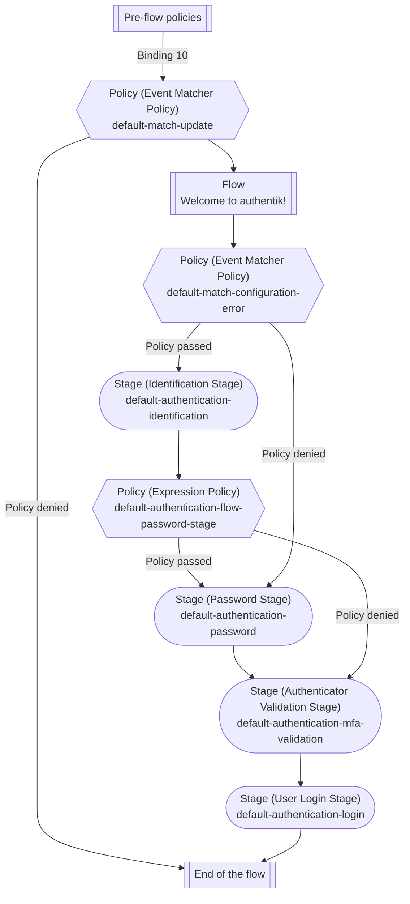

Stages are one of the fundamental building blocks in authentik, along with [flows](../flow/index.md) and [policies](../../../customize/policies/index.md).

A stage represents a single verification or logic step within a flow. You can bind one or more stages to a flow to create a customized, flexible login and authentication process.

In the following diagram of the `default-authentication-flow`, you see multiple stages, or steps, in the authentication process for a user. Policies are bound to some stages; this provides for dynamic application of a specific stage _if_ the policy criteria is met.

```mermaid
graph TD
flow_pre[["Pre-flow policies"]]
flow_pre --Binding 10--> flow_policy_0{{"Policy (Event Matcher Policy)
default-match-update"}}
flow_policy_0 --Policy denied--> done[["End of the flow"]]
flow_policy_0 --> flow_start[["Flow
Welcome to authentik!"]]
stage_0_policy_0 --Policy passed--> stage_0(["Stage (Identification Stage)
default-authentication-identification"])
stage_1_policy_0 --Policy passed--> stage_1(["Stage (Password Stage)
default-authentication-password"])
--> stage_2(["Stage (Authenticator Validation Stage)
default-authentication-mfa-validation"])
--> stage_3(["Stage (User Login Stage)
default-authentication-login"])
flow_start --> stage_0_policy_0{{"Policy (Event Matcher Policy)
default-match-configuration-error"}}
stage_0 --> stage_1_policy_0{{"Policy (Expression Policy)
default-authentication-flow-password-stage"}}
stage_0_policy_0 --Policy denied--> stage_1(["Stage (Password Stage)
default-authentication-password"])
stage_1_policy_0 --Policy denied--> stage_2(["Stage (Authenticator Validation Stage)
default-authentication-mfa-validation"])
stage_3 --> done[["End of the flow"]]
```

## Create a stage

To create a stage, follow these steps:

1. Log in as an admin to authentik, and go to the Admin interface.
2. In the Admin interface, navigate to **Flows and Stages > Stages**.
3. Click **New Stage**, select the stage type, define the stage using the configuration settings, and then click **Create Stage**.

After creating the stage, you can use bindings to determine whether the stage runs in a flow.

## Stage bindings

A stage binding connects a stage to a flow. The binding adds that stage as a step in the flow.

You can use bindings to determine which [stages](../stages/index.md) are presented to a user or group.

For an overview of binding types and behavior, see [Bindings in authentik](../../bindings-overview/index.md).

:::info
Some stages and flows do not allow user or group bindings. In some authentication or enrollment scenarios, the [flow plan](../flow/planner.md) does not yet know the current user or group.
:::

### Bind a stage to a flow

To bind a stage to a flow, follow these steps:

1. Log in as an admin to authentik, and go to the Admin interface.
2. In the Admin interface, navigate to **Flows and Stages > Flows**.
3. In the list of flows, click the name of the flow to which you want to bind one or more stages.
4. On the Flow page, click the **Stage Bindings** tab at the top.
5. Click **Create or bind...**.
6. Select **Existing Stage** to bind an existing stage to the flow, or select **Bind New Stage** to create a new stage and bind it to the flow.

### Control access to a stage

There are several ways to control access to a specific stage of a flow:

- Bind a policy to a stage binding. See [Bind a policy to a stage binding](../../../customize/policies/working_with_policies.md#bind-a-policy-to-a-stage-binding).
- Bind a user or group to the stage binding. See [Bind users and groups to a flow's stage binding](#bind-users-and-groups-to-a-flows-stage-binding).

### Bind users and groups to a flow's stage binding

You can use bindings to determine whether a stage is presented to a single user or to members of a group. Bind the user or group to the stage binding within a specific flow. For example, if a flow contains an MFA stage that should run only for certain users, bind the appropriate group or user to that stage binding.

To bind a user or a group to a stage binding for a specific flow, follow these steps:

1. Log in as an admin to authentik, and go to the Admin interface.
2. In the Admin interface, navigate to **Flows and Stages > Flows**.
3. In the list of flows, click the name of the flow to which you want to bind one or more stages.
4. On that Flow's detail page, click the **Stage Bindings** tab at the top.
5. In the list, locate the stage binding to which you want to bind a user or group, and then click the caret (>) to expand the stage binding details.
6. In the expanded area, click **Create or bind...**.
7. Under **Bind Existing**, select either **Bind a user** or **Bind a group**.
8. In the drop-down list, select the group or user.
9. Optionally, configure additional settings for the binding, and then click **Create** to create the binding and close the box.

Learn more about the different types of [bindings](../../bindings-overview/index.md) in authentik and [working with them](../../bindings-overview/work-with-bindings.md).
