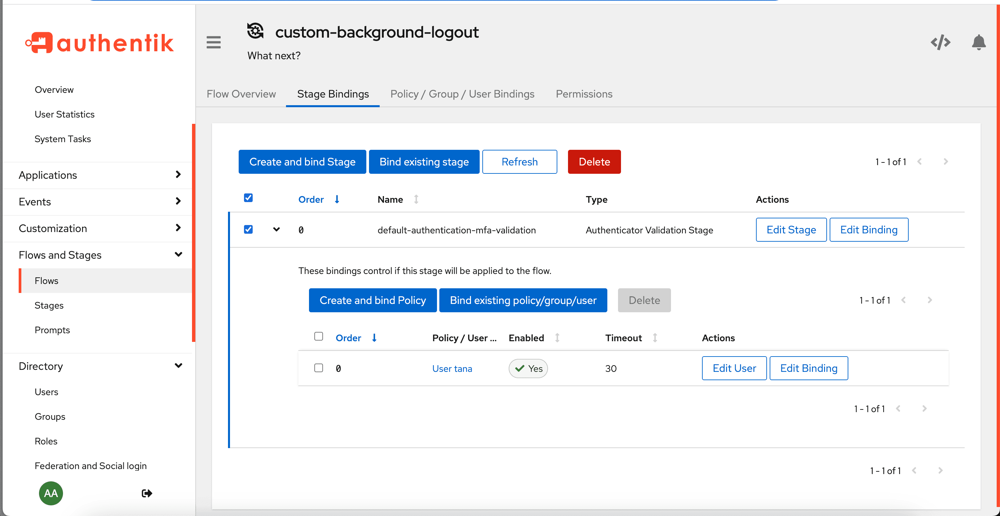

Stages are one of the fundamental building blocks in authentik, along with [flows](../flow/index.md) and [policies](../../../customize/policies/index.md).

A stage represents a single verification or logic step within a flow. You can bind one or more stages to a flow to create a customized, flexible login and authentication process.

In the following diagram of the `default-authentication-flow`, you see multiple stages, or steps, in the authentication process for a user. Policies are bound to some stages; this provides for dynamic application of a specific stage _if_ the policy criteria is met.

## Create a Stage

To create a stage, follow these steps:

1. Log in as an admin to authentik, and go to the Admin interface.
2. In the Admin interface, navigate to **Flows and Stages -> Stages**.
3. Click **Create**, define the flow using the configuration settings, and then click **Finish**.

After creating the stage, you can then [bind the stage to a flow](#bind-a-stage-to-a-flow) or [bind a policy to the stage](../../../customize/policies/working_with_policies.md) (the policy determines whether or not the stage will be implemented in the flow).

## Bind a stage to a flow

To bind a stage to a flow, follow these steps:

1. Log in as an admin to authentik, and go to the Admin interface.
2. In the Admin interface, navigate to **Flows and Stages -> Flows**.
3. In the list of flows, click the name of the flow to which you want to bind one or more stages.
4. On the Flow page, click the **Stage Bindings** tab at the top.
5. Here, you can decide if you want to create a new stage and bind it to the flow (**Create and bind Stage**), or if you want to select an existing stage and bind it to the flow (**Bind existing stage**).

## Bind users and groups to a flow's stage binding

You can use bindings to determine whehther or not a stage is presented to a single user or any users within a group. You do this by binding the user or group to a stage binding within a specific flow. For example, if you have a flow that contains a stage that prompts the user for multi-factor authentication, but you only want certain users to see this stage (and fulfill the MFA prompt), then you would bind the appropriate group (or single user) to the stage binding for that flow.

To bind a user or a group to a stage binding for a specific flow, follow these steps:

1. Log in as an admin to authentik, and go to the Admin interface.
2. In the Admin interface, navigate to **Flows and Stages -> Flows**.
3. In the list of flows, click the name of the flow to which you want to bind one or more stages.
4. On the Flow page, click the **Stage Bindings** tab at the top.
5. Locate the stage binding to which you want to bind a user or group, and then **click the caret (>) to expand the stage binding details.**

6. In the expanded area, click **Bind existing policy/group/user**.
7. In the **Create Binding** modal box, select either the tab for **Group** or **User**.
8. In the drop-down list, select the group or user.
9. Optionally, configure additional settings for the binding, and then click **Create** to create the binding and close the modal box.

Learn more about [bindings](../bindings/index.md) and [working with them](../bindings/work_with_bindings.md).
