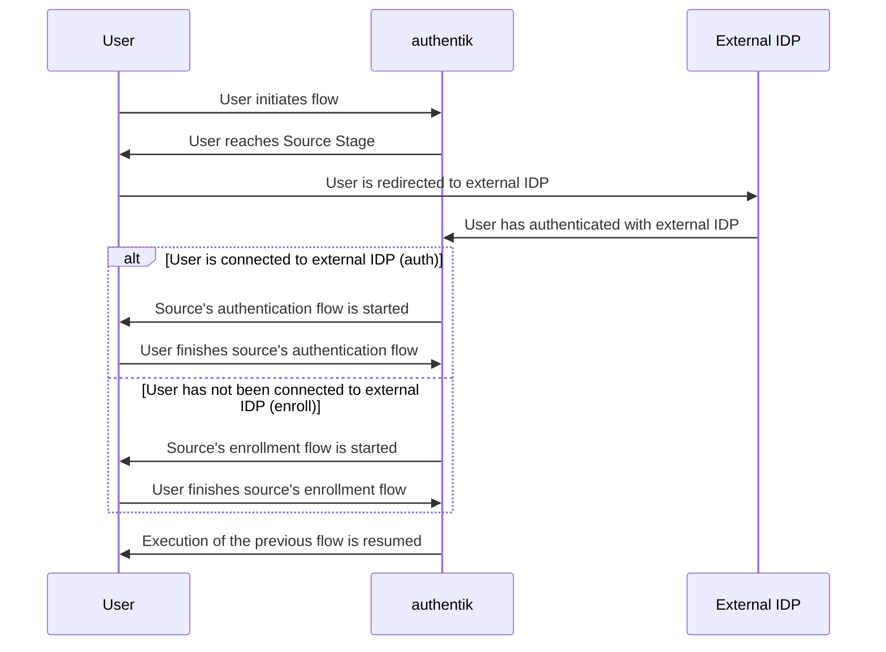

The source stage injects an [OAuth](../../../../users-sources/sources/protocols/oauth/index.mdx) or [SAML](../../../../users-sources/sources/protocols/saml/index.md) Source into the flow execution. This allows for additional user verification, or to dynamically access different sources for different user identifiers (username, email address, etc).

### Considerations

It is very important that the configured source's authentication and enrollment flows (when set; they can be left unselected to prevent authentication or enrollment with the source) do **not** have a [User login stage](../user_login/index.md) bound to them.

This is because the Source stage works by appending a [dynamic in-memory](../../../../core/terminology.md#dynamic-in-memory-stage) stage to the source's flow, so having a [User login stage](../user_login/index.md) bound will cause the source's flow to not resume the original flow it was started from, and instead directly authenticating the pending user.

### Example use case

This stage can be used to leverage an external OAuth/SAML identity provider.

For example, you can authenticate users by routing them through a custom device-health solution.

Another use case is to route users to authenticate with your legacy (Okta, etc) IdP and then use the returned identity and attributes within authentik as part of an authorization flow, for example as part of an IdP migration. For authentication/enrollment this is also possible with an [OAuth](../../../../users-sources/sources/protocols/oauth/index.mdx)/[SAML](../../../../users-sources/sources/protocols/saml/index.md) source by itself.

### Options

#### Source

The source the user is redirected to. Must be a web-based source, such as [OAuth](../../../../users-sources/sources/protocols/oauth/index.mdx) or [SAML](../../../../users-sources/sources/protocols/saml/index.md). Sources like [LDAP](../../../../users-sources/sources/protocols/ldap/index.md) are _not_ compatible.

#### Resume timeout

Because the execution of the current flow is suspended before the user is redirected to the configured source, this option configures how long the suspended flow is saved. If this timeout is exceeded, upon return from the configured source, the suspended flow will restart from the beginning.
