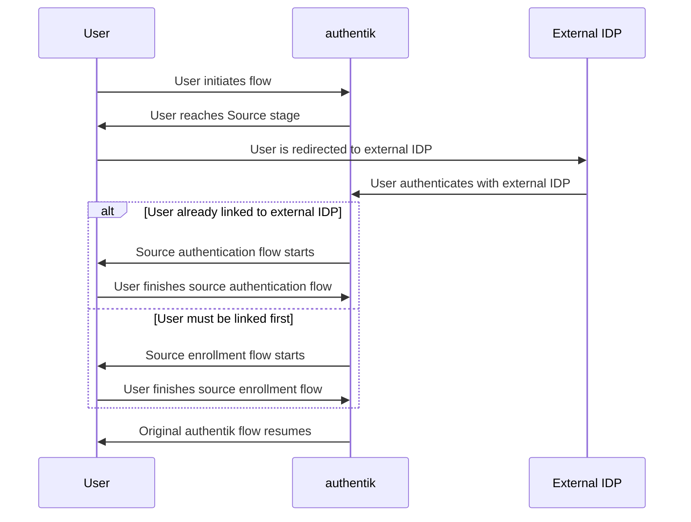

The Source stage sends the user to an [OAuth](../../../../users-sources/sources/protocols/oauth/index.mdx) or [SAML](../../../../users-sources/sources/protocols/saml/index.md) source before returning to the flow.

## Overview

Use this stage when an external identity provider should be part of the current authentik flow, for example during staged migrations or additional external verification.

Common examples include:

- Authenticating against a legacy IdP such as [Microsoft Entra ID](../../../../users-sources/sources/social-logins/entra-id/oauth/index.mdx), [Google Workspace](../../../../users-sources/sources/social-logins/google/workspace/index.md), or [Okta](../../../../users-sources/sources/social-logins/okta/index.md) during an IdP migration and then using the returned identity and attributes inside authentik
- Routing users through an external OAuth or SAML identity provider
- Sending users through a custom device-health or posture-check system before continuing

For pure authentication or enrollment, an [OAuth](../../../../users-sources/sources/protocols/oauth/index.mdx) or [SAML](../../../../users-sources/sources/protocols/saml/index.md) source can also be used directly without a Source stage. Use the Source stage when that external step needs to be embedded inside another authentik flow.

## Configuration options

- **Source**: the OAuth or SAML source to use.
- **Resume timeout**: how long authentik keeps the suspended flow available while the user is away at the external source.

## Flow integration

Bind this stage to a flow when the user should authenticate or enroll through an external source and then return to the authentik flow.

The configured source must be a browser-based source such as OAuth or SAML. LDAP and other non-browser sources are not compatible.

## Notes

### Important source-flow behavior

Do not bind a [User Login stage](../user_login/index.md) to the source's own authentication or enrollment flow.

The Source stage resumes the original flow by appending a dynamic in-memory stage to the source flow. If the source flow logs the user in directly, the original flow will not resume correctly.

### Workflow

```mermaid
sequenceDiagram
    participant u as User
    participant ak as authentik
    participant eidp as External IDP

    u->>ak: User initiates flow
    ak->>u: User reaches Source stage

    u->>eidp: User is redirected to external IDP
    eidp->>ak: User authenticates with external IDP

    alt User already linked to external IDP
        ak->>u: Source authentication flow starts
        u->>ak: User finishes source authentication flow
    else User must be linked first
        ak->>u: Source enrollment flow starts
        u->>ak: User finishes source enrollment flow
    end

    ak->>u: Original authentik flow resumes
```

### Resume timeout

If the user takes longer than the configured timeout to return from the external source, the original suspended flow is discarded and the flow restarts from the beginning on return.
