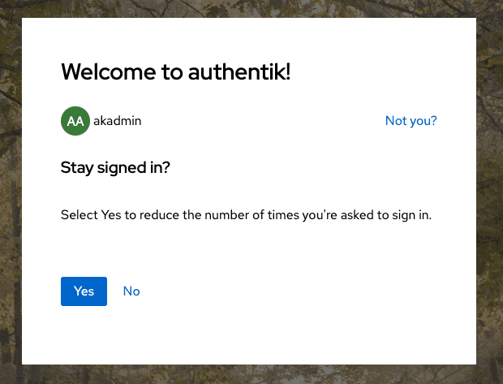

This stage attaches a currently pending user to the current session.

It can be used after `user_write` during an enrollment flow, or after a `password` stage during an authentication flow.

## User login stage configuration options

When creating or editing this stage in the UI of the Admin interface, you can set the following configuration options.

**Name**: enter a descriptive name for the stage.

**Stage-specific settings**

- **Session duration**: By default, the authentik session expires when you close your browser (_seconds=0_).

    :::warning
    Different browsers handle session cookies differently, and might not remove them even when the browser is closed. See [here](https://developer.mozilla.org/en-US/docs/Web/HTTP/Headers/Set-Cookie#expiresdate) for more info.
    :::

    You can set the session to expire after any duration using the syntax of `hours=1,minutes=2,seconds=3`. The following keys are allowed:

    - Microseconds
    - Milliseconds
    - Seconds
    - Minutes
    - Hours
    - Days
    - Weeks

    All values accept floating-point values.

- **Stay signed in offset**: When this is set to a higher value than the default _seconds=0_, the user logging in is shown a prompt, allowing the user to choose if their session should be extended or not. The same syntax as for _Session duration_ applies.

    

- **Network binding and GeoIP binding**

    When configured, all sessions authenticated by this stage will be bound to the selected network and/or GeoIP criteria.

    Sessions that break this binding will be terminated on use. The created [`logout`](../../../../sys-mgmt/events/index.md#logout) event will contain additional data related to what caused the binding to be broken:

    ```json
    {
        "asn": {
            "asn": 6805,
            "as_org": "Telefonica Germany",
            "network": "5.4.0.0/14"
        },
        "geo": {
            "lat": 51.2993,
            "city": "",
            "long": 9.491,
            "country": "DE",
            "continent": "EU"
        },
        "binding": {
            "reason": "network.missing",
            "new_value": {
                "asn": 6805,
                "as_org": "Telefonica Germany",
                "network": "5.4.0.0/14"
            },
            "previous_value": {}
        },
        "ip": {
            "previous": "1.2.3.4",
            "new": "5.6.7.8"
        },
        "http_request": {
            "args": {},
            "path": "/if/admin/",
            "method": "GET",
            "user_agent": "Mozilla/5.0 (Macintosh; Intel Mac OS X 10_15_7) AppleWebKit/537.36 (KHTML, like Gecko) Chrome/120.0.0.0 Safari/537.36"
        },
        "logout_reason": "Session binding broken"
    }
    ```

- **Terminate other sessions**

    When enabled, previous sessions of the user logging in will be revoked. This has no affect on OAuth refresh tokens.
