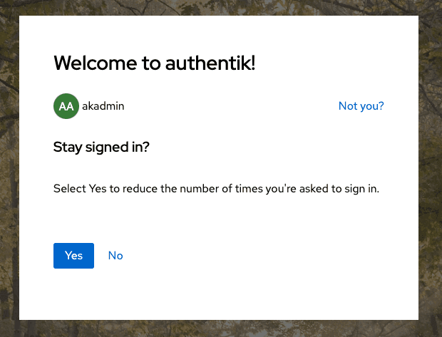

The User Login stage attaches the current `pending_user` to a new authentik session.

## Overview

This stage is usually the final step in an authentication flow. It can also be used after [User Write](../user_write/index.md) in enrollment or recovery flows when the user should be signed in immediately after the flow succeeds.

## Configuration options

- **Session duration**: how long the created session should last. A value of `seconds=0` keeps the session until the browser session ends.
- **Network binding**: optionally bind the session to ASN, network, or IP-derived network information.
- **GeoIP binding**: optionally bind the session to continent, country, or city information.
- **Terminate other sessions**: revoke the user's other active authentik sessions when this stage succeeds.
- **Remember me offset**: extend the session when the user explicitly chooses the remember-me option. A value of `seconds=0` hides the option.
- **Remember device**: store a longer-lived cookie that helps authentik recognize a known device on later sign-ins.

## Flow integration

Use this stage near the end of flows that should create an authenticated browser session.

Common placements include:

- after [Password](../password/index.md) or [Authenticator Validation](../authenticator_validate/index.md) in authentication flows
- after [User Write](../user_write/index.md) in enrollment flows

## Notes

:::warning
Browsers handle session cookies differently. A session configured with `seconds=0` is intended to end when the browser session ends, but some browsers can retain session state longer.
:::

Duration fields use the standard authentik timedelta syntax such as `hours=1,minutes=30,seconds=0`.

All values accept floating-point numbers.

Valid keys in those duration strings include:

- microseconds
- milliseconds
- seconds
- minutes
- hours
- days
- weeks

- If **Remember me offset** is greater than `seconds=0`, authentik shows the user a remember-me choice during login.



- If **Remember device** is enabled, authentik stores a cookie that can be used in later flows or policies to distinguish known from unknown devices.
- If the user already has another authenticated session from the same IP address, authentik also classifies that sign-in as coming from a known device.
- If **Network binding** or **GeoIP binding** is enabled, authentik terminates sessions that later violate the selected binding.

When a session is terminated because a binding is broken, the generated logout event includes additional binding data describing what changed.

```json
{
    "asn": {
        "asn": 6805,
        "as_org": "Telefonica Germany",
        "network": "5.4.0.0/14"
    },
    "geo": {
        "lat": 51.2993,
        "city": "",
        "long": 9.491,
        "country": "DE",
        "continent": "EU"
    },
    "binding": {
        "reason": "network.missing",
        "new_value": {
            "asn": 6805,
            "as_org": "Telefonica Germany",
            "network": "5.4.0.0/14"
        },
        "previous_value": {}
    },
    "ip": {
        "previous": "1.2.3.4",
        "new": "5.6.7.8"
    },
    "http_request": {
        "args": {},
        "path": "/if/admin/",
        "method": "GET",
        "user_agent": "Mozilla/5.0 (Macintosh; Intel Mac OS X 10_15_7) AppleWebKit/537.36 (KHTML, like Gecko) Chrome/120.0.0.0 Safari/537.36"
    },
    "logout_reason": "Session binding broken"
}
```

For alerting and policy use, authentik can also classify a login as coming from a known or unknown device based on the remember-device cookie and related session information.

See the notification policy examples for [logins from unknown devices](../../../../sys-mgmt/events/notification_rule_expression_policies.mdx#trigger-alert-when-user-logs-in-from-unknown-device).

When **Terminate other sessions** is enabled, previous authentik sessions for the same user are revoked. This does not affect OAuth refresh tokens.
