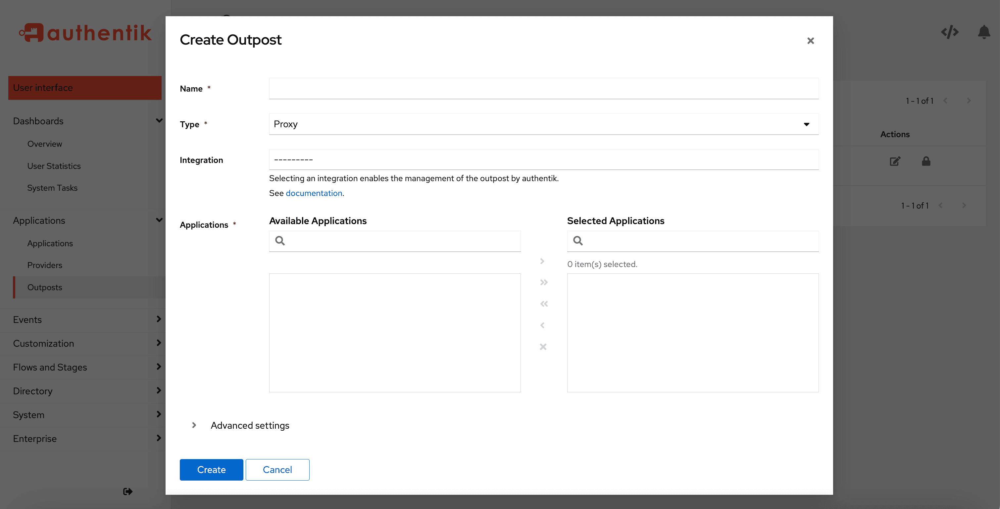

An outpost is a single deployment of an authentik component, essentially a service, that can be deployed anywhere that allows for a connection to the authentik API.

An outpost is required if you use any of the following types of providers with your application:

- [LDAP Provider](../providers/ldap/index.md)
- [Proxy Provider](../providers/proxy/index.md)
- [RADIUS Provider](../providers/radius/index.mdx)
- [RAC Provider](../providers/rac/index.md)

These types of providers use an outpost for increased flexibility and speed. Instead of the provider logic being implemented in authentik Core, these providers use an outpost to handle the logic, which provides improved performance.

An additional advantage of using an outpost is that outposts, like authentik itself, do not require access to the wider internet. Transactions between the application, the provider, and the outpost occur via the authentik API, and support single sign-on operations in firewalled or airgapped deployments and offline connections to remote machines that are not on the internet.

An outpost is given permissions to access the authentik API using a service account and token, both of which are auto-generated when you create a new outpost. The outpost is granted rights to only the application/provider pairs configured (and other necessary related objects such as certificates).

Any change made to the outpost's associated app or provider immediately triggers an event to update the configuration data stored on the outpost, via websockets. Websockets are used also by the outpost to send healthchecks to the authentik Core.

## Create and configure an outpost

    1. To create a new outpost, log in to authentik as an administrator, and open to the Admin interface.

    2. Navigate to **Applications --> Outposts** and then click **Create**.

    3. Define the following values:

    - **Name**: a name for the new outpost
    - **Type**: select the provider type (Proxy, LDAP, Radius, RAC)
    - **Integration** (_optional_): select either your [Docker or Kubernetes connection](#more-about-outpost-integrations)
    - **Applications**: select the applications that you want the outpost to serve
    - **Advanced settings** (*optional*): For further optional configuration settings, refer to [Configuration](#configuration) below.

    4. Click **Create** to save your new outpost settings and close the box.

Upon creation, a service account and a token is generated. The service account only has permissions to read the outpost and provider configuration. This token is used by the outpost to connect to authentik.

### More about outpost integrations

authentik can manage the deployment, updating, and general lifecycle of an outpost. To communicate with the underlying platforms on which the outpost is deployed, authentik has several built-in integrations.

- If you've deployed authentik on Docker Compose, authentik automatically creates an integration for the local docker socket (See [Docker](./integrations/docker.md)).
- If you've deployed authentik on Kubernetes, with `kubernetesIntegration` set to true (default), authentik automatically creates an integrations for the local Kubernetes Cluster (see [Kubernetes](./integrations/kubernetes.md)).

To deploy an outpost with these integrations, select them during the creation of an outpost. A background task is started, which creates the container/deployment. The outpost deployment can be monitored from the **Dashboards -> System Tasks** page in the Admin interface.

To deploy an outpost manually, see:

- [Kubernetes](./manual-deploy-kubernetes.md)
- [Docker Compose](./manual-deploy-docker-compose.md)

### Configuration

Outposts fetch their configuration from authentik. Below are all the options you can set, and how they influence the outpost.

import Configuration from "./_config.md";

<Configuration />

## Prometheus Metrics

Each authentik outpost has a Prometheus metrics endpoint accessible under port `:9300/metrics`. This endpoint is not mapped via Docker, as the endpoint doesn't have any authentication.

For the embedded outpost, the metrics of the outpost and the metrics of the core authentik server are both returned under the same endpoint.
