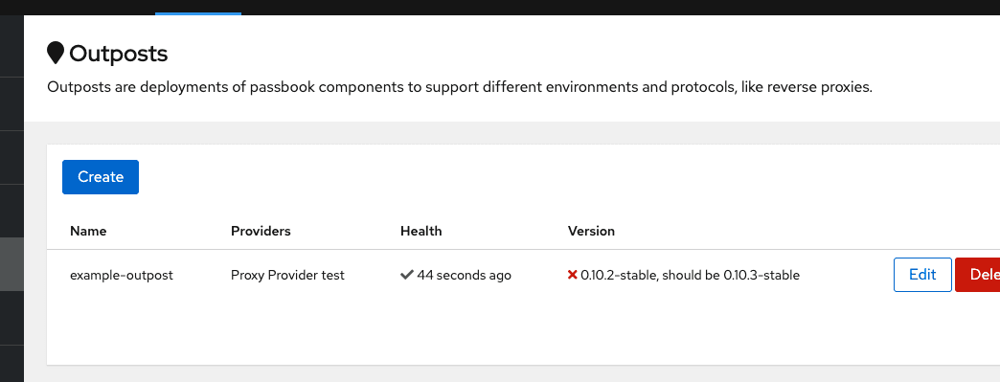
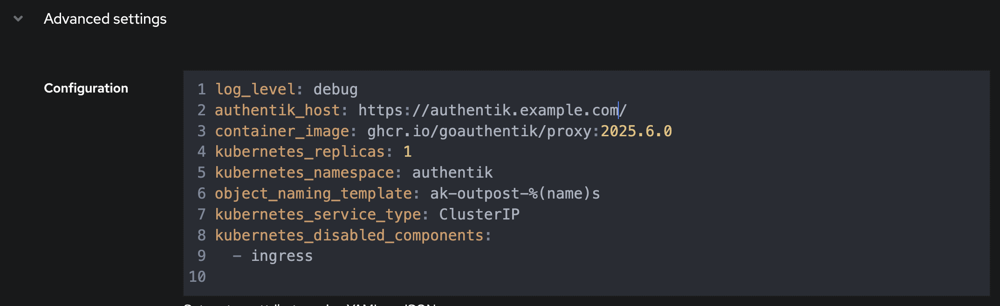

In the Outpost Overview list, you'll see if any deployed outposts are out of date.

To upgrade the Outpost to the latest version, simply adjust the key `container_image` of the outpost to the new version or your desired SemVer tag, eg. `container_image: ghcr.io/goauthentik/proxy:2025.6.0`.

Since the configuration is managed by authentik, that's all you have to do.
