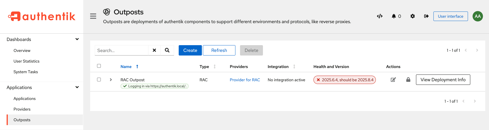

Outposts deployed using the [Docker](./integrations/docker.md) or [Kubernetes](./integrations/kubernetes.md) integrations are managed by authentik and are upgraded automatically. Outposts deployed manually via [Docker](./manual-deploy-docker-compose.md) or [Kubernetes](./manual-deploy-kubernetes.md) must be upgraded by updating the outpost's image tag to the new version.

To check if any outposts are out-of-date, navigate to **Applications** > **Outposts** and look for a message in the **Health and Version** column.

A red warning message will be shown on any outposts running outdated versions:

An up-to-date outpost will show a green message indicating the last successful connection with authentik:

