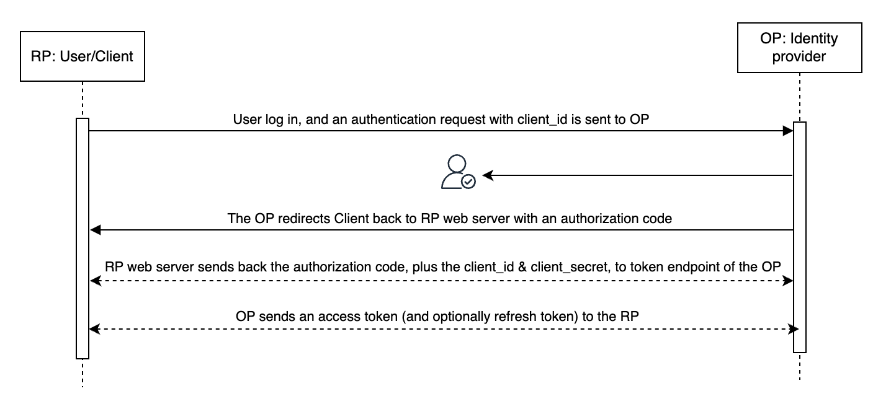

In authentik, you can create an OAuth provider that authentik uses to authenticate the user to the associated application. This provider supports both generic OAuth2 as well as OpenID Connect (OIDC).

## authentik and OAuth2

It's important to understand how authentik works with and supports the OAuth2 protocol, so before taking a [closer look at OAuth protocol](#about-oauth2) itself, let's cover a bit about authentik.

Authentik can act either as the OP, (OpenID Provider, with authentik as the IdP), or as the RP (Relying Party, or the application that uses authentik to authenticate). If you want to configure authentik to use [sources](../../../users-sources/sources/index.md) then authentik acts as the RP, because the app uses the source’s credential to authenticate.

OAuth supports multiple grant types; for more information see [below](#grant-types).

All standard OAuth flows (implicit flow, hybrid flow, device code flow) are supported in authentik, and we follow the [OIDC spec](https://openid.net/specs/openid-connect-core-1_0.html). OAuth supports generic OAuth, PKCE, [Github compatibility](./github-compatibility.md) and the RP uses our mapping system to relay info to app.

The authentik OAuth2 provider comes with all the standard functionality and features of OAuth2, including the OAuth2 security principles such as no cleartext storage of credentials, encryption, short expiration times, and automatic rotation of refresh tokens. In short, our OAuth2 protocol support does not cut any corners.

## About OAuth2

> "OAuth 2.0, which stands for “Open Authorization”, is a standard designed to allow a website or application to access resources hosted by other web apps on behalf of a user." ([source](https://auth0.com/intro-to-iam/what-is-oauth-2))

OAuth2 is an authentication protocol that allows an application (RP) to delegate authorization to an OP. OIDC is an authentication protocol built on top of OAuth2, which proves IdP and authorization (ssh) capabilities.

**Oauth2** typically requires two requests (unlike the previous "three-legged OAuth). The two "legs", or steps, for OAuth2 are:

1. user's request to the OpenID Provider, which triggers authorization, and
2. the Client request for an Identity token and an access token and optionally, a refresh token).

With OAuth2, when a user on the Client machine (known as the RP or Relying Party) logs in, the RP then sends an authentication request to the OpenID Provider (OP). The OP authenticates the User and generates an authorization code. The OP then redirects the Client back to the RP, along with that authorization code. The RP then sends that same authorization cade, the client_id, and the client_secret to the OP. Finally, the OP responds by sending an Identity Token saying this user has been authorised (the RP validates this token using cryptography) and an Access Token.



## OAuth2 flows

words here about OAuth2 flows

## Authorization code flow

The authorization code flow is for environments with both a Client and a application server, where the back and forth happens between the client and an app server (the logic lives on app server). The RP needs to authorise itself to the OP. Clint ID (public, identifies which app is talking to it) and client secret (the password) that the RP uses to authenticate.

If you configure authentik to use "Offline access" then during the initial auth the OP sends two tokens, an access token (short-lived, hours, can be customised) and a refresh token (typically longer validity, days or infinite). The RP (the app) saves both tokens. When the access token is about to expire, the RP sends the saved refresh token back to the OP, and requests a new access token. When the refresh token itself is about to expire, the RP can also ask for a new refresh token. This can all happen without user interaction if you configured the offline access.

### Implicit flow

This is for more modern single page-applicatinss, or ones you download, that are all client-side (all JS, no backend logic, etc) and have no server to make tokens. Because the secret cannot be stored on the client machine, the implicit flow is required in these architectures. With the implicit flow, the flow skips the second part of the two requests seen in the authorization flow; after the initial author request, the implicit flow receives a token, and then with cryptocracy and with PKCE, it can validate that it is the correct client, and that is safe to send a token. The RP (still called that with this implicit flow) can use cryptography to validate the token.

An OAuth grant type is the same as the implicit flow...

Downside of implicit is that there is no client secret.

Everything on the M2M page is a diff type of grant type... it's a client_credentials grant type.

For both Device code and M2M we supply examples... we don't need to for other flows because they should use a standard library (one appropriate for their language, etc).

It's important with OAuth, there are a lot of validation steps. There is a third step (past the credentials and the client secret)... the redirect of the authorisations step, the rp redirects to OP gives parts, this is what I want.... One thing is the URL to redirect back to the app (the URL of the RP that does the checks)... this is is a scary attack vector. Sooooo the OP much validate against an allow list... th authentik admin configures this redirect field in the Provider... there are some things that authentik does: 1. When you create a new OAuth provider and app, if you leave the redirect field empty, the first time someone uses that app to, authentik uses that Url as the saved redirect URL. 2) you can also in authentik for advanced use cases, you can use regular expressions instead of a redirect Url... if you want to list 10 diff apps, instead of listing all ten you create an expression with wildcards.. this will work. 3) possible gotcha.. in URL, we have a dot as a separator,, but in regex a dot means "one of any character". So you should escape the dot to say No I mean really exactly this Url not wildcards.

Also when we do 1) above, we escape the dot in that URL.

## Scope mappings

Scopes can be configured using scope mappings, a type of [property mapping](../property-mappings/index.md#scope-mappings).

| Endpoint             | URL                                                                  |
| -------------------- | -------------------------------------------------------------------- |
| Authorization        | `/application/o/authorize/`                                          |
| Token                | `/application/o/token/`                                              |
| User Info            | `/application/o/userinfo/`                                           |
| Token Revoke         | `/application/o/revoke/`                                             |
| End Session          | `/application/o/<application slug>/end-session/`                     |
| JWKS                 | `/application/o/<application slug>/jwks/`                            |
| OpenID Configuration | `/application/o/<application slug>/.well-known/openid-configuration` |

## Grant types

### `authorization_code`:

This grant is used to convert an authorization code to an access token (and optionally refresh token). The authorization code is retrieved through the Authorization flow, and can only be used once, and expires quickly.

:::info
Starting with authentik 2024.2, applications only receive an access token. To receive a refresh token, both applications and authentik must be configured to request the `offline_access` scope. In authentik this can be done by selecting the `offline_access` Scope mapping in the provider settings.
:::

### `refresh_token`:

Refresh tokens can be used as long-lived tokens to access user data, and further renew the refresh token down the road.

:::info
Starting with authentik 2024.2, this grant requires the `offline_access` scope.
:::

### `client_credentials`:

See [Machine-to-machine authentication](./client_credentials.md)

## Scope authorization

By default, every user that has access to an application can request any of the configured scopes. Starting with authentik 2022.4, you can do additional checks for the scope in an expression policy (bound to the application):

```python
# There are additional fields set in the context, use `ak_logger.debug(request.context)` to see them.
if "my-admin-scope" in request.context["oauth_scopes"]:
    return ak_is_group_member(request.user, name="my-admin-group")
return True
```

## Special scopes

#### GitHub compatibility

For these scopes, refer to [GitHub Compatibility](./github-compatibility.md).

#### authentik

-   `goauthentik.io/api`: This scope grants the refresh token access to the authentik API on behalf of the user

## Default scopes <span class="badge badge--version">authentik 2022.7+</span>

When a client does not request any scopes, authentik will treat the request as if all configured scopes were requested. Depending on the configured authorization flow, consent still needs to be given, and all scopes are listed there.

This does _not_ apply to special scopes, as those are not configurable in the provider.

## Signing & Encryption

[JWT](https://jwt.io/introduction)s created by authentik will always be signed.

When a _Signing Key_ is selected in the provider, the JWT will be signed asymmetrically with the private key of the selected certificate, and can be verified using the public key of the certificate. The public key data of the signing key can be retrieved via the JWKS endpoint listed on the provider page.

When no _Signing Key_ is selected, the JWT will be signed symmetrically with the _Client secret_ of the provider, which can be seen in the provider settings.

### Encryption <span class="badge badge--version">authentik 2024.10+</span>

authentik can also encrypt JWTs (turning them into JWEs) it issues by selecting an _Encryption Key_ in the provider. When selected, all JWTs will be encrypted symmetrically using the selected certificate. authentik uses the `RSA-OAEP-256` algorithm with the `A256CBC-HS512` encryption method.
