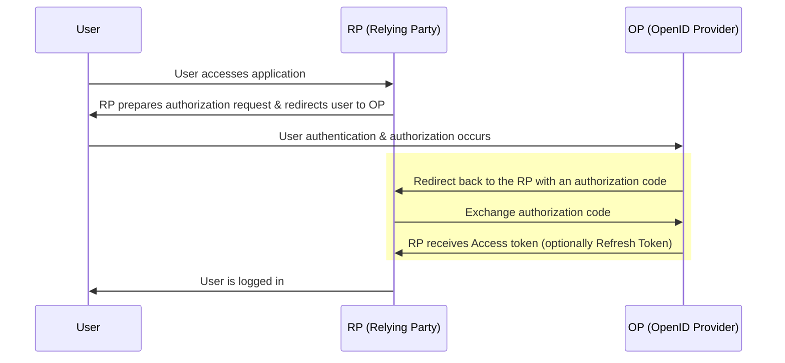

In authentik, you can [create](./create-oauth2-provider.md) an [OAuth 2.0](https://oauth.net/2/) provider that authentik uses to authenticate the user to the associated application. This provider supports both generic OAuth2 as well as OpenID Connect (OIDC).

## authentik and OAuth 2.0

It's important to understand how authentik works with and supports the OAuth 2.0 protocol, so before taking a [closer look at OAuth protocol](#about-oauth-20-and-oidc) itself, let's cover a bit about authentik.

authentik can act either as the OP, (OpenID Provider, with authentik as the IdP), or as the RP (Relying Party, or the application that uses OAuth 2.0 to authenticate). If you want to configure authentik to use [sources](../../../users-sources/sources/index.md) then authentik acts as the RP where the OP is the source configure.

All standard OAuth 2.0 flows (implicit flow, hybrid flow, device code flow) and grant types are supported in authentik, and we follow the [OIDC spec](https://openid.net/specs/openid-connect-core-1_0.html). OAuth 2.0 in authentik supports OAuth, PKCE, [Github compatibility](./github-compatibility.md) and the RP receives data from our mapping system.

The authentik OAuth 2.0 provider comes with all the standard functionality and features of OAuth 2.0, including the OAuth 2.0 security principles such as no cleartext storage of credentials, configurable encryption, configurable short expiration times, and the configuration of automatic rotation of refresh tokens. In short, our OAuth 2.0 protocol support does not cut any corners.

## About OAuth 2.0 and OIDC

OAuth 2.0 is an authorization protocol that allows an application (RP) to delegate authorization to an OP. OIDC is an authentication protocol built on top of OAuth2, which provides Identity and other data on top of OAuth2.

**OAuth 2.0** typically requires two requests (unlike the previous "three-legged" OAuth 1.0). The two "legs" or requests, for OAuth 2.0 are:

1. An authorization request is prepared by the RP and contains parameters for its implementation of OAuth and which data it requires, and the User's browser is redirected to that URL.
2. The RP sends a request to authentik in the background to exchange the access code for a token (and optionally a refresh token).

In detail, with OAuth2 when a user accesses the application (known as the RP or Relying Party) via their browser, the RP then prepares a URL with parameters for the OpenID Provider (OP), which the users's browser is redirected to. The OP authenticates the user and generates an authorization code. The OP then redirects the client (the user's browser) back to the RP, along with that authorization code. In the background, the RP then sends that same authorization code in a request authenticated by the `client_id` and `client_secret` to the OP. Finally, the OP responds by sending an Access Token saying this user has been authorised (the RP is recommended to validate this token using cryptography) and optionally a Refresh Token.



### Additional configuration options with Redirect URIs

When using an OAuth 2.0 provider in authentik, the OP must validate against an allow list. An authentik admin can configure this allow list in the **Redirect URI** field on the Provider.

When you create a new OAuth 2.0 provider and app in authentik and you leave the **Redirect URI** field empty, then the first time a user opens that app, authentik uses that URL as the saved redirect URL.

For advanced use cases, an authentik admin can use regular expressions (regex) instead of a redirect URL. For example, if you want to list 10 diff applications, instead of listing all ten you can create an expression with wildcards. Be aware, when using regex, that authetnik uses a dot as a separator in the URL, but in regex a dot means "one of any character", a wildcard. So you should escape the dot to prevent its interpration as a wildcard.

## OAuth2 flows and grant types

There are three general "use case" categories of OAuth2 flows and grants:

-   Web-based application authorization (Authorization, Implicit, Refresh token)
-   Client_credentials (M2M)
-   Device_code

### Category 1: Web-based application authorization

The flows and grant types used in the category are those used for a typical authorization process, with a user and an application:

-   the _Authorization code_ flow and grant type
-   the _Implicit_ flow and grant type (legacy)
-   the _Refresh token_ flow and grant type

#### Authorization code flow

The authorization code flow is for environments with both a Client and a application server, where the back and forth happens between the client and an app server (the logic lives on app server). The RP needs to authorise itself to the OP. Clint ID (public, identifies which app is talking to it) and client secret (the password) that the RP uses to authenticate.

If you configure authentik to use "Offline access" then during the initial auth the OP sends two tokens, an access token (short-lived, hours, can be customised) and a refresh token (typically longer validity, days or infinite). The RP (the app) saves both tokens. When the access token is about to expire, the RP sends the saved refresh token back to the OP, and requests a new access token. When the refresh token itself is about to expire, the RP can also ask for a new refresh token. This can all happen without user interaction if you configured the offline access.

:::info
Starting with authentik 2024.2, applications only receive an access token. To receive a refresh token, both applications and authentik must be configured to request the `offline_access` scope. In authentik this can be done by selecting the `offline_access` Scope mapping in the provider settings.
:::

The authorization code grant type is used to convert an authorization code to an access token (and optionally a refresh token). The authorization code is retrieved through the authentik [Authorization flow](../../flows-stages/flow/index.md), can only be used once, and expires quickly.

#### Implicit flow

:::info
The OAuth 2.0 [Security Best Current Practice document](https://tools.ietf.org/html/draft-ietf-oauth-security-topics) recommends against using the Implicit flow entirely, and OAuth 2.0 for Browser-Based Apps describes the technique of using the authorization code flow with PKCE instead. ([source](https://oauth.net/2/grant-types/implicit/))
:::

This flow is for more modern single page-applications, or ones you download, that are all client-side (all JS, no backend logic, etc) and have no server to make tokens. Because the secret cannot be stored on the client machine, the implicit flow is required in these architectures. With the implicit flow, the flow skips the second part of the two requests seen in the authorization flow; after the initial author request, the implicit flow receives a token, and then with cryptocracy and with PKCE, it can validate that it is the correct client, and that is safe to send a token. The RP (still called that with this implicit flow) can use cryptography to validate the token.

#### Refresh token flow

Refresh tokens can be used as long-lived tokens to access user data, and further renew the refresh token down the road.

:::info
Starting with authentik 2024.2, the refresh token grant type requires the `offline_access` scope.
:::

### Category 2: Client credentials flow

The client credentials flow and grant types are typically implemented for server-to-server scenarios, when code in a web application invokes a web API.

For more information, see [Machine-to-machine authentication](./client_credentials.md).

### Category 3: Device code

The device code flow is used in situations where there is no browser and limited options for text or data input from a client ("input-constrained devices"). For example, using a subscription TV program on a television in a hotel room, where you use your mobile app to input a code displayed on the TV, and thus get authorized.

For more iformation, see [Device code flow](./device_code.md).

## Scope mappings

Scopes can be configured using scope mappings, a type of [property mapping](../property-mappings/index.md#scope-mappings).

| Endpoint             | URL                                                                  |
| -------------------- | -------------------------------------------------------------------- |
| Authorization        | `/application/o/authorize/`                                          |
| Token                | `/application/o/token/`                                              |
| User Info            | `/application/o/userinfo/`                                           |
| Token Revoke         | `/application/o/revoke/`                                             |
| End Session          | `/application/o/<application slug>/end-session/`                     |
| JWKS                 | `/application/o/<application slug>/jwks/`                            |
| OpenID Configuration | `/application/o/<application slug>/.well-known/openid-configuration` |

## Scope authorization

By default, every user that has access to an application can request any of the configured scopes. Starting with authentik 2022.4, you can do additional checks for the scope in an expression policy (bound to the application):

```python
# There are additional fields set in the context, use `ak_logger.debug(request.context)` to see them.
if "my-admin-scope" in request.context["oauth_scopes"]:
    return ak_is_group_member(request.user, name="my-admin-group")
return True
```

## Special scopes

#### GitHub compatibility

For these scopes, refer to [GitHub Compatibility](./github-compatibility.md).

#### authentik

-   `goauthentik.io/api`: This scope grants the refresh token access to the authentik API on behalf of the user

## Default scopes <span class="badge badge--version">authentik 2022.7+</span>

When a client does not request any scopes, authentik will treat the request as if all configured scopes were requested. Depending on the configured authorization flow, consent still needs to be given, and all scopes are listed there.

This does _not_ apply to special scopes, as those are not configurable in the provider.

## Signing & Encryption

[JWT](https://jwt.io/introduction)s created by authentik will always be signed.

When a _Signing Key_ is selected in the provider, the JWT will be signed asymmetrically with the private key of the selected certificate, and can be verified using the public key of the certificate. The public key data of the signing key can be retrieved via the JWKS endpoint listed on the provider page.

When no _Signing Key_ is selected, the JWT will be signed symmetrically with the _Client secret_ of the provider, which can be seen in the provider settings.

### Encryption <span class="badge badge--version">authentik 2024.10+</span>

authentik can also encrypt JWTs (turning them into JWEs) it issues by selecting an _Encryption Key_ in the provider. When selected, all JWTs will be encrypted symmetrically using the selected certificate. authentik uses the `RSA-OAEP-256` algorithm with the `A256CBC-HS512` encryption method.
