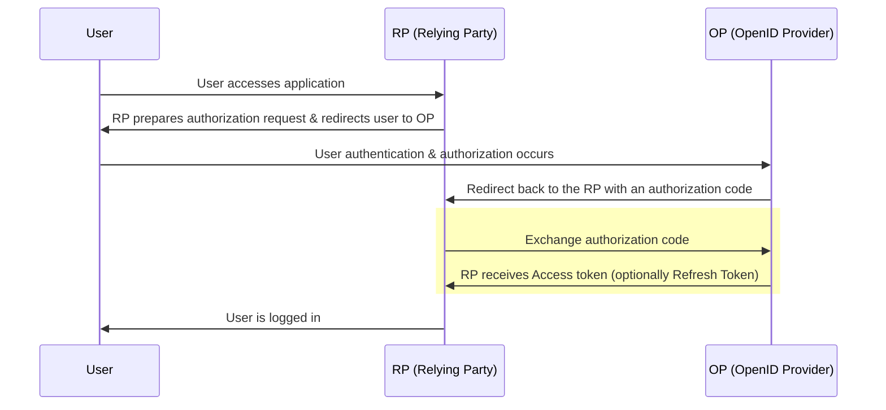

In authentik, you can [create](./create-oauth2-provider.md) an [OAuth 2.0](https://oauth.net/2/) provider that authentik uses to authenticate the user to the associated application. This provider supports both generic OAuth2 as well as OpenID Connect (OIDC).

## authentik and OAuth 2.0

It's important to understand how authentik works with and supports the OAuth 2.0 protocol, so before taking a [closer look at OAuth 2.0 protocol](#about-oauth-20-and-oidc) itself, let's cover a bit about authentik.

authentik can act either as the OP, (OpenID Provider, with authentik as the IdP), or as the RP (Relying Party, or the application that uses OAuth 2.0 to authenticate). If you want to configure authentik as an OP, then you create a provider, then use the OAuth 2.0 provider. If you want authentik to serve as the RP, then configure a [source](../../../users-sources/sources/index.md). Of course, authentik can serve as both the RP and OP, if you want to use the authentik OAuth provider and also use sources.

All standard OAuth 2.0 flows (authorization code, client_credentials, implicit, hybrid, device code) and grant types are supported in authentik, and we follow the [OIDC spec](https://openid.net/specs/openid-connect-core-1_0.html). OAuth 2.0 in authentik supports OAuth, PKCE, [Github compatibility](./github-compatibility.md) and the RP receives data from our scope mapping system.

The authentik OAuth 2.0 provider comes with all the standard functionality and features of OAuth 2.0, including the OAuth 2.0 security principles such as no cleartext storage of credentials, configurable encryption, configurable short expiration times, and the configuration of automatic rotation of refresh tokens. In short, our OAuth 2.0 protocol support provides full coverage.

## About OAuth 2.0 and OIDC

OAuth 2.0 is an authorization protocol that allows an application (the RP) to delegate authorization to an OP. OIDC is an authentication protocol built on top of OAuth2, which provides identity credentials and other data on top of OAuth2.

**OAuth 2.0** typically requires two requests (unlike the previous "three-legged" OAuth 1.0). The two "legs", or requests, for OAuth 2.0 are:

1. An authorization request is prepared by the RP and contains parameters for its implementation of OAuth and which data it requires, and then the User's browser is redirected to that URL.
2. The RP sends a request to authentik in the background to exchange the access code for an access token (and optionally a refresh token).

In detail, with OAuth2 when a user accesses the application (the RP) via their browser, the RP then prepares a URL with parameters for the OpenID Provider (OP), which the users's browser is redirected to. The OP authenticates the user and generates an authorization code. The OP then redirects the client (the user's browser) back to the RP, along with that authorization code. In the background, the RP then sends that same authorization code in a request authenticated by the `client_id` and `client_secret` to the OP. Finally, the OP responds by sending an Access Token saying this user has been authorised (the RP is recommended to validate this token using cryptography) and optionally a Refresh Token.

The image below shows a typical authorization code flow.



| Endpoint             | URL                                                                  |
| -------------------- | -------------------------------------------------------------------- |
| Authorization        | `/application/o/authorize/`                                          |
| Token                | `/application/o/token/`                                              |
| User Info            | `/application/o/userinfo/`                                           |
| Token Revoke         | `/application/o/revoke/`                                             |
| End Session          | `/application/o/<application slug>/end-session/`                     |
| JWKS                 | `/application/o/<application slug>/jwks/`                            |
| OpenID Configuration | `/application/o/<application slug>/.well-known/openid-configuration` |

### Additional configuration options with Redirect URIs

When using an OAuth 2.0 provider in authentik, the OP must validate the provided redirect URI by the RP. An authentik admin can configure a list in the **Redirect URI** field on the Provider.

When you create a new OAuth 2.0 provider and app in authentik and you leave the **Redirect URI** field empty, then the first time a user opens that app, authentik uses that URL as the saved redirect URL.

For advanced use cases, an authentik admin can use regular expressions (regex) instead of a redirect URL. For example, if you want to list 10 diff applications, instead of listing all ten you can create an expression with wildcards. Be aware, when using regex, that authetnik uses a dot as a separator in the URL, but in regex a dot means "one of any character", a wildcard. So you should escape the dot to prevent its interpration as a wildcard.

## OAuth 2.0 flows and grant types

There are three general flows of OAuth 2.0:

1. Web-based application authorization (Authorization code, Implicit, Refresh token)
2. Client credentials (Machine-to-machine)
3. Device code

Additionally, the [Refresh token](#refresh-token-grant) (grant type) is optionally used with any of the above flows, as well as the client credentials and device code flows.

### 1: Web-based application authorization

The flows and grant types used in this case are those used for a typical authorization process, with a user and an application:

- _Authorization code_ grant type
- _Implicit_ grant type (legacy)
- _Hybrid_ grant type

#### Authorization code

The authorization code is for environments with both a Client and a application server, where the back and forth happens between the client and an app server (the logic lives on app server). The RP needs to authorise itself to the OP. Client ID (public, identifies which app is talking to it) and client secret (the password) that the RP uses to authenticate.

If you configure authentik to use "Offline access" then during the initial auth the OP sends two tokens, an access token (short-lived, hours, can be customised) and a refresh token (typically longer validity, days or infinite). The RP (the app) saves both tokens. When the access token is about to expire, the RP sends the saved refresh token back to the OP, and requests a new access token. When the refresh token itself is about to expire, the RP can also ask for a new refresh token. This can all happen without user interaction if you configured the offline access.

:::info
Starting with authentik 2024.2, applications only receive an access token. To receive a refresh token, both applications and authentik must be configured to request the `offline_access` scope. In authentik this can be done by selecting the `offline_access` Scope mapping in the provider settings.
:::

The authorization code grant type is used to convert an authorization code to an access token (and optionally a refresh token). The authorization code is retrieved through the authentik [Authorization flow](../../flows-stages/flow/index.md), can only be used once, and expires quickly.

#### Implicit

:::info
The OAuth 2.0 [Security Best Current Practice document](https://tools.ietf.org/html/draft-ietf-oauth-security-topics) recommends against using the Implicit flow entirely, and OAuth 2.0 for Browser-Based Apps describes the technique of using the authorization code flow with PKCE instead. ([source](https://oauth.net/2/grant-types/implicit/))
:::

This flow is for more modern single page-applications, or ones you download, that are all client-side (all JS, no backend logic, etc) and have no server to make tokens. Because the secret cannot be stored on the client machine, the implicit flow is required in these architectures. With the implicit flow, the flow skips the second part of the two requests seen in the authorization flow; after the initial author request, the implicit flow receives a token, and then with cryptocracy and with PKCE, it can validate that it is the correct client, and that is safe to send a token. The RP (still called that with this implicit flow) can use cryptography to validate the token.

#### Hybrid

The Hybrid Flow is an OpenID Connect flow that incorporates traits of both the Implicit flow and the Authorization Code flow. It provides an application instant access to an ID token while ensuring secure and safe retrieval of access tokens and refresh tokens. This can be useful in situations where the application needs to quickly access information about the user, while in the background doing further processing to get additional tokens before gaining access to additional resources.

### 2. Client credentials

The client credentials flow and grant types are typically implemented for server-to-server scenarios, when code in a web application invokes a web API.

For more information, see [Machine-to-machine authentication](./client_credentials.mdx).

### 3. Device code

The device code flow is used in situations where there is no browser and limited options for text or data input from a client ("input-constrained devices"). For example, using a subscription TV program on a television, where you use a website on your mobile device to input a code displayed on the TV, authenticate, and then you are logged in to the TV.

For more information, see [Device code flow](./device_code.md).

#### Refresh token grant

Refresh tokens can be used as long-lived tokens to access user data, and further renew the refresh token down the road.

:::info
Starting with authentik 2024.2, the refresh token grant type requires the `offline_access` scope.
:::

## Scope mappings

Scopes can be configured using scope mappings, a type of [property mapping](../property-mappings/index.md#scope-mappings).

## Scope authorization

By default, every user that has access to an application can request any of the configured scopes. Starting with authentik 2022.4, you can do additional checks for the scope in an expression policy (bound to the application):

```python
# There are additional fields set in the context, use `ak_logger.debug(request.context)` to see them.
if "my-admin-scope" in request.context["oauth_scopes"]:
    return ak_is_group_member(request.user, name="my-admin-group")
return True
```

## Default & special scopes

When a client does not request any scopes, authentik will treat the request as if all configured scopes were requested. Depending on the configured authorization flow, consent still needs to be given, and all scopes are listed there.

This does _not_ apply to special scopes, as those are not configurable in the provider.

### Default

- `openid`: A scope required by the OpenID Connect spec to specify that an OAuth interaction is OpenID Connect. Does not add any data to the token.
- `profile`: Include basic profile information, such as username, name and group membership.
- `email`: Include the users' email address.
- `entitlements`: Include application entitlement data.
- `offline_access`: An OAuth 2.0 scope which indicates that the application is requesting a refresh token.

### authentik

- `goauthentik.io/api`: This scope grants the refresh token access to the authentik API on behalf of the user

### GitHub compatibility

- `user`: No-op, is accepted for compatibility but does not give access to any resources
- `read:user`: Same as above
- `user:email`: Allows read-only access to `/user`, including email address
- `read:org`: Allows read-only access to `/user/teams`, listing all the user's groups as teams.

## Signing & Encryption

[JWTs](https://jwt.io/introduction) created by authentik will always be signed.

When a _Signing Key_ is selected in the provider, the JWT will be signed asymmetrically with the private key of the selected certificate, and can be verified using the public key of the certificate. The public key data of the signing key can be retrieved via the JWKS endpoint listed on the provider page.

When no _Signing Key_ is selected, the JWT will be signed symmetrically with the _Client secret_ of the provider, which can be seen in the provider settings.

### Encryption:ak-version[2024.10]

authentik can also encrypt JWTs (turning them into JWEs) it issues by selecting an _Encryption Key_ in the provider. When selected, all JWTs will be encrypted symmetrically using the selected certificate. authentik uses the `RSA-OAEP-256` algorithm with the `A256CBC-HS512` encryption method.
