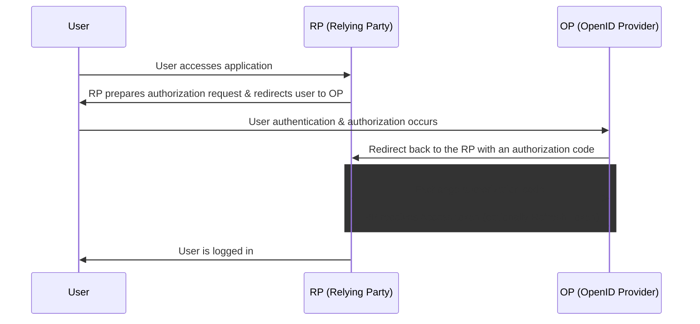

In authentik, you can [create](./create-oauth2-provider.md) an [OAuth 2.0](https://oauth.net/2/) provider that authenticates users to an associated application. The provider supports generic OAuth 2.0 clients and OpenID Connect (OIDC) relying parties.

## authentik and OAuth 2.0

Before looking at the [OAuth 2.0 protocol](#about-oauth-20-and-oidc), it helps to understand the roles that authentik can play.

authentik can act as the OpenID Provider (OP), where authentik is the identity provider, or as the Relying Party (RP), where authentik uses an external OAuth 2.0 or OIDC provider for authentication. To use authentik as the OP, create an OAuth 2.0 provider and attach it to an application. To use authentik as the RP, configure an OAuth [source](../../../users-sources/sources/index.md). The same authentik instance can act as both an OP and an RP.

authentik supports standard OAuth 2.0 flows and grant types, including authorization code, client credentials, implicit, hybrid, refresh token, and device code. authentik also follows the [OIDC spec](https://openid.net/specs/openid-connect-core-1_0.html), supports PKCE and [GitHub compatibility](./github-compatibility.md), and uses [scope mappings](../property-mappings/index.md#scope-mappings-with-oauth2) to control the claims returned to the RP.

The OAuth 2.0 provider includes security-focused configuration options such as no cleartext storage of credentials, configurable signing and encryption keys, short token expiration times, and automatic refresh token rotation.

## About OAuth 2.0 and OIDC

OAuth 2.0 is an authorization framework that lets an application delegate authorization to an authorization server. OIDC builds authentication on top of OAuth 2.0, adding identity tokens and standardized user claims.

A typical OAuth 2.0 authorization code flow has two main requests:

1. The RP prepares an authorization request that describes the requested access and redirects the user's browser to the OP.
2. After the OP authenticates the user, the RP exchanges the authorization code for an access token and, optionally, a refresh token.

When a user opens the application, the RP builds an authorization URL and redirects the user's browser to the OP. The OP authenticates the user and redirects the browser back to the RP with an authorization code. The RP then sends the code to the OP in a back-channel request, authenticating with its `client_id` and, for confidential clients, its `client_secret`. The OP returns an access token and, when configured, a refresh token. The RP should validate received tokens before trusting their contents.

The image below shows a typical authorization code flow.


```mermaid
sequenceDiagram
    participant user as User
    participant rp as RP (Relying Party)
    participant op as OP (OpenID Provider)

    user->>rp: User accesses application
    rp->>user: RP prepares authorization request & redirects user to OP

    user->>op: User authentication & authorization occurs
    op->>rp: Redirect back to the RP with an authorization code

    rect

        rp->>op: Exchange authorization code
        op->>rp: RP receives Access token (optionally Refresh Token)
    end

    rp->>user: User is logged in
```

## OAuth 2.0 endpoints and bindings

| Endpoint             | URL                                                                  |
| -------------------- | -------------------------------------------------------------------- |
| Authorization        | `/application/o/authorize/`                                          |
| Token                | `/application/o/token/`                                              |
| User Info            | `/application/o/userinfo/`                                           |
| Token Revoke         | `/application/o/revoke/`                                             |
| Token Introspection  | `/application/o/introspect/`                                         |
| Device Authorization | `/application/o/device/`                                             |
| End Session          | `/application/o/<application slug>/end-session/`                     |
| JWKS                 | `/application/o/<application slug>/jwks/`                            |
| OpenID Configuration | `/application/o/<application slug>/.well-known/openid-configuration` |

:::caution Reserved application slugs
Due to how the OAuth2/OpenID provider endpoints are structured, you cannot create applications that use the slugs `authorize`, `token`, `device`, `userinfo`, `introspect`, or `revoke` as these would conflict with the global OAuth 2.0 endpoints.
:::

### Cross-provider token introspection and revocation

The token introspection and revocation endpoints are global OAuth 2.0 endpoints, but access to tokens is still scoped by provider. A client can introspect or revoke tokens issued by the same OAuth2 provider that authenticated the request.

For cross-provider introspection or revocation, authenticate the request with a confidential provider. Then, on the provider that issues the token, select the authenticating provider under **Federated OAuth2/OpenID Providers**. This allows the authenticating provider to introspect and revoke tokens issued by the federated provider.

### Additional configuration options with Redirect URIs

When using an OAuth 2.0 provider in authentik, the OP must validate the redirect URI provided by the RP. An authentik administrator can configure allowed redirect URIs in the provider's **Redirect URI** field.

If you leave the **Redirect URI** field empty when creating a provider and application, authentik saves the first redirect URI used when a user opens the application.

For advanced use cases, an authentik administrator can use regular expressions instead of static redirect URLs. For example, you can use a regular expression to match a group of related redirect URLs instead of listing each URL individually. When matching literal periods in hostnames, escape them as `\.` because, in regular expressions, an unescaped period matches any character.

### OAuth2/OpenID Connect back-channel logout

Using back-channel logout (a server-to-server notification mechanism) allows an identity provider to notify connected OAuth2/OpenID clients whenever a user's session is terminated.

For more information, see our [OAuth2/OpenID Connect front-channel and back-channel logout](./frontchannel_and_backchannel_logout.mdx) documentation.

## Issuer mode

The **Issuer mode** setting (under **Advanced protocol settings**) controls the value that authentik uses for the `iss` (issuer) claim in the tokens it signs, and for the `issuer` field in the provider's [OpenID Connect discovery document](#oauth-20-endpoints-and-bindings).

| Mode (UI label)                                                                   | `iss` value                                                   |
| --------------------------------------------------------------------------------- | ------------------------------------------------------------- |
| **Each provider has a different issuer, based on the application slug** (default) | `https://authentik.company/application/o/<application_slug>/` |
| **Same identifier is used for all providers**                                     | `https://authentik.company/`                                  |

By default, authentik uses per-provider mode: every provider has a unique issuer derived from its application slug. This is the recommended setting, and matches how the discovery and JWKS endpoints are structured, since both are served under the per-application `/application/o/<application_slug>/` path.

### Global issuer mode

Setting the issuer mode to **Same identifier is used for all providers** (referred to internally as **global** mode) makes every OAuth 2.0 provider configured with this mode share the same issuer: the root URL of the instance (`https://authentik.company/`).

:::info Well-known location
Global issuer mode still serves the discovery document at `https://authentik.company/application/o/<application_slug>/.well-known/openid-configuration`, not at the root issuer URL.
:::

## OAuth 2.0 flows and grant types

There are three general flows of OAuth 2.0:

1. Web-based application authorization (authorization code, implicit, and hybrid)
2. Client credentials (machine-to-machine)
3. Device code

The [refresh token](#refresh-token-grant) grant type can be used with several flows to obtain a new access token without another interactive login.

You can define which grant types are available for your OAuth2 provider when you [create and configure the provider](./create-oauth2-provider.md). By default, all types are selected.

### 1: Web-based application authorization

The flows and grant types used in this case are those used for a typical authorization process, with a user and an application:

- _Authorization code_ grant type
- _Implicit_ grant type (legacy)
- _Hybrid_ grant type

#### Authorization code

The authorization code grant is intended for applications with a backend server. The browser receives an authorization code, and the backend exchanges that code for tokens. During the exchange, confidential clients authenticate to the OP with their client ID and client secret.

If you configure authentik to allow offline access, the OP can return both a short-lived access token and a longer-lived refresh token during the initial authorization. The RP stores the tokens and uses the refresh token to request a new access token before the current access token expires. Depending on the provider settings, the RP can also receive a rotated refresh token without requiring another user interaction.

:::info
Starting with authentik 2024.2, applications only receive an access token by default. To receive a refresh token, the application must request the `offline_access` scope and the authentik provider must include the `offline_access` scope mapping.
:::

The authorization code grant converts an authorization code into an access token and, optionally, a refresh token. The authorization code is issued by the authentik [authorization flow](../../flows-stages/flow/index.md), can only be used once, and expires quickly.

#### Implicit

:::info
The OAuth 2.0 [Security Best Current Practice document](https://tools.ietf.org/html/draft-ietf-oauth-security-topics) recommends against using the implicit flow. OAuth 2.0 for browser-based apps recommends using the authorization code flow with PKCE instead. ([source](https://oauth.net/2/grant-types/implicit/))
:::

The implicit flow was designed for browser-only or installed applications that cannot safely store a client secret. In this flow, the OP returns tokens directly from the authorization request instead of requiring a separate back-channel token exchange. For new browser-based applications, use the authorization code flow with PKCE instead.

#### Hybrid

The hybrid flow is an OpenID Connect flow that combines parts of the implicit flow and the authorization code flow. It can return an ID token immediately while the application completes a back-channel exchange to retrieve access tokens and refresh tokens.

### 2. Client credentials

The client credentials flow and grant types are typically implemented for server-to-server scenarios, when code in a web application invokes a web API.

For more information, see [Machine-to-machine authentication](./machine_to_machine.mdx).

### 3. Device code

The device code flow is used when a device has no browser or has limited text input. For example, a TV application can display a code that the user enters on another device to authenticate the session.

For more information, see [Device code flow](./device_code.md).

#### Refresh token grant

Refresh tokens let an application obtain new access tokens without requiring another interactive login. Depending on the provider settings, refresh tokens can also be rotated when they are used.

:::info
Starting with authentik 2024.2, the refresh token grant type requires the `offline_access` scope.
:::

## Scope mappings

Scopes can be configured using scope mappings, a type of [property mapping](../property-mappings/index.md#scope-mappings-with-oauth2).

## Scope authorization

By default, every user that has access to an application can request any of the configured scopes. Starting with authentik 2022.4, you can do additional checks for the scope in an expression policy (bound to the application):

```python
# There are additional fields set in the context; use `ak_logger.debug(request.context)` to see them.

if "my-admin-scope" in request.context["oauth_scopes"]:
    return ak_is_group_member(request.user, name="my-admin-group")
return True
```

## Default & special scopes

When a client does not request any scopes, authentik treats the request as if all configured scopes were requested. Depending on the configured authorization flow, consent still needs to be given, and all scopes are listed there.

This does _not_ apply to special scopes, as those are not configurable in the provider.

### Default

- `openid`: A scope required by the OpenID Connect spec to specify that an OAuth interaction is OpenID Connect. Does not add any data to the token.
- `profile`: Include basic profile information, such as username, name and group membership.
- `email`: Include the users' email address.
- `entitlements`: Include application entitlement data.
- `offline_access`: An OAuth 2.0 scope which indicates that the application is requesting a refresh token.

### authentik

- `goauthentik.io/api`: This scope grants the refresh token access to the authentik API on behalf of the user.

### GitHub compatibility

- `user`: No-op, is accepted for compatibility but does not give access to any resources.
- `read:user`: Same as above.
- `user:email`: Allows read-only access to `/user`, including email address.
- `read:org`: Allows read-only access to `/user/teams`, listing all the user's groups as teams.

### Email scope verification

In authentik releases prior to 2025.10, the email scope always set the `email_verified` claim to `True`. Since authentik does not have a single authoritative source to determine whether a user's email is actually verified, asserting this claim could have security implications. As of 2025.10, `email_verified` now defaults to `False`.

Some applications require this claim to be `True` in order to authenticate users. In those cases, you can create a custom email scope mapping (**Customization** > **Property Mappings**) that always returns `email_verified` as `True`:

```python
return {
    "email": request.user.email,
    "email_verified": True
}
```

For greater security guarantees, verify users' email addresses and store the verification status as a user attribute (for example, `email_verified` set to `True` or `False`). You can then configure the scope mapping to return this value dynamically:

```python
return {
    "email": request.user.email,
    "email_verified": request.user.attributes.get("email_verified", False)
}
```

## Signing and encryption

Selecting **Signing Key** is optional. [JWTs](https://jwt.io/introduction) created by authentik will always be signed.

When **Signing Key** is selected in the provider, authentik signs JWTs asymmetrically with the private key of the selected certificate. Clients can verify those JWTs with the certificate's public key, which is available from the JWKS endpoint listed on the provider page.

When **Signing Key** is not selected, authentik signs JWTs symmetrically with the provider **Client secret**, which is shown in the provider settings.

### Encryption

authentik can also encrypt JWTs (turning them into JWEs) that it issues by selecting an **Encryption Key** in the provider. When selected, all JWTs will be encrypted using the selected certificate. authentik uses the `RSA-OAEP-256` key management algorithm with the `A256CBC-HS512` content encryption method.
