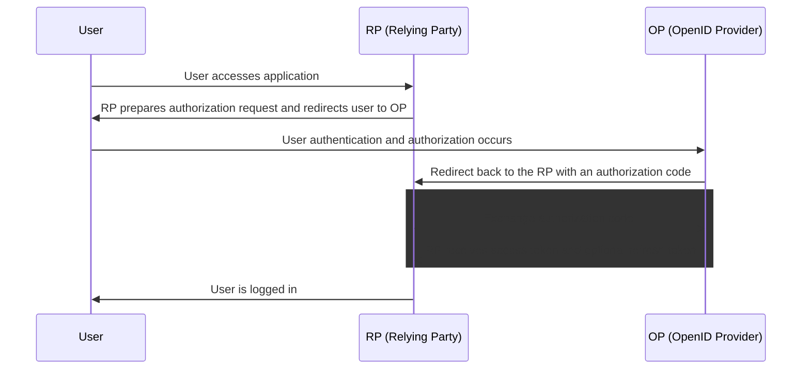

In authentik, you can [create](./create-oauth2-provider.md) an [OAuth 2.0](https://oauth.net/2/) provider to authenticate users to an associated application. The provider supports both OAuth 2.0 and OpenID Connect (OIDC).

## authentik and OAuth 2.0

Before taking a [closer look at OAuth 2.0 and OIDC](#about-oauth-20-and-oidc), it is important to understand how authentik works with these protocols.

authentik can act as either an OpenID Provider (OP) or a Relying Party (RP):

- To use authentik as an OP, create an OAuth 2.0 provider and associate it with an application.
- To use authentik as an RP, configure an OAuth or OIDC [source](../../../users-sources/sources/index.md).

authentik can act as both an OP and an RP in the same deployment.

authentik supports common OAuth 2.0 and OIDC flows and grant types, including authorization code, client credentials, implicit, hybrid, device code, refresh token, and token exchange. authentik follows the [OpenID Connect specification](https://openid.net/specs/openid-connect-core-1_0.html) and supports PKCE, [GitHub compatibility](./github-compatibility.md), and scope mappings.

The authentik OAuth 2.0 provider supports standard OAuth 2.0 security features, including secure credential storage, configurable signing and encryption, configurable token expiration times, and automatic refresh token rotation.

## About OAuth 2.0 and OIDC

OAuth 2.0 is an authorization framework that allows an application to obtain limited access to protected resources. OpenID Connect is an authentication protocol built on OAuth 2.0 that allows an application to verify a user's identity and obtain information about that user.

In a typical authorization code flow:

1. The RP prepares an authorization request that identifies the client and specifies the access it requires. The RP then redirects the user's browser to the OP.
2. The OP authenticates the user and, when required, requests the user's consent.
3. The OP redirects the user's browser back to the RP with an authorization code.
4. The RP sends the authorization code to the OP's token endpoint and authenticates using its client credentials or another supported client authentication method.
5. The OP returns an access token and, when requested and permitted, a refresh token.

The following diagram shows a typical authorization code flow:


```mermaid
sequenceDiagram
    participant user as User
    participant rp as RP (Relying Party)
    participant op as OP (OpenID Provider)

    user->>rp: User accesses application
    rp->>user: RP prepares authorization request and redirects user to OP
    user->>op: User authentication and authorization occurs
    op->>rp: Redirect back to the RP with an authorization code

    rect
        rp->>op: Exchange authorization code
        op->>rp: RP receives access token and optional refresh token
    end

    rp->>user: User is logged in
```

## OAuth 2.0 endpoints and bindings

| Endpoint             | URL                                                                  |
| -------------------- | -------------------------------------------------------------------- |
| Authorization        | `/application/o/authorize/`                                          |
| Token                | `/application/o/token/`                                              |
| User Info            | `/application/o/userinfo/`                                           |
| Token Revocation     | `/application/o/revoke/`                                             |
| Token Introspection  | `/application/o/introspect/`                                         |
| Device Authorization | `/application/o/device/`                                             |
| End Session          | `/application/o/<application_slug>/end-session/`                     |
| JWKS                 | `/application/o/<application_slug>/jwks/`                            |
| OpenID Configuration | `/application/o/<application_slug>/.well-known/openid-configuration` |

:::caution Reserved application slugs
Because of how the OAuth 2.0 provider endpoints are structured, you cannot create applications with the slugs `authorize`, `token`, `device`, `userinfo`, `introspect`, or `revoke`. These slugs conflict with the global OAuth 2.0 endpoints.
:::

### Cross-provider token introspection and revocation

The token introspection and revocation endpoints are global OAuth 2.0 endpoints, but access to tokens is still scoped by provider. A client can introspect or revoke tokens issued by the same OAuth2 provider that authenticated the request.

For cross-provider introspection or revocation, authenticate the request with a confidential provider. Then, on the provider that issues the token, select the authenticating provider under **Federated OAuth2/OpenID Providers**. This allows the authenticating provider to introspect and revoke tokens issued by the federated provider.

### Redirect URIs

When using an OAuth 2.0 provider in authentik, the OP must validate the redirect URI supplied by the RP. An authentik administrator can configure a list of allowed redirect URIs in the provider's **Redirect URIs** field.

If you leave the **Redirect URIs** field empty when creating a provider and application, authentik saves the redirect URI used the first time a user opens the application.

For advanced use cases, an authentik administrator can use regular expressions instead of exact redirect URIs. For example, instead of listing several similar application URLs individually, you can create a regular expression that matches all of them.

When using regular expressions, remember that a period (`.`) matches any single character. To match a literal period in a URL, escape it as `\.`.

### OAuth 2.0 and OpenID Connect logout

Back-channel logout is a server-to-server notification mechanism that allows an identity provider to notify connected OAuth 2.0 or OpenID Connect clients when a user's session ends.

For more information, see [OAuth2/OpenID Connect front-channel and back-channel logout](./frontchannel_and_backchannel_logout.mdx).

## Issuer mode

The **Issuer mode** setting (under **Advanced protocol settings**) controls the value that authentik uses for the `iss` (issuer) claim in the tokens it signs, and for the `issuer` field in the provider's [OpenID Connect discovery document](#oauth-20-endpoints-and-bindings).

| Mode (UI label)                                                                   | `iss` value                                                   |
| --------------------------------------------------------------------------------- | ------------------------------------------------------------- |
| **Each provider has a different issuer, based on the application slug** (default) | `https://authentik.company/application/o/<application_slug>/` |
| **Same identifier is used for all providers**                                     | `https://authentik.company/`                                  |

By default, authentik uses per-provider mode: every provider has a unique issuer derived from its application slug. This is the recommended setting, and matches how the discovery and JWKS endpoints are structured, since both are served under the per-application `/application/o/<application_slug>/` path.

### Global issuer mode

Setting the issuer mode to **Same identifier is used for all providers** (referred to internally as **global** mode) makes every OAuth 2.0 provider configured with this mode share the same issuer: the root URL of the instance (`https://authentik.company/`).

:::info Well-known location
Global issuer mode still serves the discovery document at `https://authentik.company/application/o/<application_slug>/.well-known/openid-configuration`, not at the root issuer URL.
:::

## OAuth 2.0 flows and grant types

authentik supports the following general OAuth 2.0 and OpenID Connect flows:

1. Web-based application authorization
2. Client credentials
3. Device code
4. Token exchange

The [refresh token](#refresh-token-grant) grant allows a client to obtain new access tokens without repeating the original authorization flow.

You can define which grant types are available for your OAuth2 provider when you [create and configure the provider](./create-oauth2-provider.md). By default, all types are selected.

### 1. Web-based application authorization

Web-based application authorization typically involves a user authenticating to an application. authentik supports the following flows and grant types for this use case:

- _Authorization code_
- _Implicit_ (legacy)
- _Hybrid_

#### Authorization code

The authorization code flow is intended for applications that can exchange an authorization code securely at the token endpoint. The application redirects the user to the OP for authentication and receives an authorization code through the user's browser. The application's backend then exchanges that code for an access token and, when requested and permitted, a refresh token.

Confidential clients authenticate to the token endpoint using a client ID and client secret or another supported client authentication method. Public clients, which cannot securely store a client secret, should use the authorization code flow with PKCE.

The authorization code can be used only once and expires after a short period.

To receive a refresh token, the client must request the `offline_access` scope, and the provider must include the `offline_access` scope mapping.

:::info
Starting with authentik 2024.2, applications receive only an access token by default. To receive a refresh token, the application must request the `offline_access` scope, and the authentik provider must include the `offline_access` scope mapping.
:::

#### Implicit

:::warning
The OAuth 2.0 [Security Best Current Practice](https://datatracker.ietf.org/doc/html/rfc9700) recommends against using the implicit grant. Browser-based applications should use the authorization code flow with PKCE instead.
:::

The implicit flow returns tokens directly from the authorization endpoint without exchanging an authorization code at the token endpoint. It was designed for browser-based applications that could not securely store client credentials.

Because tokens can be exposed through browser history, redirect URIs, and other browser mechanisms, the implicit flow is considered a legacy flow and should not be used for new applications.

#### Hybrid

The OpenID Connect hybrid flow combines elements of the authorization code and implicit flows. It can return an ID token directly from the authorization endpoint while providing an authorization code that the application exchanges for access and refresh tokens at the token endpoint.

This flow can be useful when an application needs to verify the user's identity immediately while securely obtaining additional tokens through a back-channel request.

### 2. Client credentials

The client credentials flow is typically used for machine-to-machine or server-to-server authentication, where no user is involved. For example, a web service might use client credentials to authenticate when calling an API.

For more information, see [Machine-to-machine authentication](./machine_to_machine.mdx).

### 3. Device code

The device code flow is intended for devices that have limited input capabilities or do not have a suitable browser. For example, a television application can display a code that the user enters on a website using a phone or computer. After the user authenticates, the television application receives authorization.

For more information, see [Device code flow](./device_code.md).

### 4. Token exchange

The token exchange grant allows a client to exchange an existing token for a new access token. authentik supports both impersonation and delegation as defined by [RFC 8693](https://datatracker.ietf.org/doc/html/rfc8693).

With delegation, also known as on-behalf-of (OBO) token exchange, the issued token identifies both the user and the authentik Actor acting on the user's behalf.

For configuration instructions and information about supported parameters, see [Token exchange](./token_exchange.md).

:::info
Delegation and on-behalf-of token exchange are available in authentik 2026.8 and later.
:::

### Refresh token grant

The refresh token grant allows a client to obtain a new access token without requiring the user to authenticate again. Depending on the provider's configuration, authentik can also rotate the refresh token when it is used.

## Scope mappings

Scopes can be configured using scope mappings, which are a type of [property mapping](../property-mappings/index.md#scope-mappings-with-oauth2).

## Scope authorization

By default, every user who has access to an application can request any of the scopes configured on its provider. Starting with authentik 2022.4, you can perform additional scope checks using an expression policy bound to the application:

```python
# Additional fields are available in the context.
# Use `ak_logger.debug(request.context)` to inspect them.

if "my-admin-scope" in request.context["oauth_scopes"]:
    return ak_is_group_member(request.user, name="my-admin-group")
return True
```

## Default and special scopes

For authorization requests, when a client does not request any scopes, authentik treats the request as though all configured scopes were requested. Depending on the configured authorization flow, the user might still need to provide consent, and the consent page lists all requested scopes.

This behavior does not apply to special scopes because they are not configurable on the provider. It also does not apply to token exchange: if `scope` is omitted from a token exchange request, the issued token has no scopes.

### Default scopes

- `openid`: Indicates that an OAuth 2.0 interaction is an OpenID Connect request. This scope does not add data to the token.
- `profile`: Includes basic profile information, such as the user's username, name, and group membership.
- `email`: Includes the user's email address.
- `entitlements`: Includes application entitlement data.
- `offline_access`: Indicates that the application is requesting a refresh token.
- `bound_key`: Requests an ID token bound to a client-held key using [OpenID Connect Key Binding](https://openid.github.io/connect-key-binding/main.html) and Demonstrating Proof of Possession (DPoP).

:::info `bound_key` scope
The `bound_key` scope applies OpenID Connect Key Binding to the ID token. It does not bind the access token to the client's key.
:::

### authentik scopes

- `goauthentik.io/api`: Grants access to the authentik API on behalf of the user.
- `goauthentik.io/oidc/dcr`: Allows the client to register new OAuth 2.0 clients using [Dynamic Client Registration](./dynamic-client-registration.mdx).

### GitHub compatibility scopes

- `user`: Accepted for compatibility but does not grant access to any resources.
- `read:user`: Accepted for compatibility but does not grant access to any resources.
- `user:email`: Grants read-only access to `/user`, including the user's email address.
- `read:org`: Grants read-only access to `/user/teams`, which lists the user's groups as teams.

### Email scope verification

In authentik releases before 2025.10, the email scope always set the `email_verified` claim to `True`. Because authentik does not have a single authoritative source for determining whether a user's email address is verified, asserting this claim could have security implications. Starting with authentik 2025.10, `email_verified` defaults to `False`.

Some applications require this claim to be `True` before allowing users to authenticate. In these cases, you can create a custom email scope mapping under **Customization** > **Property Mappings** that always returns `email_verified` as `True`:

```python
return {
    "email": request.user.email,
    "email_verified": True,
}
```

For greater security, verify users' email addresses and store the verification status as a user attribute, such as `email_verified` set to `True` or `False`. You can then configure the scope mapping to return this value dynamically:

```python
return {
    "email": request.user.email,
    "email_verified": request.user.attributes.get("email_verified", False),
}
```

## Signing and encryption

[JWTs](https://jwt.io/introduction) created by authentik are always signed.

When a **Signing Key** is selected in the provider, authentik signs JWTs asymmetrically using the private key of the selected certificate-key pair. Clients can verify the signature using the corresponding public key. The signing key's public key is available through the JWKS endpoint listed on the provider page.

When no **Signing Key** is selected, authentik signs JWTs symmetrically using the provider's **Client secret**.

### Encryption

authentik can also encrypt the JWTs it issues, producing JSON Web Encryption (JWE) tokens. To enable encryption, select an **Encryption Key** in the provider.

authentik uses the `RSA-OAEP-256` key encryption algorithm with the `A256CBC-HS512` content encryption method.
